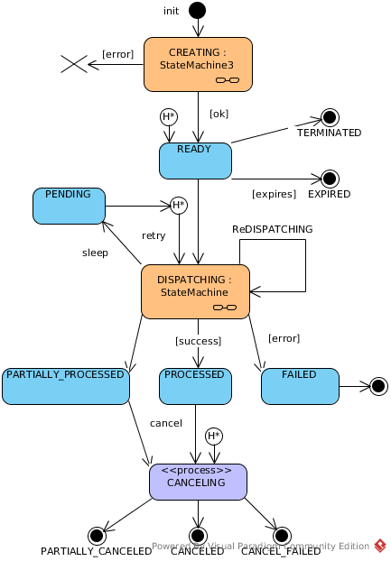

# Payout Gateway: Payout Requests

## General

!!! info "Definition"
    **```Payout request```** - is an operation for abstraction from route and payout. It allows dynamic routing and failover for payouts.
    
    **```Payout Request Event```**  - event log for a specific request for payout. Gives detailed information about the process for requesting payout.

## Payout Request Workflow

!!! info "State Diagram"
    [](images/payout_request_state_diagram.png)