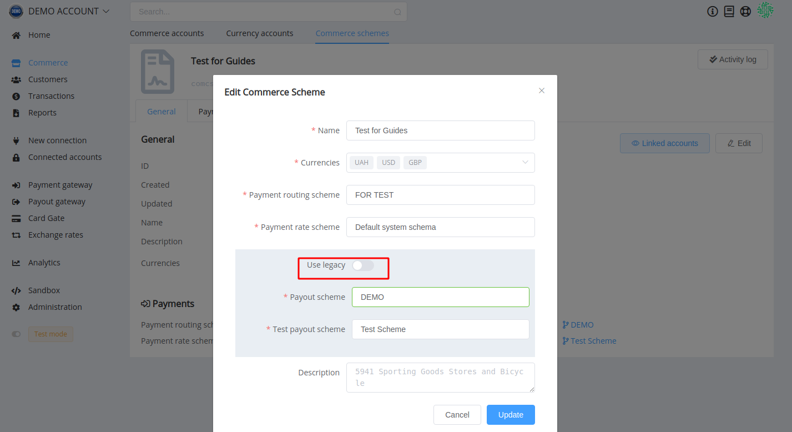
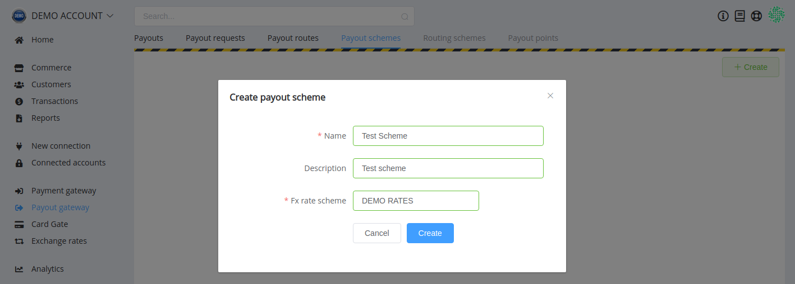
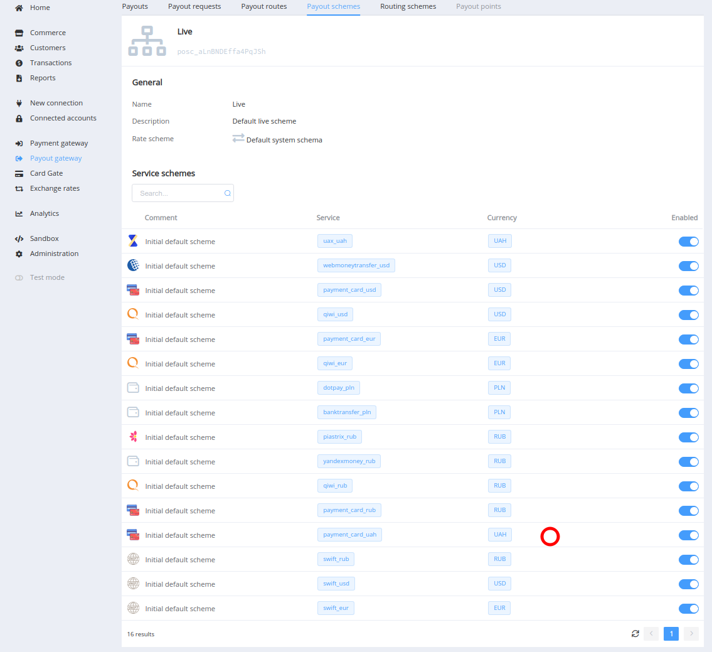
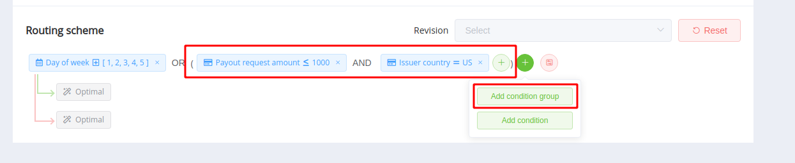
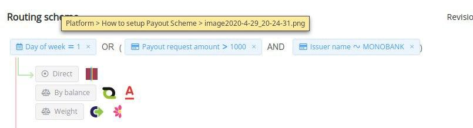
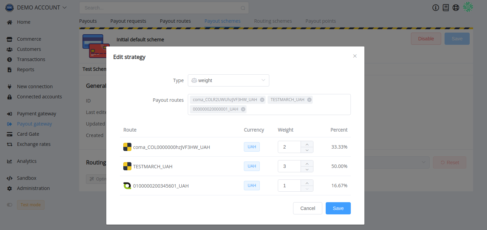
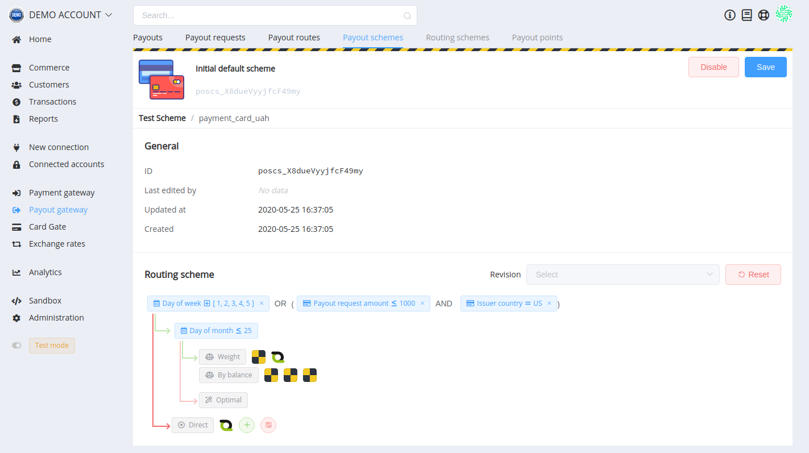
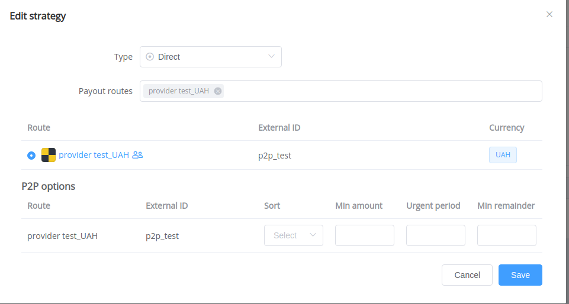

# Payout Schemes

## Overview

We use smart routing to maximise transaction performance, and payout schemes are our brand-new tools that help to increase efficiency and security of the payment process.

The benefits of the Payout Schemes using are:

- improved routing and fine-tune managing of route selection
- the possibility to configure a backup processing plan with the strategy cascade
- and the possibility to create the scheme of blockages that allows rejection of payouts based on transaction attributes

You still can handle payout processing with old settings and use previously created payout routing schemes and payout rate schemes.

??? info "Commerce scheme editing"
    

But we recommend to take your transaction routing to the next level as early as possible.

!!! attention
    You should create different schemes for testing and performing live payout transactions. Test payout schemes are created and displayed only when you activate the test mode.

??? info "Commerce scheme editing"
    

## Create your first payout scheme

!!! tips "Before you start"
    Ensure you have a proper conversion scheme in the *'[Rate Schemes](https://dashboard.paycore.io/fx-rates/schemes)'*. Create a new scheme if necessary.

Find *Payout Schemes* tab in *Payout Gateway* section. Click on the *Create* button, specify the name of a new scheme and description (optional), choose rate scheme from the drop-down list.

In the new scheme configuration, you can see automatically created routes for all services available to the organisation. All of them are enabled by default, and you can turn off those you don't plan to use.

## Configure routing

The set of service schemes defines the routing in the payout scheme. To configure each of them, click on the corresponding row in the grid.

A *Routing Scheme* is the main component for Payout Service Scheme. By default, it has *optimal* routing according to our system settings. Press the '*Replace by condition*' button to start editing the route and set the conditions for execution of the script.

You can combine different conditions and groups of conditions; connect them using AND and OR operators.

For illustration purposes, routing has a tree structure. Branches start from a node with conditions and end with a strategy, a set of strategies, or the following set of conditions. Green branches refer to meet conditions, red—represent the state when conditions are not met.

Set of strategies allows you to combine strategies (by balance, by weight) within a branch. The execution of strategies there depends on how they locate from top to bottom.

!!! tip "Failover"
    Failover is handled at Payout Request level by creating additional payouts if the previous ones were unsuccessful. This feature is set in the payout settings by the *Attempts limit* option if its value is above zero.

    In this case, the decision point component executes the routing scheme afresh. Still, the previous (unsuccessful) route is filtered, and routing returns the new route (or nothing) depending on the configuration. 

    Therefore, for full use of failover, the result of conditions must be either a set of strategies or a strategy with multiple routes. And the number of strategies (or routes) in this branch should be equal to or exceed the given Attempts limit.

If the strategy operates a p2p route, an additional p2p option section appears for it; they redefine p2p options from the payout route. Thus they can change the strategy of choosing p2p payouts depending on the transaction attributes.

## P2p Routing Strategies

P2p options help you to customise the P2P routing as efficiently as possible. You can override the following options as part of the whole strategy. By default, p2p routes do not have priority over regular routes, but you can turn on the *P2P firstly* option in the payout processing settings for a Commerce account.

1. Sorting: you can select the oldest transactions (that will soon be expired), biggest—with the highest amount, and with the minimal remainder (the recent option is only relevant for routes with p2p payment splitting and, at the same time, turned-off splitting on payouts).

2. Minimal amount: to select from p2p-pool transactions with amounts that are over or equal to the set value.

    ??? example "Example calculation"
        If you use a branch in a routing scheme for payouts of more than $10,000 and specify $5000 as a *minimal amount*, such transactions are split in at least $5000.

3. Urgent period: if p2p transactions have an expiration date within this number of days, they will be taken first (the option interferes the primary sorting).

4. Minimal remainder: after p2p splitting.

    ??? example "Example calculation"
        Let there are processed $100 payout, and the p2p pool has $130 and $140 payments, you choose to sort transactions by *minimal remainders* and select those with a *minimal amount* $35. Based on sorting settings, the components should take $130 payment, but in that case, the $30 rest will never be paid. So, you need to set 35 as the minimal remainder to split $140 payment on $100 and $40.

## Status Resolutions Related to Payout Schemes

We have also added additional types of payout request's failed status resolutions related to payout schemes usage:

- `STRATEGY_RECEIVED_NO_ROUTES` — there are no routes by the condition in the routing
- `STRATEGY_CONFIGURED_ROUTES_WERE_FILTERED` — all rows do not match a result of filtration
- `NO_AVAILABLE_P2P_PAYMENTS` — there are no proper p2p-payments (for р2р-routes only)
