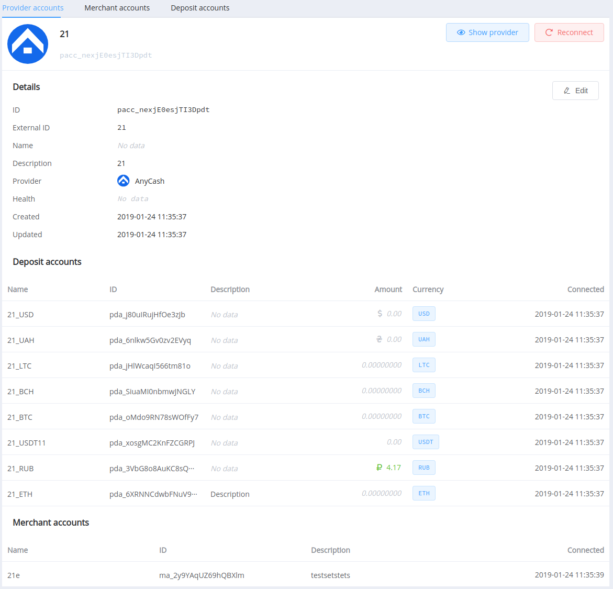

# Managing Accounts

## Введение

Управление аккаунтами позволяет в одином окне управлять и контролировать состояние ваших подключенных аккаунтов платежных провайдеров.

Вы можете отслежить их состояние, доступные балансы, активные платежные направления и направления выплат.

Если у вас еще нет ни одного подключенного аккаунта, то рекомендуем ознакомится с [предыдущей статьей](#).

## General

### Account Health

Напротив каждого аккаунта есть свойство Health.

Оно отображает состоние подключения на основании взаимодействия с платежным провайдером.

Например: если по какому то Deposit Account невозможно получить состояние его баланса, то статус "здоровья" покажет неполядки в соединении, что будет сигнализировать о необходимости провести ручную модерацию

### Account Naming

Во всех аккаунтах можно редактировать их названия и описания.

Настроятельно рекомендуем всем аккаунтам давать коннектные названия для простоты их идентификации.

Эти названия потом можно удобно использовать для формирования отчетов.

### Managing routes

В Merchant accounts и Deposit accounts доступные блоки с управлением маршрутами в конктексте конкретного аккаунта.

Это удобно, если вы хотите управлять маршрутами конкретного аккаунта.

Также, маршруты можно архивировать. В этом состоянии они не будут отображаться в списке, пока вы явно не включите отображение архивных маршрутов.

Для этого необходимо сперва выключить маршрут, а потом нажать на кнопку "Archive disabled".

Вы всегда можете обратно разархивировать и активировать архивные маршруты.

## Provider accounts

На экране управления аккаунтов провайдеров вы можете отслеживать подключенные аккаунты провайдеров, а также связанные с ним **Merchant Account** и **Deposit Account**.

Если провалиться глубже в какой то аккаунт, то вы увидите его детали.

Если отозвать доступ на стороне провайдера, это произведет сбой подключения на стороне [{{custom.company_name}}](http://PayCore.io) и потребуется его переподключение.

На экране аккаунта можно его переподключить как по существующим доступам, так и указав новые.

В момент переподключения, {{custom.company_name}} синхронихирует все данные по аккаунту с провайдером: его **Merchant Account**, **Deposit Account**, маршруты, балансы.

## Merchant accounts

Данный раздел дает возможность управлять вашими **Merchant Accounts** и конролировать их состоние.

В **Merchant Account Overview** вы можете видить активные для него валюты и платежные маршруты по ним.

## Deposit accounts

.png")

На экране **Deposit Accounts** можно видить аутальные балансы, если коннектор конкретного провайдера поддерживает синхронизацию балансов.

В Overview доступны маршруты для выплат и детали аккаунта.