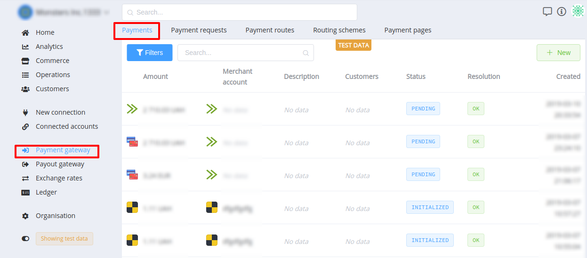
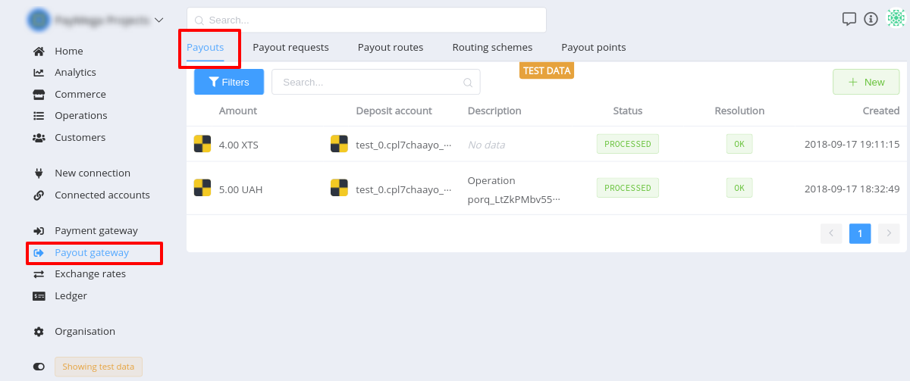
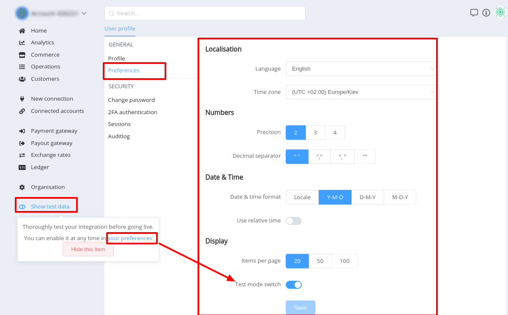
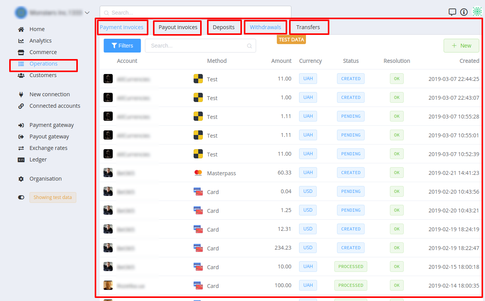
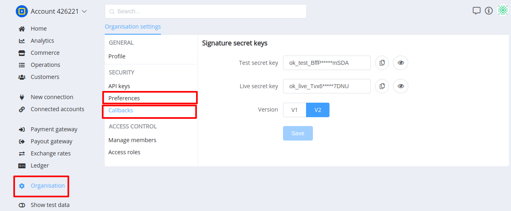
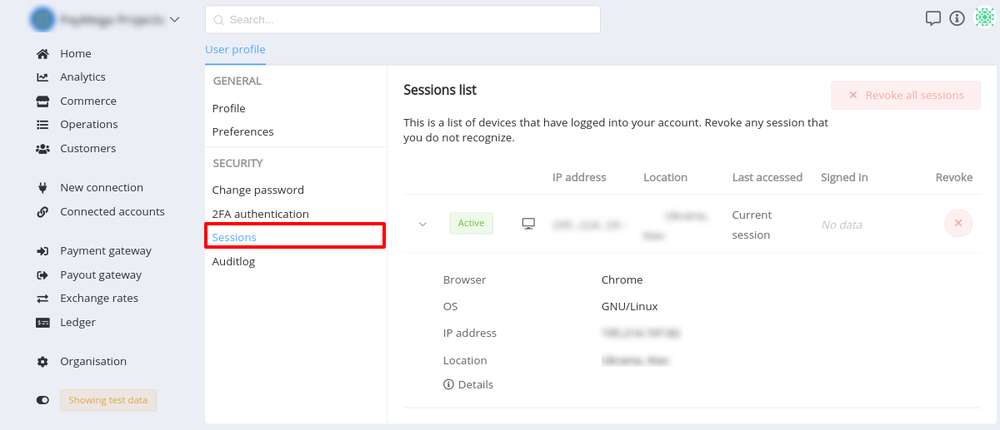

# **{{custom.company_name}} v0.56 (March 4, 2019)**

*By Dmytro Dziubenko, Chief Technology Officer*

Hello all, we have released a new version (**`v0.56`**) of [{{custom.company_name}}](http://paycore.io/). 

This major release introduces new functionality and improvements. 

It’s often helpful to know what’s happening under the hood because it gives you insight into things you cannot see. Thus in this document, we will give a brief overview of the highlights of this release.

## Summary

**`v0.56`** comes with a new platform layer above the Payment and Payout Gateways in which we centralised the common functionality and services for ecommerce for both online business and FinTech customers. 

This is a fundamental architectural restructuring which hugely simplifies and standardises the interaction and operation of your payment infrastructure in  {{custom.company_name}}. 

Major ecommerce services now are taken care of within the Commerce layer and no longer from within each Payment and Payout Gateways, making integration and interaction a much easier and leaner process.

## List of changes
    
- [Commerce feature](#commerce-feature)
- [New UI/UX](#look-and-feel-new-uiux)
    
    - [Navigation changes](#navigation-changes) 
    - [Organisation Settings changes](#organisation-settings-changes)
    - [User Profile changes](#user-profile-changes)

- [API updates](#api-updates-and-changes-for-developers)
- [Performance improvements](#performance-improvements)

### Commerce feature

- **Commerce Account**

Instead of having multiple {{custom.company_name}} accounts to support various projects or business entities now you can create as many  **Commerce Accounts**  as you require within one {{custom.company_name}} account. When it comes to running multiple businesses now you can manage them all in one place. For our FinTech and marketplace customers, this means an ability to create accounts for their merchants and manage them in one place.

- **Currency Accounts**

With  **Currency Accounts**  now is possible to create and manage currency holding accounts that give your merchants the flexibility to make and receive foreign currency payments in selected currencies without converting the funds into a base currency. For online businesses, multiple currency accounts enable to support billing in multiple currencies and consolidate transaction data made in the same currency for accounting and financial management purposes.

- **Contract Schemes**

**Contract Schemes**  are to create a set of rules comprises routing and FX-rate schemes for both ingoing and outgoing transactions in supported currencies. You need to create first a contract scheme before you'll be able to create a Commerce Account. 

This is due to requiring that every commerce account has linked to a certain Contract Scheme. Online businesses can create multiple Contract Schemes to be assigned to numerous Commerce Accounts to support different types of offerings or multiple storefronts.

 The ability to assign one Contract Scheme to any number of Commerce Accounts allows FinTechs and marketplaces to apply the same conditions mirror agreement conditions to a certain group of merchants (i.g. toy retailers or ticketing) such as available payment methods, commissions, reserves, and etc.

- **Payment and Payout Invoice**

There are three types of transactions that occur in  {{custom.company_name}}: invoice, request and payment or payout. A Payment or Payout is a low-level operation that initiates a financial transaction in the defined payment provider using the specified payment method, it simply provides communication with an external provider and the mapping of statuses. A Payment or Payout Request is an operation with rich functionality that initiates one or many payments or payouts depending on the conditions set in the routing and exchange rate schemes. A  [Payment Invoice](https://dashboard.paycore.io/operations/payment-invoices)  or  [Payout Invoice](https://dashboard.paycore.io/operations/payout-invoices)  is a high-level operation that initiates not only payment or payout request correspondingly but also Ledger account transactions. An invoice includes information on a currency, commission and exchange rate.

This new functionality allows online businesses to apply commission fee for all incoming and outgoing transactions separately for every Commerce Account. For example, Uber and Fiverr take a 20% commission rate, while Freelancer charges 10% per transaction. Transaction fees are usually the main revenue stream of any payment processor.

- **Ledger feature: taking every penny into account**

For  {{custom.company_name}} users with a limited accounting background, the Ledger feature can appear to be the most foreign part of the platform. The Ledger screen actually includes all aspects of the accounting record and based in double-entry bookkeeping: in order for an amount to be presented in one account, it must also be present in another account, hence the use of debits and credits. It is an extremely valuable tool in accounting and financial management when it comes to payment processing for third parties.

{{custom.company_name}} allows for quick processing of accounting information ‘behind the scenes’. The Ledger activities of a business are all captured in  {{custom.company_name}}, through the summation of all  [Transactions](https://dashboard.paycore.io/ledger/accounts) by particular [Account](https://dashboard.paycore.io/ledger/categories) the cash flowed to and from. Each account has an account  [Category](https://dashboard.paycore.io/ledger/categories) which determines where the account appears in your financial statements. We enable you adding or editing Categories those are divided into active and passive. Ledger feature is available for customers on {{custom.company_name}} Commerce plan, you can upgrade at any time to use this functionality. It worth to mention that Ledger feature can be enabled for any Commerce Account when required to take into account the cash flows through the commerce account.

- **Ledger: new types of transactions**
    
    **New** types of Ledger transactions are:

    - [Deposits](https://dashboard.paycore.io/operations/deposits)
    - [Withdrawals](https://dashboard.paycore.io/operations/withdrawals) 
    - [Transfers](https://dashboard.paycore.io/operations/transfers)

These new Ledger transaction types are required to take into account the financial transactions made outside  [{{custom.company_name}}](http://paycore.io/) and can be initiated manually at the moment.

!!! info
    Read more about [**Commerce**](/products/commerce/overview/)

### Look and feel: New UI/UX

We’ve started refreshing  [{{custom.company_name}}](http://paycore.io/)’s UI some time ago, and {{custom.company_name}} v0.56 brings another wave of changes in this area. 

This time, we’ve focused on improving the Payment Gateway and Payout Gateway screens supported by the recent release of Commerce functionality. 

Both payments and payouts requests or transactions are the most commonly used lists, and we always aim at making your time spent with {{custom.company_name}} more enjoyable and productive. 

#### Navigation changes

- **`Payments`** and **`Payouts`** moved to Payment Gateway and Payout Gateway sections correspondingly. Now it is more intuitive for identifying where to go for details.

    !!! info "Screenshots"
        

        

-  **`Show test data`** key moved to the bottom of the main menu, which is used to toggle between **Live** and **Test** data.
    
    !!! info "Screenshots"
        

- [Operations](https://dashboard.paycore.io/operations/) screen now includes 5 brand new tabs:  
    - Payment Invoices  
    - Payout Invoices
    - Deposit
    - Withdrawals
    - Transfers

    !!! info "Screenshots"
        
    
    Every tab will provide a list of transactions with regard to their origins.

####  Organisation Settings changes

 - We've added setting organisation level  Preferences  and  Callbacks  screens in the  [Organisation Settings](/getting-started/organisation) 

    !!! info "Screenshots"
        

####  User Profile changes

- The User Profile  **Sessions** are long-lived but now we added the screen with the list of all active sessions. They can be viewed and revoked from the  [User Profile Sessions](https://dashboard.paycore.io/user/settings/sessions) page.

    !!! info "Screenshots"
        

- The User Profile  **Auditlog**  screen shows a timeline of the types of activities that have happened to this User Profile over time. The Auditlog is always shown in reverse chronological order (newest first) with an external IP address for every activity.

    !!! info "Screenshots"
        

    Current activities being logged include:

    -   **_Security changes_** - password reset request or change, two-factor authentication enable or disable.
    -   **_Profile changes_** - any overrides or changes to user profile information.
    -   **_Preferences changes_** - changes to user-specific preferences such as localisation, date, time and number formats.

!!! info
    Get more information about the [User Profile Auditlog](/getting-started/user-profile/security/#auditlog)

### API Updates and changes for developers

The latest  {{custom.company_name}} version is chalked full of changes in everything from the user experience to under the programming hood. Along with the new Commerce and Ledger features, we have also released a new round of public and private APIs to support those products. 

The all-new [ Commerce ](https://swagger.paycore.io/#/Commerce/get_commerce_contract_payment_services) and [ Ledger ](https://swagger.paycore.io/#/Ledger/get_ledger_accounts) groups of endpoints have been released into production to support new functionality. 

In this release, we have introduced dozens of new endpoints in the  [ Public API ](http://swagger.paycore.io/)

Now every Commerce Account has its own  [Commerce Private API ](https://swagger.paycore.io/commerce/) that opens parts of backend data and application functionality within that commerce account. 

As well every Commerce Account has the [ Commerce Public API ](https://swagger.paycore.io/commerce-public/) that allows external service access. Those new APIs were introduced to satisfy the requirements for the Account Information Service (AIS) and Payment Initiation Service (PIS) elements of the EU's revised Payment Services Directive (PSD2). If you're among our FinTech customers such as ewallet or cryptocurrency exchange, there's no need to worry about compliance with the legislative requirements for APIs. 

### Performance improvements

We also made general performance improvements, aesthetic corrections and various bug fixes.
