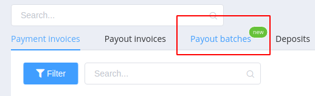
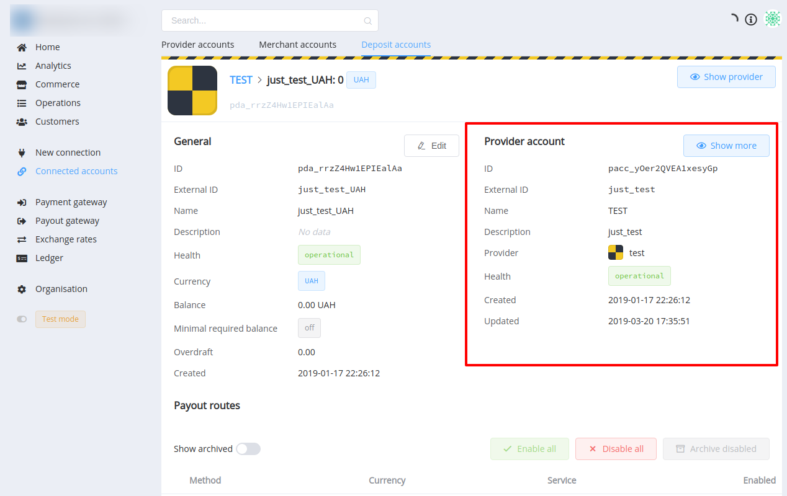
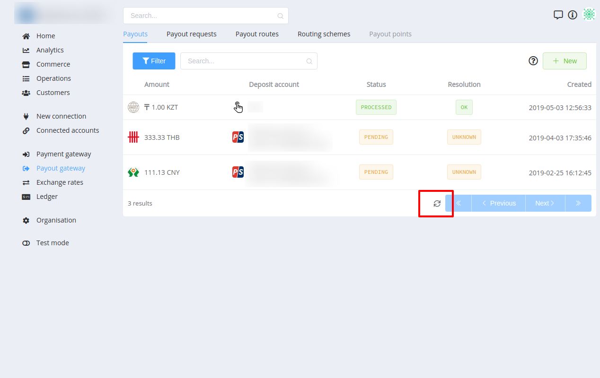
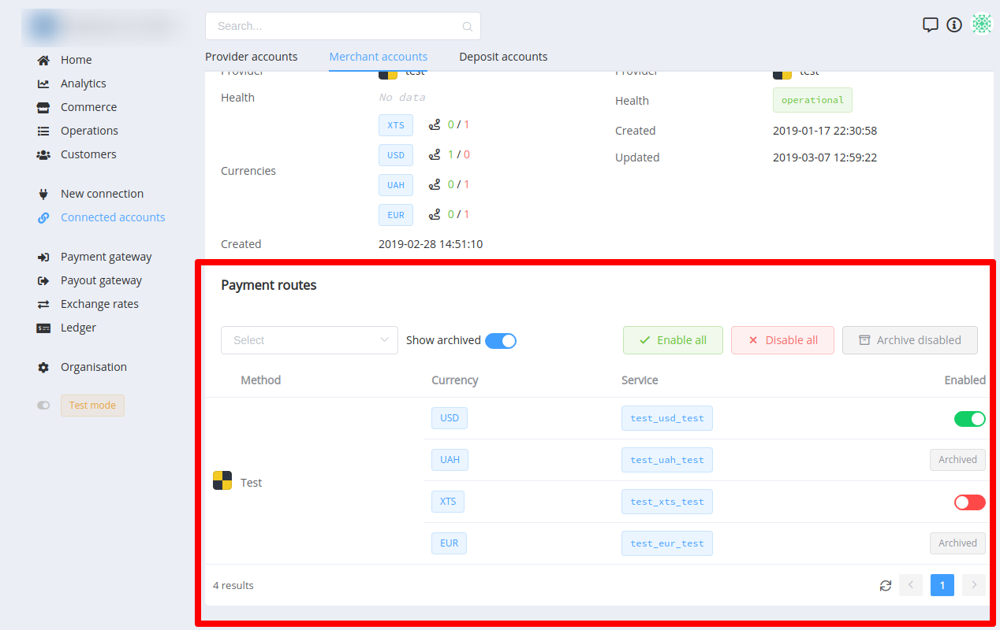
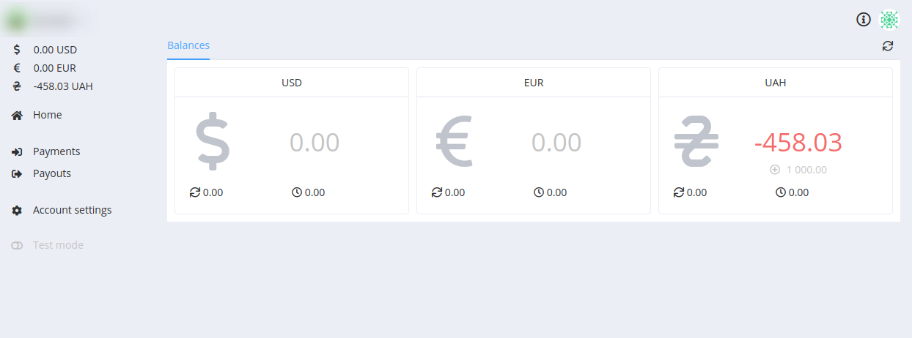

# **PayCore.io v0.59 (April 15, 2019)**

*By Dmytro Dziubenko, Chief Technology Officer*

Greetings! We're constantly working on the improvement of your PayCore.io experience. This minor software update focusing mostly and bug fixes, security fixes, UI/UX and performance improvements.

## List of changes
   
- [Platform-wide search](#platform-wide-search)
- [UI/UX updates](#uiux-updates)
- [Analytics upgrade](#analytics)
- [Merchant Portal application update](#paycoreio-merchant-portal)
- [Telegram Bot upgrade](#telegram-bot-upgrade)
- [New Integrations](#new-integrations)
- [Bug fixes](#performance-improvements)

### Platform-wide search

- Added Commerce entities
- Updated search by Reference ID

### UI/UX updates

#### Layout

- New functionality is now marked with a label 'New'.

    

- Upgraded navigation by related entities — now part of the main information is displayed on screens of related entities.

    

- Table data refresh without reloading the whole page.
    
    

- Data grids are more informative now. We added some extra columns to the certain data grids.

#### Features

- Merchant and Deposit accounts: added a list of routes and management capabilities to control them.
- Payment and payout route management capabilities were enhanced that means you can archive, enable or disable all the routes.

     

- Added **`Reconnect`** button for Provider/Merchant account - the feature polls the provider's API in order to retrieve the updated information. As well you can now change the account credentials if they are invalid or has been invoked. 
- The **auto-refresh** feature has been added to the Batch Payout details screen.
- Added localisation and formatting for numbers depending on the currency (the number of digits to the right of the decimal point).

#### Deprecates

The **Payment Page** and **Payout Point** have been deprecated. 

We've disabled these features for the new signups and the features will be removed for existing accounts in a future update to v 1.0. 

The deprecation period for these changes began on **01 June 2019**. Please contact our technical support to provide you with a migration path to the new REST APIs.

### Analytics

PayCore.io Analytics now supports all Commerce service functionality. 

Using SQL queries you can extract information from your database for incoming and outgoing invoices and batch payouts, commerce schemes, commerce account balances, as well as the other entities, were previously supported.

### PayCore.io Merchant Portal

- The **Balance** page was added.

    

- The **balance auto-update** feature has been added to allow you to automatically reload your account balance every 30 seconds.

### Telegram Bot upgrade

- Added an ability to **switch between connected accounts** (organisations).
- **Recheck the balance** is one of the most useful features: all the commerce accounts are rechecked and all the balances are recalculated. - Use this feature any time you think something might be wrong.
- Bug fixes (connection/shutdown).

### New Integrations

We have established a new integration with:

- [Neteller](https://www.neteller.com/)
- [Tranzzo](https://tranzzo.com/)
- [Parimatch](https://parimatch.com/)
- [Piastrix](https://piastrix.com/)

For a list of all available integrations, please visit [Payment Providers](https://dashboard.paycore.io/connect-directory/payment-providers) page.

### Performance improvements

We also made general performance improvements and various bug fixes.

