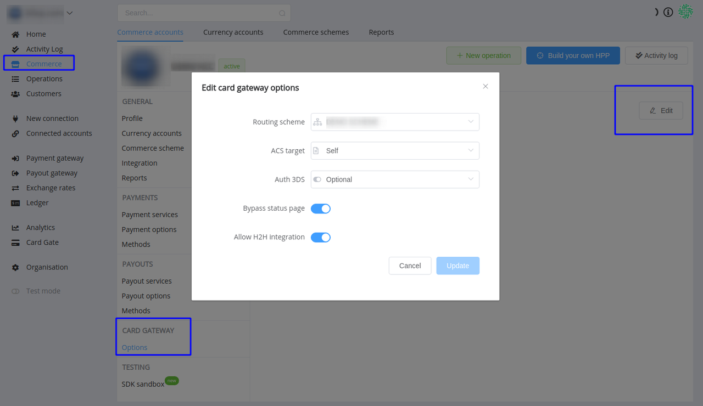
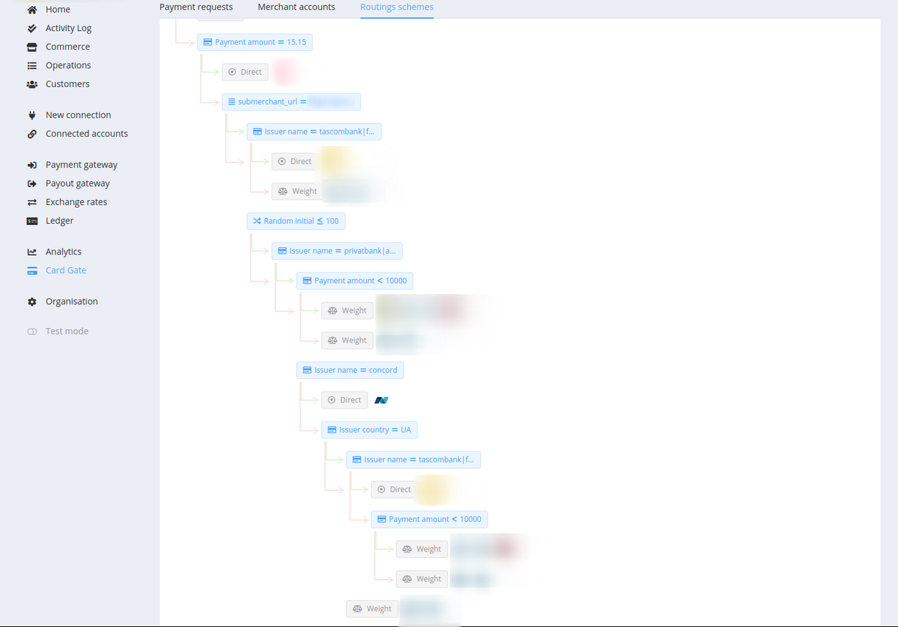
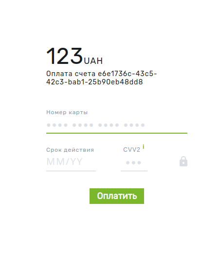
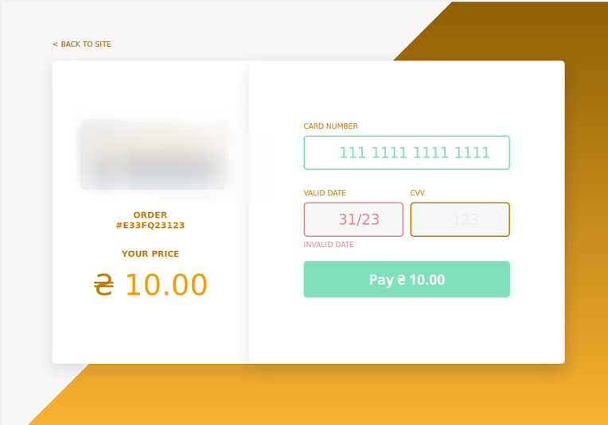
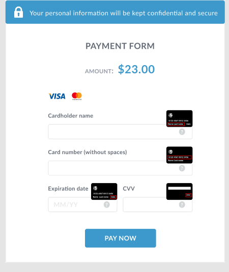

# **PayCore.io v0.60.25 (August 9, 2019)**

*By Dmytro Dziubenko, Chief Technology Officer*

Cheery Greetings from [PayCore.io](http://paycore.io/)!

Our dev team continues working on system enhancements.

## List of changes

* [Global search re-launch](#global-search-re-launch)
* [Card Gate improvements](#card-gate-improvements)
* [Commerce upgrade](#commerce-upgrade)
* [Layout upgrade](#layout-upgrade)
* [Performance improvements](#performance-developments)

## Global search re-launch

We progressed the productivity of our search modules and re-launched full directory search. Search results are displayed in a convenient grid form on a separate page and grouped by sections.

## Card Gate improvements

* Added the new section in the Dashboard for Commerce Card Gateway options. You can attach to the Commerce account required routing scheme, turn on bypass status page and allow host-to-host integration.

* Support multicurrency in organisation settings.

* Added helpful visual presentation of Routing schemes

* Activated the possibility of creating customised Hosted Payment Page (HPP) in your original design. Here are some implementations:

  

* Also, now Event messages can be simply handled on the parent HPP without saving sensitive customer data on your side.

## Commerce upgrade

### Forced 2FA Authentication

We paid a lot of attention to the safety of your payments, so we added an extra level of security for your Deposit, Withdrawal, and Transfer transactions. Now you can initialise these type of transactions only after confirmation from your mobile device.

Friendly remind that you can enable 2FA in account preferences → [User profile settings](https://dashboard.paycore.io/user/settings/two-step-verification).

### Private API upgrade

You can submit `return_url` in the `payment_invoice` request.

## Layout upgrade

Operating the dashboard data has proved to be easier: we added new filters for Customer and Commerce accounts.  Now you can filter your Commerce accounts by Commerce scheme, date of creation, and moderation status.

## Performance developments

We also made general performance improvements and various bug fixes.
