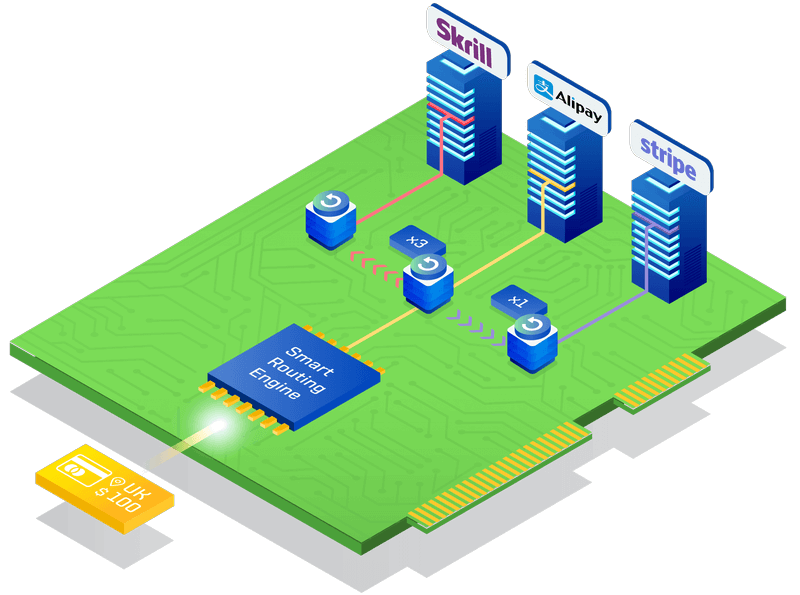

# **PayCore.io v0.60.37 (August 23, 2019)**

*By Dmytro Dziubenko, Chief Technology Officer*

Happy Friday mood from [PayCore.io](https://paycore.io)!

It was a hot week, and we're putting the full force of our team behind the fixes and system improvements. Most of them are under the hood, but you may have noticed the platform's speeding up.

And without any further ado, let's move on to the list of changes.

## Highlights

* [Cascading launch](#cascading-launch): the key technology to support executing transactions through the alternative gateway now available for testing
* [Ledger betterment](#ledger-betterment): boosted up and optimised processes
* [New integrations](#new-integrations) with Decta and SafeCharge
* [Bug fixes](#bug-fixes). A batch of irritating bugs was found and cleared!

## All Updates

### Cascading Launch

One of the key features of Smart Routing has been launch for testing! 

Cascading is the technology that supports executing transactions through the alternative gateway if the primary channel is unavailable. The process is invisible to your customers but helps guarantee a higher success rate in processing payments and better revenue stream. It also protects your transactions loss because of a disruption to the acquirer services.

So we're all excited to introduce Cascading to reroute your payments and payouts in cases of declined transactions and provider inaccessibility.

### Ledger Betterment

We know that for the users, the ledger is the most puzzling section of the platform. But it is a vital part of the process, and we put a lot of effort into performance improvements and enhancing the links inside the system.

*As a soft reminder to our customers, Ledger screen is available on PayCore.io Commerce plan*. And after the activation, you can organise debit and credit accounts to suit your needs better for accounting and financial management.

### New Integrations

This release includes new integrations with:

| Provider | Name  | New features | How to connect |
|:-:|:-:|:-:| :-:|
|  | Decta | Host-to-host | [Step-by-Step](/connectors/decta/) |
|  | SafeCharge | Host-to-host | [Step-by-Step](/connectors/safecharge/) |

For a list of all available integrations, please visit [Payment Providers](https://dashboard.paycore.io/connect-directory/payment-providers) page.

### Bug Fixes

It is essential for us to promote the smooth running of the service, so this week we also worked hard on fixing and preventing bugs. Sorry about your previous frustration in case you mention a small degree of system instability.
