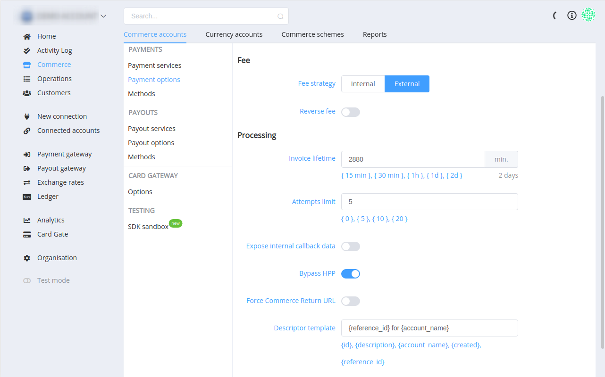
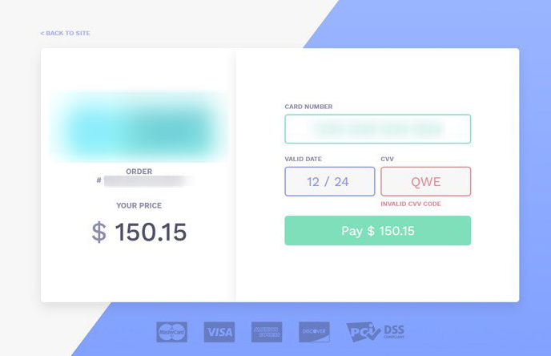
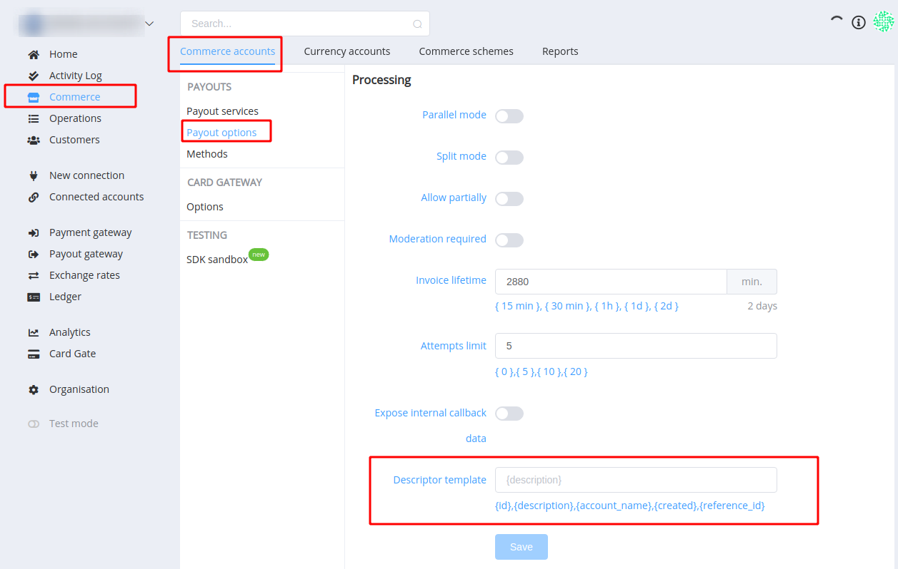

# **PayCore.io v0.60.41 (August 30, 2019)**

*By Dmytro Dziubenko, Chief Technology Officer*

Cheery Greetings from [PayCore.io](https://paycore.io/)!

We keep working to improve our product, and here is an update on what our dev team has been achieving in the last week.

Summer is going to end soon, and in hindsight, we were more than efficient in the integration of new connectors and technologies this season. Now is the time to focus on support and system enhancements.

## Highlights

* [Payment Retry feature is added](#payment-retry-feature): to retry incomplete or refused payments without leaving the payment page
* [Commerce improvements](#dynamic-descriptor): added a dynamic descriptor to the payment
* [Integrations Update](#integrations-update): supporting new features
* [Bug fixes](#performance-improvements). A batch of irritating bugs was found and cleared!

## All Updates

### Payment Retry Feature

The most common reasons for card payments declines are incorrect card number or expiration date, insufficient funds, acquirers fraud rules blocked the transaction, including based on customer's location. Usually, customers can solve these problems quickly and continue the payment. Payment Retry Feature allows your customers to enter or update payment information, and to retry the incomplete or refused payment without leaving the payment page. If the payment cannot be processed due to some error, the resulting page displays the error that occurred along with an explanation. It helps to understand the problem and the ways to solve it.

### Dynamic Descriptor

The descriptor is the text that your customer sees on their bank account statement. We added the possibility to generate the descriptor with e.g. an order number for improved customer service and recognisability. The more recognisable your descriptor is, the less risk you have of receiving disputes (e.g. chargebacks). Go to the *Commerce* section → *Commerce accounts* settings → *Payment options*/*Payout options* → *Descriptor template*.

Use order parameters in braces to add their values to the template.

*The Dynamic Descriptor feature is currently available for Decta, CardPay, and Fondy. We're working to extend the list.*

### Integrations Update

This release includes integrations update:

| Provider | Name  | New features | How to connect |
|:-:|:-:|:-:| :-: |
|  | Decta | Support for cascading technology | [Step-by-Step](/connectors/decta/) |
|  | ePay | Payouts | [Step-by-Step](/connectors/epay/) |
|  | Piastrix | Host-to-host, payments | [Step-by-Step](/connectors/piastrix/) |

For a list of all available integrations, please visit [Payment Providers](https://dashboard.paycore.io/connect-directory/payment-providers) page.

### Performance Improvements

We continue developing quality improvements and made numerous fixes all across our platform.
