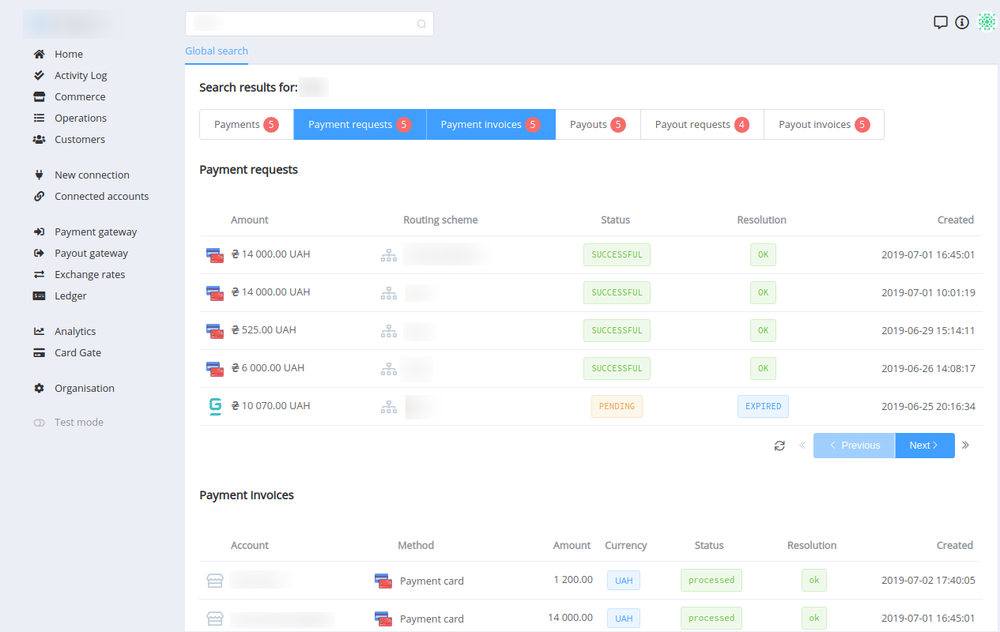
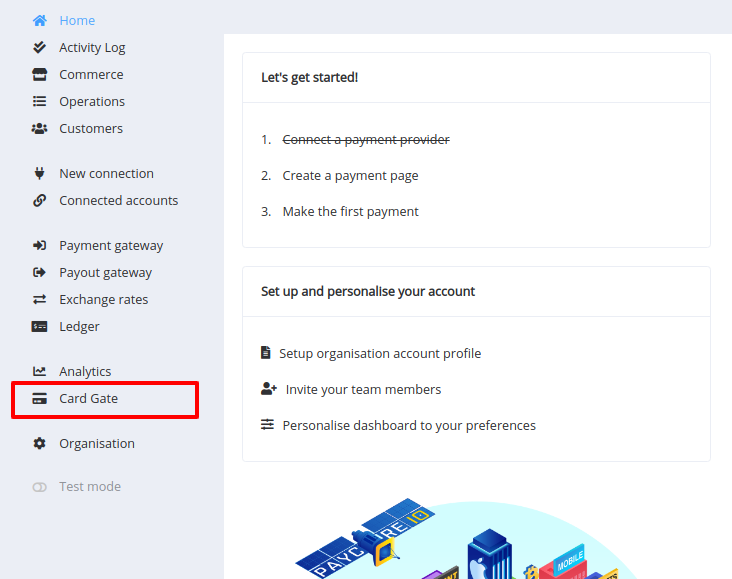
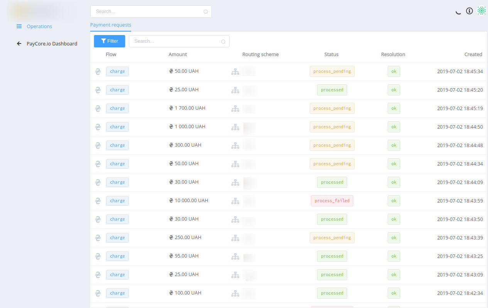
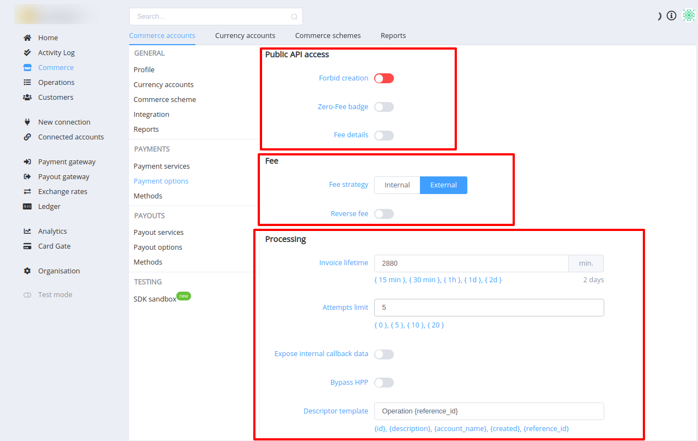
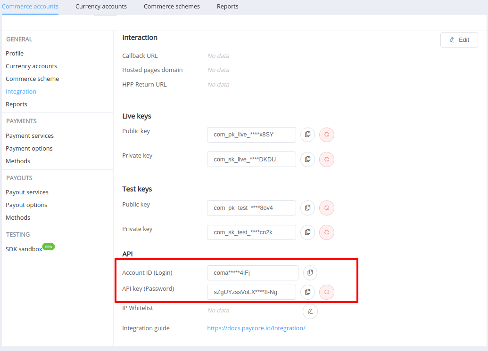
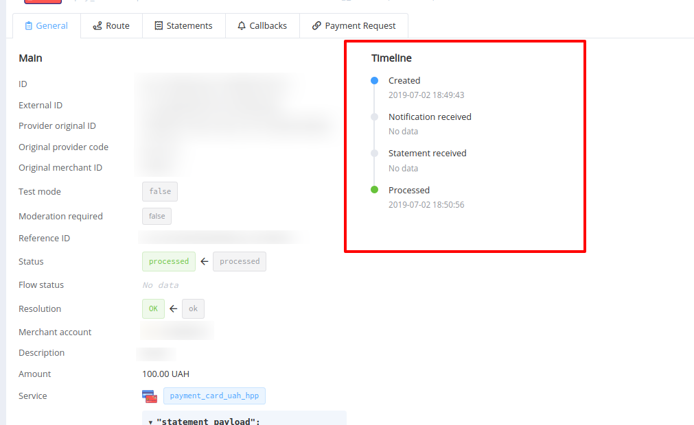
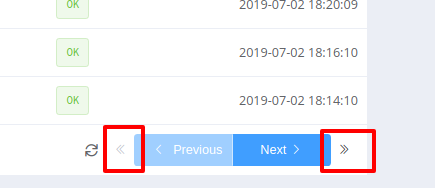
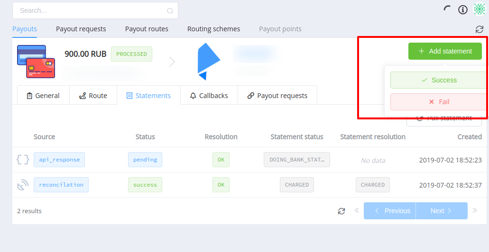

# **PayCore.io v0.60 (July 1, 2019)**

*By Dmytro Dziubenko, Chief Technology Officer*

Hello all, most of the features we promised for v0.60 are ready, though, including the platform-wide search, new Hosted Payment Page for Commerce. As we continue to improve PayCore.io, we bundle our fixes, improvements and new features in this massive minor update release notes. 

## List of changes

- [Platform-wide search upgrade](#platform-wide-search)
- [Commerce HPP Released](#commerce-hosted-payment-page)
- [CardGate is added to the Dashboard](#cardgate)
- [New features released](#features)
- [Layout upgrade](#layout-and-uiux-enhancements-and-updates)
- [Merchant Portal application update](#paycoreio-merchant-portal)
- [Bug fixes](#performance-improvements)

### Platform-wide search

- Advanced search is finally released. Now, you can search for transactions by ID or external ID you supplied regardless of transaction origins.
- Search results are displayed on a separate page. Each result displayed on the page normally includes an amount, a merchant or deposit account name, transaction status, resolution, time and date. By clicking on a search result you'll be pointed to the actual transaction.
- Search results are displayed as filtering buttons by transaction origins each with the counter of occurrences.

### Commerce Hosted Payment Page

It's now possible to integrate a hosted payment page on any client using a specially designed widget, or simply pass the link for payment to your client. Everything you need is a public API key of the commerce account along with some invoice data the will be created. 

Before taking your integration live, make sure that your application is tested thoroughly in the Sandbox. You can enter our dashboard to play with settings and parameters in the Sandbox and to get a feel for your hosted payment page experience before completing your integration. 

Also, you may use our JavaScript widget for building payment flows in different environments with a few clicks by simply copying the configured look and feel from the Sandbox to initiate a payment page.

### CardGate

- **CardGate** is now available in the main menu.
- The list of **payment request** with included lists of payments and transaction has been added. 
- CardGate's and acquirers' **transaction IDs** along with their appropriate **business IDs** are listed in every payment and can be found in the Dashboard.

### Layout and UI/UX enhancements and updates

- **Russian** localisation has been updated.
- Now we also support **Ukrainian** following recent changes in the legislation.
- Integration options for a **Commerce Account**:
    - Changed sections order - the Integration section is now listed first.
    - API settings of Integration section were added Account ID (Login) option and the link to the integration guide.

    

    

- A **Timeline** labelled with dates and times has been added for each transaction showing the events log.

    

- **Cursor** based pagination now has 4 controls: first, previous, next, and last.

    

### Features

- **Navigation**. Use Ctrl + left or by clicking the middle button of the mouse to open the menu section in a new tab.
- Click **Refresh** icon if you need to refresh a list or a transaction overview. Previously, the data refreshed every time you opened a page, causing a delay while it checked for changes. So, we have added the button to refresh the following content:
    - A Commerce transaction details;
    - A Payment Gateway or Payout Gateway transaction details;
    - The list of Live Exchange Rates;
    - A Provider, Merchant or Deposit account details and the available routes list.
- **Manual Statements (Both Payment and Payout Gateways )**. Now you can manually change the status of a payout transaction to 'Success' or 'Fail'.
    - Success means the transaction was successful (status = success, resolution = ok). You may set External ID and Description with a comment of the reason for every transaction. 
    - Fail means the transaction was unsuccessful. Now you may set its Status, Resolution, External ID, and Description details.

    
    
- **Manual Payout Statement request**. We have added an option to manually request the account statement from your payment provider to update the payout transaction details and status.
- **Deleting Merchant Account**. Users now have the ability to delete a connected Merchant Account. If no single transaction occurred for this merchant account you may remove it from the platform.
- **Cloning Routing Scheme**. Now you can clone routing schemes. Cloning simplifies the operations management of multiple Commerce Accounts if there is a need to slightly change the routing scheme and apply to another Commerce Account.
- **Download option for Batch Payouts**. Download option for each batch payout is provided for your convenience. You can simply download a CSV file, play with data and upload to make a large batch payout.
- **Payout Routing Scheme rule engine**. Henceforth, the new rule is **disabled** by default when created and arranged as the **last item** of the list.

### Security

**Activity Log**. You can find Activity Log in the navigation bar. It contains logs of users' activity within your organisation. 

**Password Change**. Changing the password will invalidate all active sessions

### Miscellaneous Changes

- The option **Allow public creation** (go to _Commerce Account_ > _Payment options_ > _Public access_) has now the opposite meaning (**Forbid creation**), and its default value is accordingly opposite (turned off by default). This option forbids the creation of invoices through the Commerce Public API. You still have an ability to create invoices through the Commerce Private API.
- Contract scheme is now named 'Commerce Scheme' to prevent possible confusions.
- The name of the **bank_card** service has been altered to **payment_card**.
- The name of the **Watcher** system role was changed to **Viewer**.

### PayCore.io Merchant Portal

- Large Batch Payouts functionality has been added.
- The registration processes for PayCore.io Merchant Portal has now required an email confirmation when registering over the invitation sent to the email.
- Ledger transactions list has been added (_Deposits_, _Withdrawals_)

<!--
### New Integrations

We have established a new integration with:

- Paylink;
- Geo Pay (v 2.0 support);
- Manual Connector for semi-automation of SWIFT transactions (manual entry only as for now).
- Paylogic
- Leogaming
- Concord Bank
- Odysseq
- Procard
- GlobalMoney
- Easybits

For a list of all available integrations, please visit [Payment Providers](https://dashboard.paycore.io/connect-directory/payment-providers) page.
-->

### Performance improvements

We also made general performance improvements and various bug fixes.

