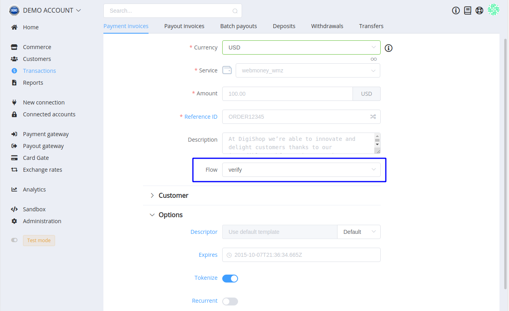
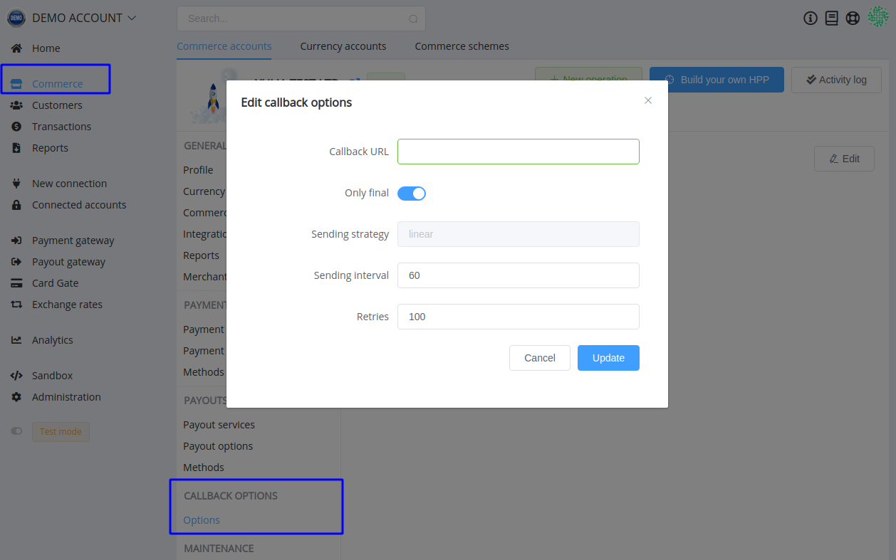
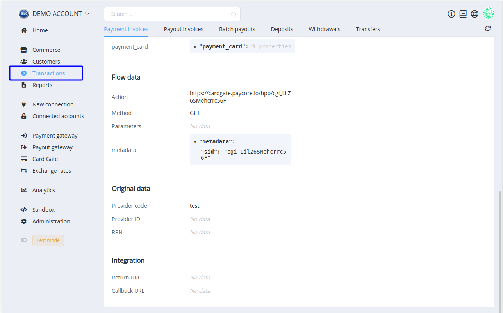

# **PayCore.io v1.10 (March 11, 2020)**

*By Dmytro Dziubenko, Chief Technology Officer*

Cheery [PayCore.io](https://paycore.io/) greetings to all of you! It's time for Version 1.10 now!

??? info "We updated approach to publication our release notes"
    We changed notes' frequency, linked them with release dates of the platform's major and minor versions and skipped patch versions. Mostly, our dev team releases updates every second Wednesday in the evening so that you may wait for information about the latest news on the same day.

The main upgrade of this release is the ledger division. Early, we faced the problem when a massive flow of activities in one commerce account might block transactions throughout the organisation account. We have eliminated it when separated ledger processes on commerce accounts. That eased the burden on the system and increased the general performance of our platform.

To know about other updates, check the list below.

## Highlights

* [Card Gate upgrade](#verify-flow): added flow for card verification
* [Commerce improvements](#commerce-improvements): added possibility to set up Callbacks' options, filtered archived currency accounts
* [Dashboard betterment](#expanded-transaction-overview): expanded information about payment
* [Performance improvements](#performance-improvements)

## List of Changes

### Verify Flow

Card verification allows you to accept, tokenise, and verify a cardholder's payment information without actually billing the customer for a charge. It is especially useful if you're offering a trial period for a product or service, or if you give your users the possibility to link their cards with the application.

After authorising, the card payment is not complete until capturing. So, in Verify Flow, payment with the verification request will be voided and won't affect your balances.

### Commerce Improvements

We moved callbacks' options to the separate section in the Commerce settings. Also, we added the possibility to set up delays between Callbacks' requests and the number of attempts to receive the final status of the payment invoice.

Additionally, you can avoid receiving unnecessary messages in Callbacks by toggling the "Only final" statuses option.

And another minor commerce update: we no longer displayed currency accounts that linked with archived commerce accounts. If you require information about them, unarchive the related commerce account.

### Expanded Transaction Overview

We added Flow Data, Original Data, and Integration sections to the payment invoice overview (and you know what to do with them).

### Performance Improvements

We have successfully improved our products' performance, identified and effectively fixed various types of bugs.

Stay tuned for the next updates!
