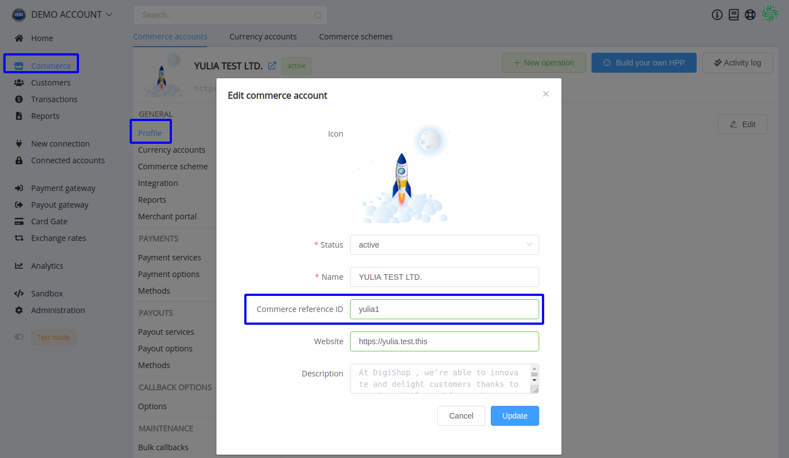
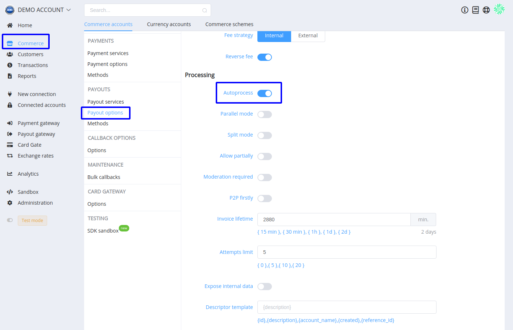
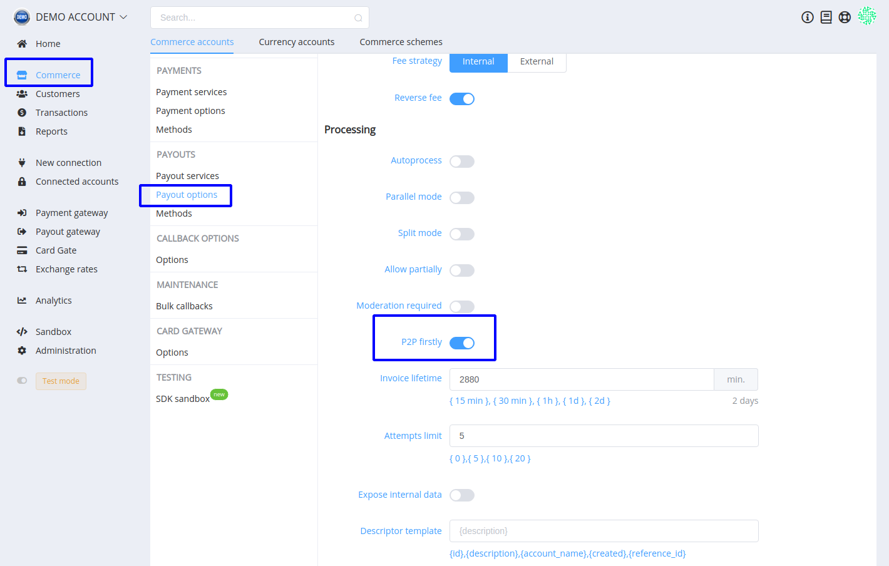
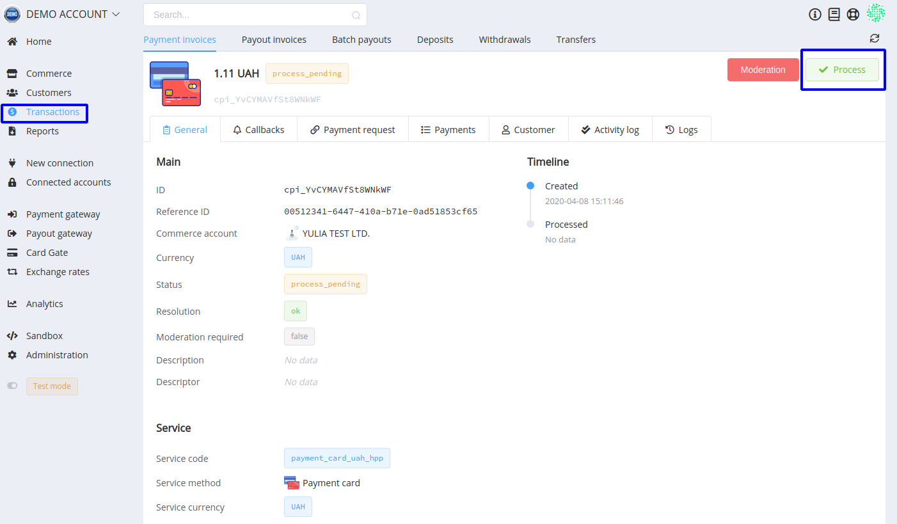
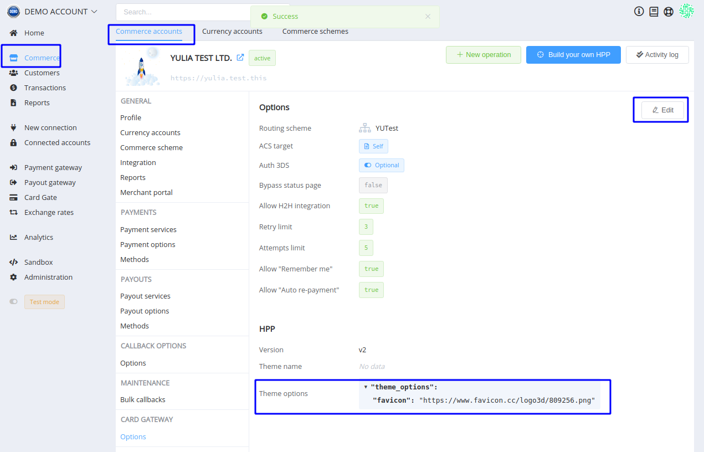
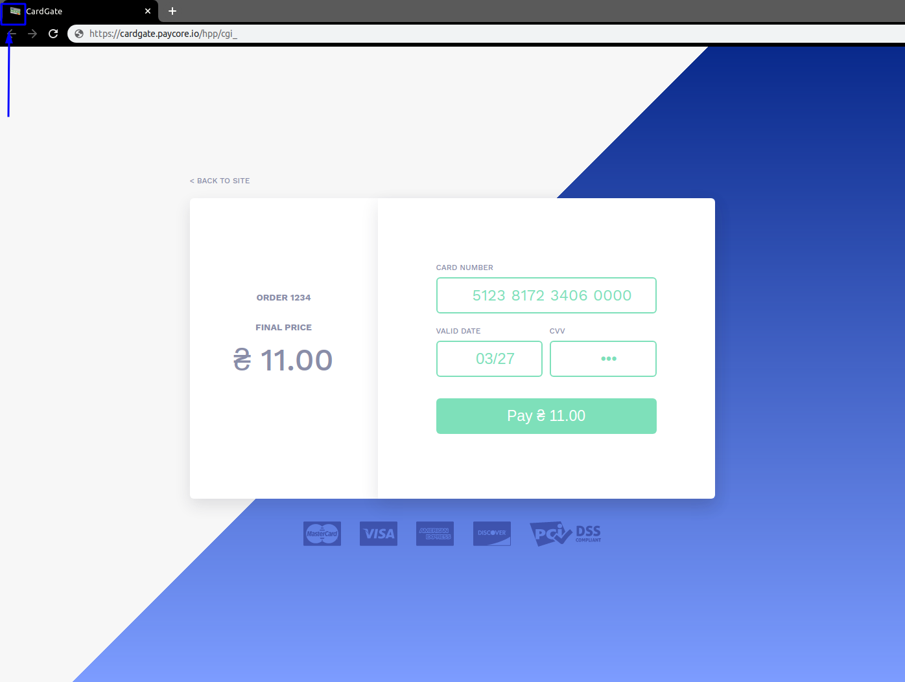

# **PayCore.io v1.12 (April 10, 2020)**

*By Dmytro Dziubenko, Chief Technology Officer*

Cheery Friday Greetings from [PayCore.io](https://paycore.io/)!

April is pleasant and sunny, and as much as it hurts to spend it indoors, we keep working patiently to improve our product. And here is what we have shipped through the last two weeks!

## Highlights

* [Commerce Improvements](#commerce-improvements): added Reference ID for Commerce Accounts, Autoprocess and P2P-firstly strategy to the Payouts options, enabled process pending transactions from the Dashboard, added custom favicons for HPP
* [Integration Updates](#integration-updates): Concord Bank Google Pay UI Flow, Xpate Payouts, XPAY 1-stage Payouts
* [Bug Fixes](#bug-fixes)

## List of Changes

### Commerce Improvements

We have a lot of upgrades for this section so let's get right to the point!

#### Reference ID for Commerce Account

Commerce reference ID replaces the System commerce ID in the database. This field is not strictly mandatory, but human-readable and easy-to-remember ID enables a quick search and operating with [*Analytics*](/release-notes/v0.59/#analytics) queries.

#### Payout Autoprocessing

When selected, this option permits to skip additional confirmation at `/payout-invoices/{id}/process` endpoint and to process payouts automatically after creation.

#### Structuring P2P Routing Strategies

If you choose using P2P firstly option, you prioritise P2P routes in payout schemes. But if you have more than one p2p routes in the scheme, to select between them, the strategy is applied according to the current rules.

#### Process Pending Payments

If you have pending transactions due to provider technical failures or something, you can retry their processing from the dashboard.

!!! note "Please note"
    This command does not automatically assign the transaction a successful status, but only puts it in the queue for re-processing.

#### Custom Favicons for HPP

From now on, you can customise one more small but significant element in your HPP theme. To replace default icon by your one, use `favicon` as key and a link (in the URL format, such as `https://...`) as a value in the *Theme options*.

And this little extra sign is ready for checkout process!

### Integration Updates

| Provider | Name  | New features |
|:-:|:-:|:-:|
|  | [Concord Bank](/connectors/concordbank/) | Google Pay UI Flow                                         |
|            | [xpate](/connectors/xpate/)                  | Payouts                          |
|           | [XPAY](/connectors/xpayua/)                  |  1-stage Payouts (direct card payment bypassing a virtual wallet)                            |

### Bug Fixes

We put many efforts on performance betterment and hope you mentioned the enhancement of the platform's productivity  (but not that annoying bugs that we have fixed so far).

Stay tuned and have a great weekend!
