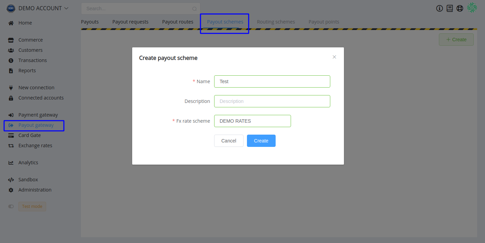
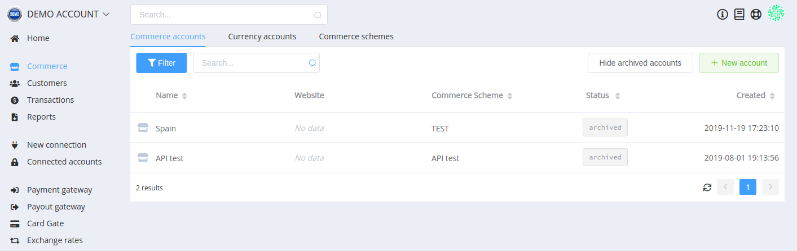
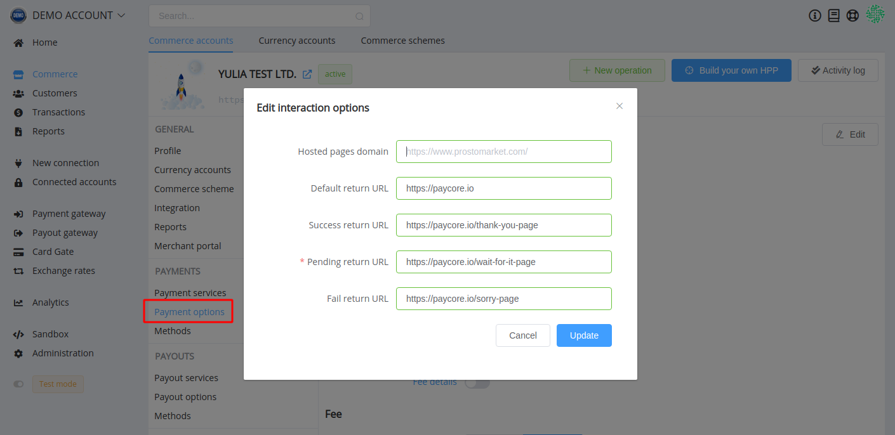
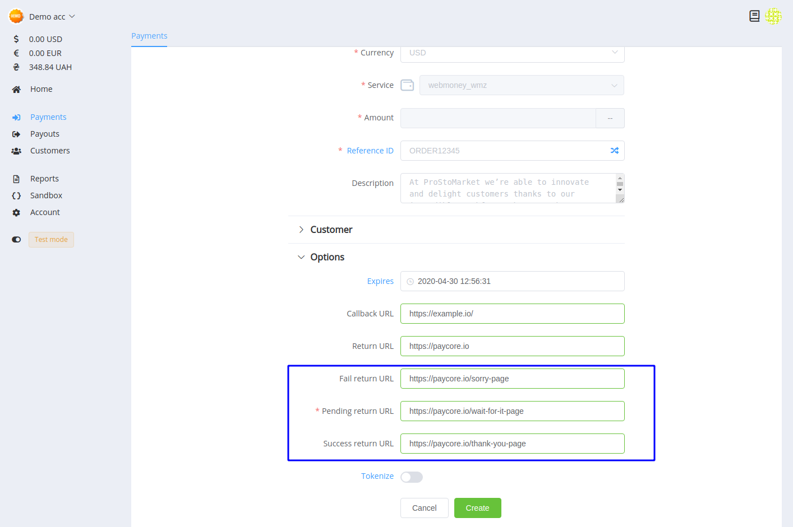
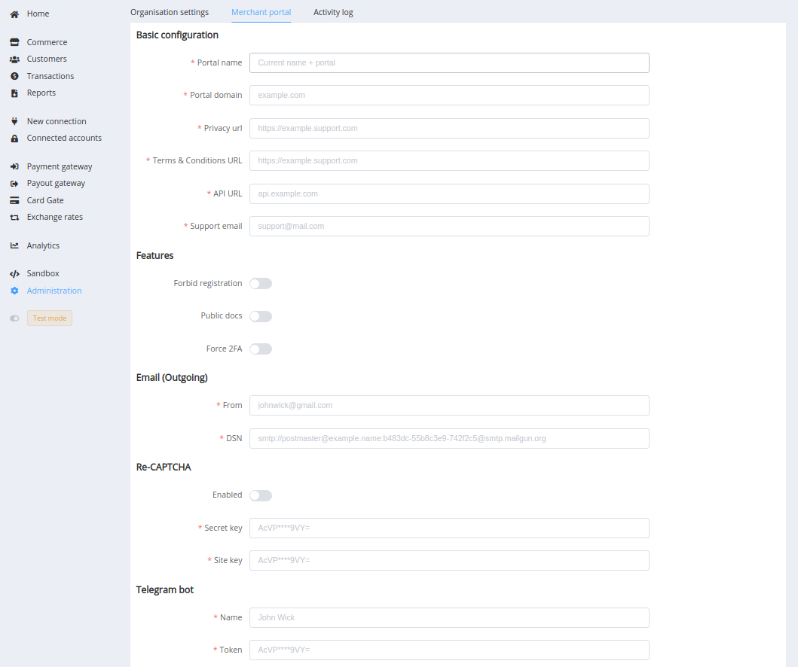
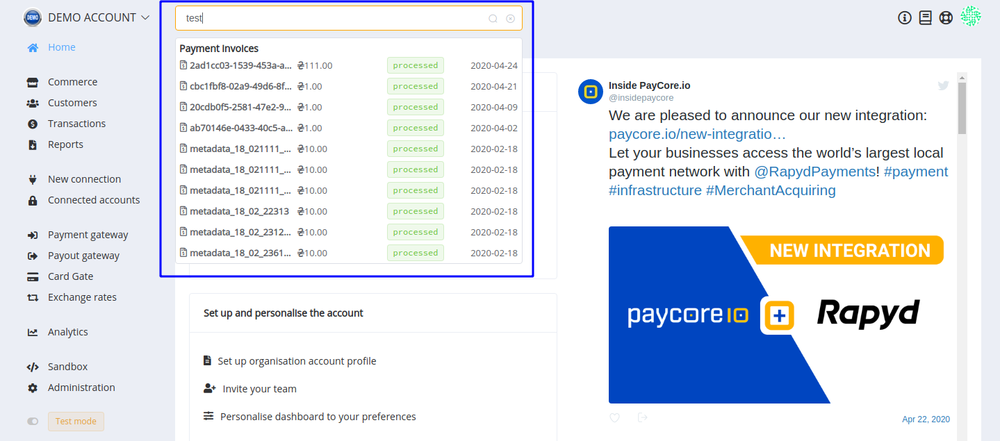

# **PayCore.io v1.13 (May 14, 2020)**

*By Dmytro Dziubenko, Chief Technology Officer*

Cheery Mid-week Greetings from PayCore.io!

We take our clients' requests seriously, especially when it comes to updating our product. So, let us provide insight into what we've been developing inspired by your needs and wishes.

## Highlights

* [Payout Schemes](#payout-schemes): improved payout routing
* [Tokenisation process upgrade](#tokenisation-process-upgrade): separated two types of tokens
* [Updates for Commerce account management](#updates-for-commerce-account-management): functionalities for archiving accounts and for setting up different Return URLs from the dashboard; also, updated Merchant Portal settings
* [Dashboard UX Betterment](#dashboard-ux-betterment): a full-text search launch
* [HPP Update](#hpp-update): change localisation key
* [Bug Fixes](#bug-fixes)

## List of Changes

### Payout Schemes

We are gradually improving our approaches to transactions' routing. In the new version, we have significantly extended the functionality of the payout routing scheme and created a new component named the *Payout Scheme*. Find a new tool in the *Payout Gateway* section.

The benefits of the Payout Schemes' implementation are:

* improved routing and fine-tune managing of route selection
* the possibility to configure a backup processing plan with the strategy cascade
* and the possibility to create the scheme of blockages that allows rejection of payouts based on transaction attributes

!!! note "Please note"
    The Payout Schemes have the `test_mode` parameter. So that to test and then use them, you need to create both&mdash;test and live&mdash;schemes (pay attention to the mode change toggle).

### Tokenisation Process Upgrade

And another internal improvement: we separate two types of tokens. Now we have public tokens for using in the Checkout process with the *Remember me* option—and private tokens for card predefining and write-offs.

This update does not affect the integration processes for our clients but allows us to speed up the interaction between the platform components.

### Updates for Commerce Account Management

#### Archiving Accounts

Our dev team cleaned up the *Commerce* section and added functionality for archiving accounts that already not in use. Their data is stored in a separate tab, and you can always find, view and unarchive them if necessary.

#### Setup of Different Return URLs

As an extension for [this API update](/release-notes/v1.6.12/#return-urls-variations), we have added a relevant block to the integration options.

And you can find the same options on the *Merchant Portal* when the *New Payment* is creating. They are automatically filled in according to the Commerce account settings, but you can modify their value in invoice.

#### Update Settings for Merchant Portal

We analysed the use of settings for Merchant portal creation, then streamlined the existing and also added some new ones, in particular parameters for custom API URLs and legal documents.

### Dashboard UX Betterment

We launched a full-text search and updated the database so that all newer and older transaction data are presently available for search.

### HPP Update

If you customise our Hosted Payment Page, pay your attention to localisation parameter: we have replaced its key `language` by `locale`. In so doing, its value remained the same: you need to use the ISO 639-1 code of one of the predefined languages.

### Bug Fixes

We are polishing up our platform now, so it's not surprising that we find a lot of tiny things that can be developed or fixed. And thank our clients for help in these improvements!

Feel free to contact us via [e-mail](mailto:support@paycore.io) or your account at [Jira service desk](https://support.paycore.io) and stay tuned for the next updates!
