# **PayCore.io v1.14 (June 9, 2020)**

*By Dmytro Dziubenko, Chief Technology Officer*

Cheery Greetings from [PayCore.io](https://paycore.io/)!

These notes provide a brief overview of the new features, enhancements, and other significant changes introduced in the release 1.14 of our platform.

## Highlights

* [Commerce Enhancements](#commerce-enhancements): added possibility to withhold part of the funds before releasing to the merchant and to include the minimum required balance for the currency account; restrictions on transfers between commerce accounts, and resolutions related to payout schemes usage
* [Merchant Application update](#merchant-application-settings-update): added custom roles to account settings and the session limit to Merchant Portal configuration
* [Card Gate Update](#card-gate-update): added metadata modifier; a cap limit increase to 100,000 UAH for payouts; bank transfers can be used for manual payouts
* [And other minor performance improvements](#performance-improvements)

## List of Changes

### Commerce Enhancements

#### Rolling Reserve

What is a *Rolling Reserve*? A rolling reserve is a type of reserves that withholds a small percentage of all of a merchant’s gross sales in a non-interest-bearing account for a predetermined amount of time before releasing the funds to the merchant. Payment processors may use rolling reserves as a risk management tactic for high-risk merchant accounts.

You can set up the reserve rate (in percentage) and continuance (in minutes) for every commerce payment service you use.

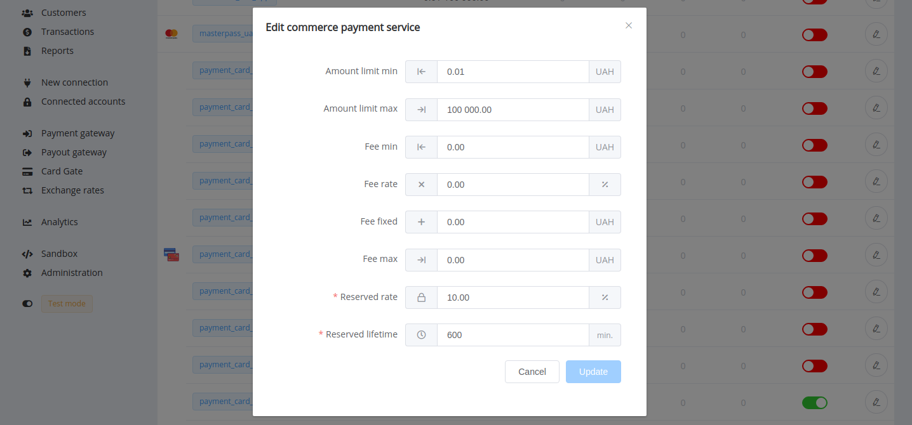

After turning-on reserve, these services are marked with a clock icon in the service scheme's list. Move the mouse over the icon to see a tooltip about percentage and expiry date of reservation.

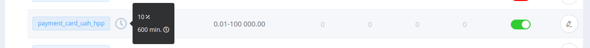

When we have carried out transactions using the service with rolling reserve included, the reservation data is displayed in the General overview of the corresponding payment invoice.

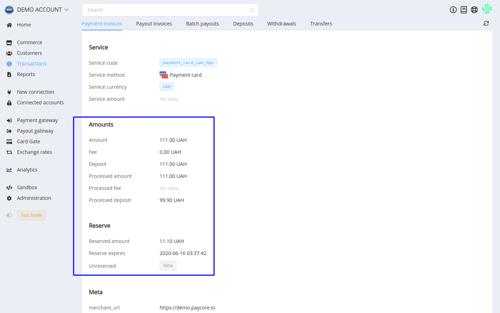

You also can unreserve the funds manually before the expiry of the reservation. Click on the *Actions* button to unwrap the sub-menu and find the function.

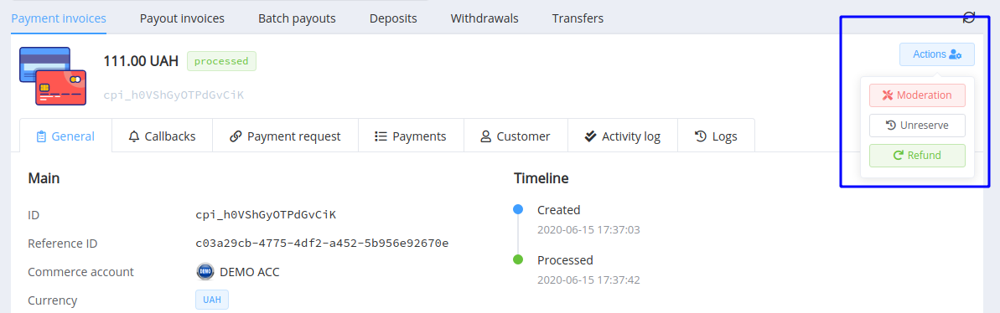
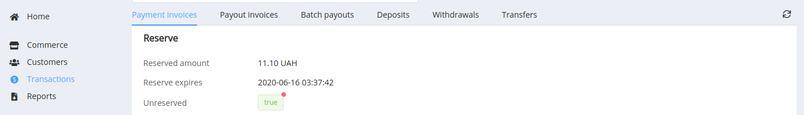

#### Minimal Required Balance

The Minimal Required Balance (**MRB**) is a reserve that cannot be taken out from the *Merchant Portal*. MRB can be extra saves for your merchant funds in the relevant currency. To use, you should set it for each currency account separately in *Commerce* --> *Currency accounts* settings.

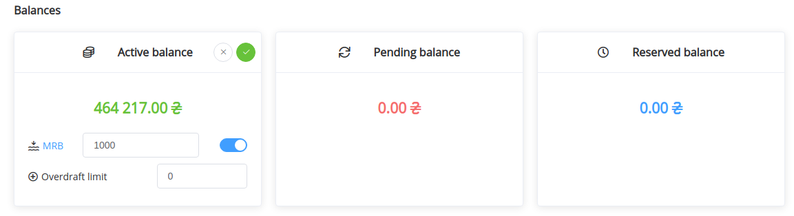

If MRB is set or become after manual withdrawals higher than the active account balance, the amount will be highlighted in red.

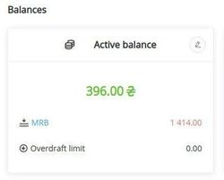

#### Transfers between Commerce Accounts

Merchants can operate with fund transfers between their accounts. And to fully use this option, you should specify accounts for transfers 'from' and 'to' defined commerce accounts in the *Commerce* settings.

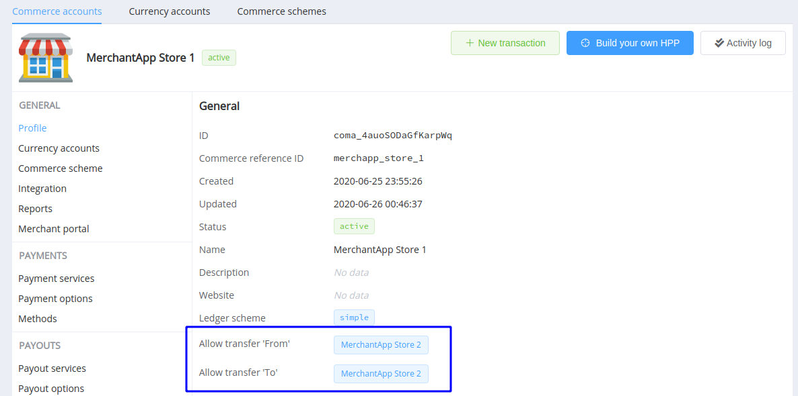

When enabled, these accounts will be displayed as available for transfers in the Merchant Portal.

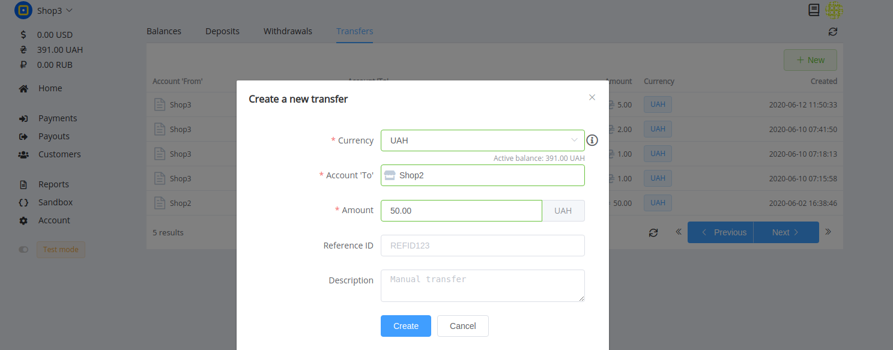

#### Status Resolutions Related to Payout Schemes

We have also added additional types of payout request's failed status resolutions related to payout schemes usage:

* `STRATEGY_RECEIVED_NO_ROUTES` — there are no routes by the condition in the routing
* `STRATEGY_CONFIGURED_ROUTES_WERE_FILTERED` — all rows do not match a result of filtration
* `NO_AVAILABLE_P2P_PAYMENTS` — there are no proper p2p-payments (for р2р-routes only)

Test routing and handle resolutions as hints for setting up Payout Schemes.

### Merchant Application Settings Update

*Merchant portal* administrators now have the opportunity to create new roles for their account users based on the existing ones.

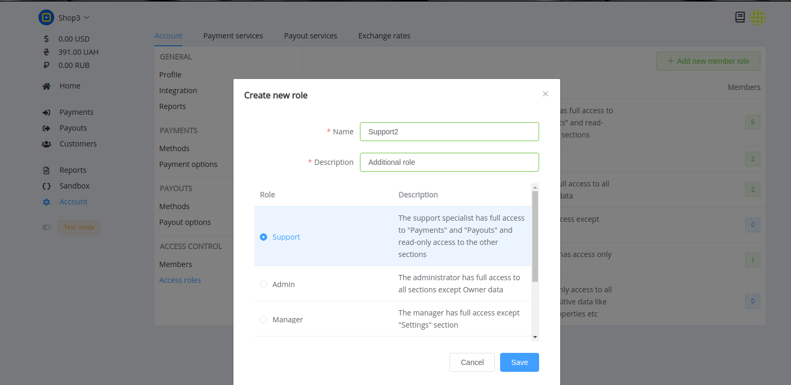

And in the basic configurations of the *Merchant Portal*, now you can set the time limit for user sessions (15 minutes by default).

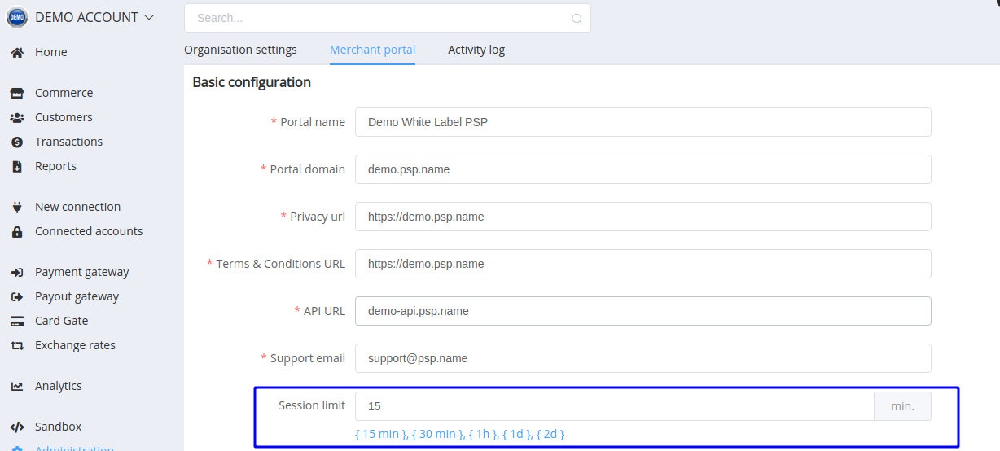

### Card Gate Update

We added Metadata attribute to payment scheme modifiers. So now you can use any of the metadata keys to determine payment invoice and enable or disable CVV and 3DS checks.

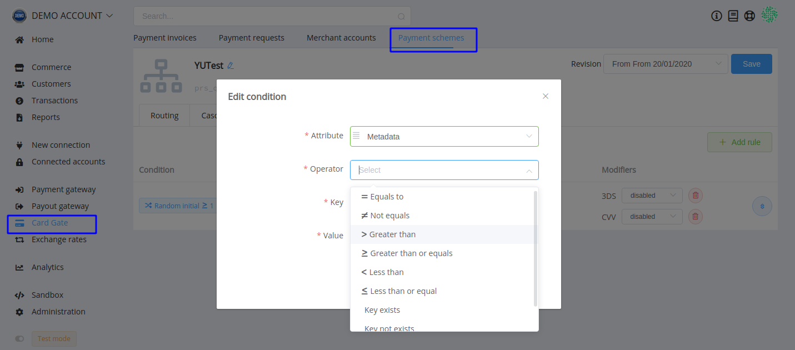

!!! info
    If you make payouts to payment cards in Ukrainian hryvnias, we just want you to know about a cap limit raise up to 100,000 UAH.

From now on, you can also use the [Manual connector](/connectors/manual/) for bank transfer payouts.

### Performance Improvements

Hope you notice an increase in the platform's productivity because we're continuously polishing our products for you.

Stay tuned for the next updates!
