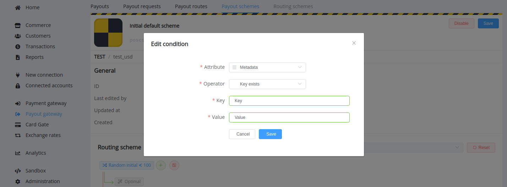
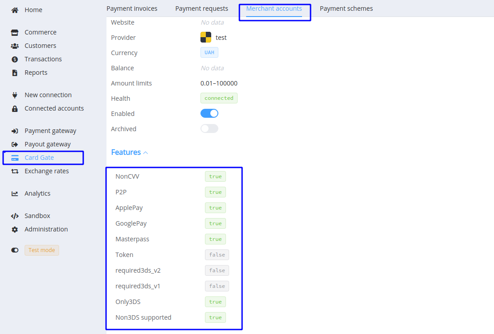
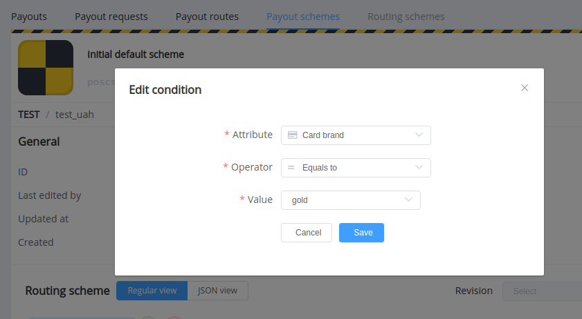

# **PayCore.io v1.17 (August 4, 2020)**

*By Dmytro Dziubenko, Chief Technology Officer*

Cheery Greetings from [PayCore.io](https://paycore.io/)!

Today’s post features all the updates and enhancements you can find in our last update.

## Highlights

* [The Refund Fee option](#refund-fee-option): added possibility to return refund fee
* [Payout Gateway Updates](#payout-gateway-updates): added a routing condition by Metadata, limited payout splitting to 100 parts
* [Card Gate Improvements](#card-gate-improvements): put to the general overview all connected features for the Merchant account, added new attributes for payment and payout routings, failover routing for same cards in case of auto-repeatable resolutions
* [HPP Theme Options](#additional-checkout-theme-options): increased limit up to 20
* [Reports Update](#reports-update): added Reserved amounts and Reserved balances
* [Bug Fixes](#bug-fixes)

## List of Changes

### Refund Fee Option

Commerce accounts have a new option related to the refund process. Earlier, when you approved a refund request, the payment fee was withheld in any case and not returned to the account. Now our clients as providers can decide whether to cover the fee themselves or to pass it on to the consumer (the determination usually depends on the credibility of merchants, typical situations and reasons for the requests).

This option is not yet available in the Commerce settings from the Dashboard. [Please contact our support team](mailto:support@paycore.io) to customise it.

### Payout Gateway Updates

We added **a routing condition by Metadata to Payout Schemes** in line with [Payment Routing Schemes](/release-notes/v1.14/#card-gate-update).

Also, please take into account that **the Payout can now be split into a maximum of 100 parts**. We imposed this restriction to prevent situations where payments are split too small to meet the conditions set by some route.

### Card Gate Improvements

Now you can view **all connected features for the Merchant account** in the General overview. This is especially convenient for accounts connected long ago whose a list of features are already forgotten a bit.

We revised currently used card parameters and, accordingly, **added new attributes for payment and payout routings**. And now you can set up routes depending on a global card system or network (such as Visa, Mastercard, Cirrus), a card brand (such as Standard, Gold, or World), and a card type (debit, credit, prepaid).

**Failover routing** allows us to route payments if an error occurs on the way from a provider to an issuer. We have further **improved** the process; and now, when the card payment process fails with one of the auto-repeatable resolutions (such as `access_denied`, `card_type_not_supported`, or `fatal_timeout`), we send payment to retry but filter the route caused the error if the customer enters the same card data.

### Additional Checkout Theme Options

Excellent news for our Hosted Payment Page users! From now on, you can customise your checkout process with more variables because HPP theme limit has been increased up to 20 options.

### Reports Update

We added new columns for Reserved amounts and Reserved balances to the tables to make reports more informative. The update applies automatically to all reports created after July 10.

### Bug Fixes

Our version 1.17 also contains bug fixes and different minor system improvements.

So that is all essential news for today. Stay tuned for the next updates!
