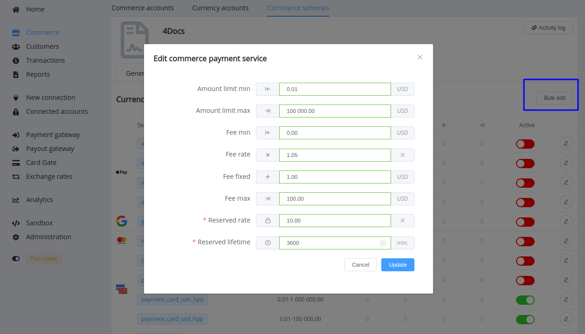
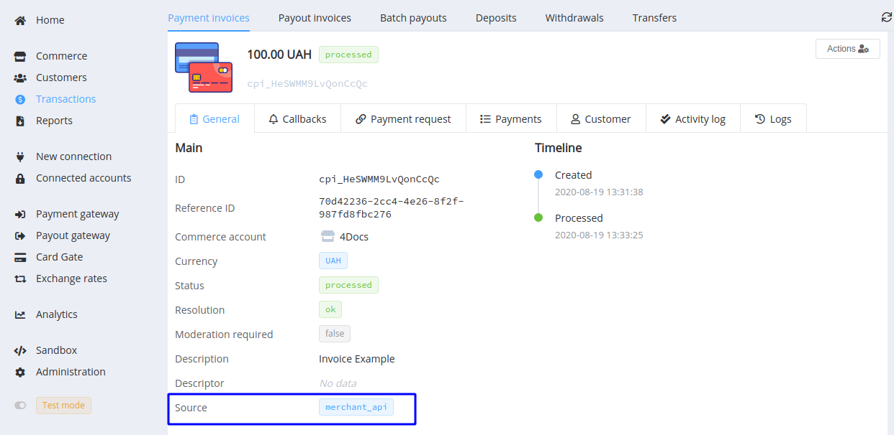
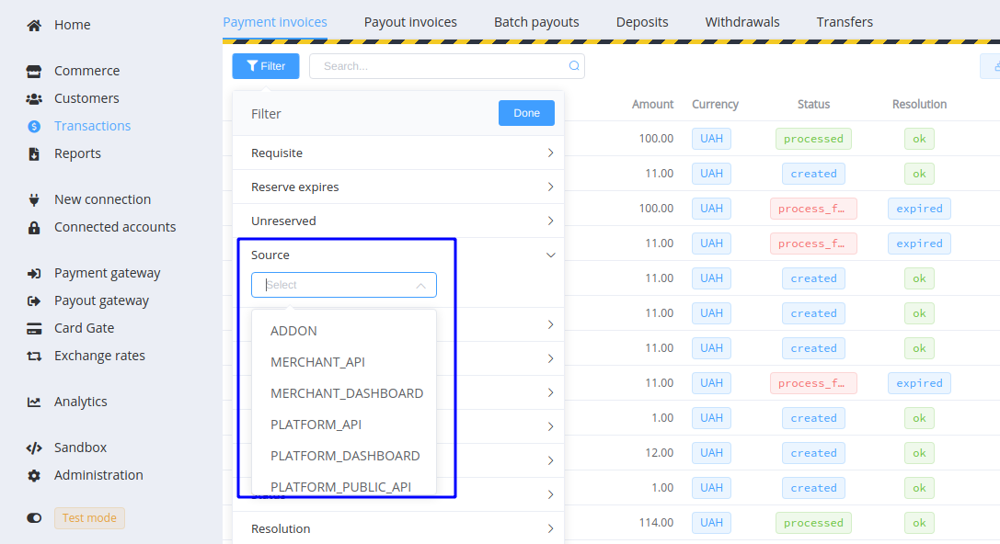
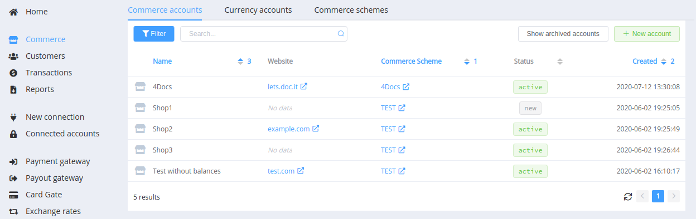

# **PayCore.io v1.18 (August 18, 2020)**

*By Dmytro Dziubenko, Chief Technology Officer*

Cheery Greetings from [PayCore.io](https://paycore.io/)!

Today we are releasing our v1.18 Update that advances platform usability and adds new integrations.

## Highlights

* [Dashboard UX Improvements](#dashboard-ux-improvements): added bulk editing of commerce payment services, started to display transaction source in the Dashboard and the Merchant Portal, improved multiple sorting
* [Card Gate Update](#card-gate-update): increased the Card Gate limit of the possible invoice amount up to 1,000,000,000
* [Bug Fixes](#bug-fixes)

## List of Changes

### Dashboard UX Improvements

#### Bulk Editing of Commerce Payment Services

You have a lot of services in the commerce scheme but the same approach to everything? Then you might like the new feature of editing all services in one bundle. Simply go to settings of the Commerce Scheme, click the Bulk Edit button and update the options for all payment services at once.

#### Transaction Source in the Invoice Overview

The source of the initiated transaction is an additional valuable characteristic for invoices. Previously, it could be obtained through the API only, but we added this parameter to the Transaction Overview in the Dashboard and the Merchant Application.

You can also filter payment and payout transactions in the general lists by their source type:

??? tip "Available source types for the invoices"
    |Type         | Description  |
    |:-----------|:------------|
    | `addon` | Created in the connected addon |
    | `merchant_api` | Initiated through the Commerce API |
    | `merchant_dashboard` | Created in the Merchant Portal |
    | `platform_api` | Initiated through the Paycore Private API |
    | `platform_dashboard` | Created in the Paycore Dashboard |
    | `platform_public_api` | Initiated through the Paycore Public API |

#### Multiple Sorting Improvement

A small but useful addition to the [July update](/release-notes/v1.16/#multi-sorting-for-grid-layouts): we attached priorities to the multiple sorting.

### Card Gate Update

We also increased the Card Gate limit of the possible invoice amount up to 1,000,000,000 (for any currency).

### Bug Fixes

Our version 1.18 also carries different fixes and slight system enhancements.

And that's that, so, stay tuned for the next updates!
