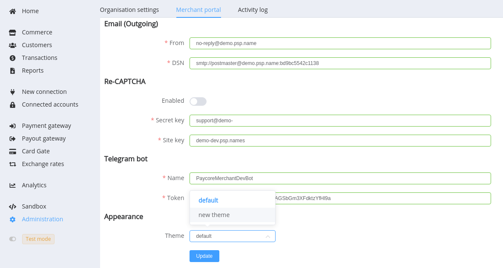
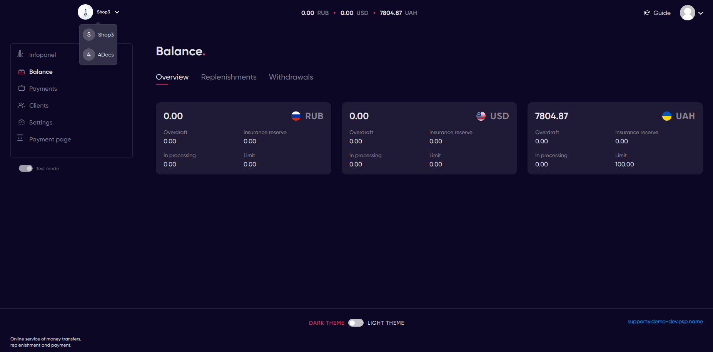
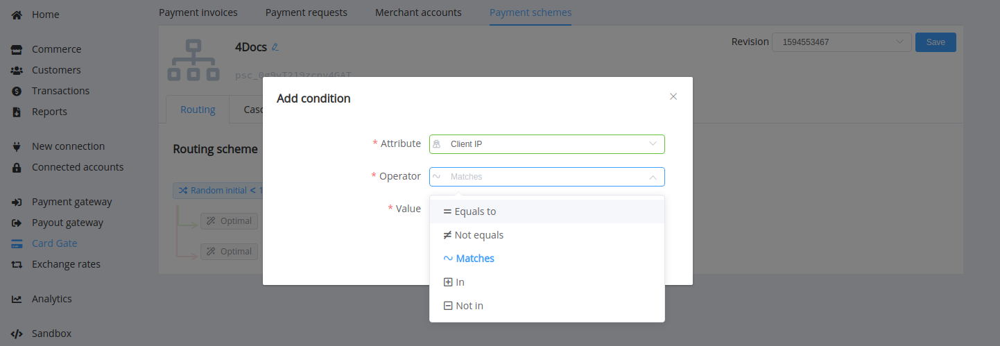
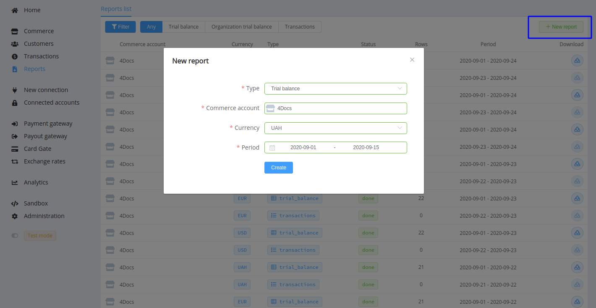

# **PayCore.io v1.20 (September 15, 2020)**

*By Dmytro Dziubenko, Chief Technology Officer*

Cheery Greetings from [PayCore.io](https://paycore.io/)!

Our dev team continues working on system polishing and enhancement.

These two weeks, we have been focusing on internal improvements, among other things, on optimising the number and sequences of payout scheme checks, and on boosting up front-end performance. Hope, you will be able to assess the results of our efforts very soon, and, in the meantime, present you short notes about other meaningful features in version 1.20.

## Highlights

* [Merchant App Theme Switcher](#merchant-app-theme-switcher): added possibility to change Merchant Portal appearance in the settings
* [Card Gate update](#card-gate-update): added routing by the client IPs
* [Reports and Exports upgrades](#reports-and-exports-upgrades): added a feature to create a custom report from the Reports section, added the `account` (Commerce account ID) column to the Export spreadsheets
* [Minor bug fixes](#bug-fixes)

## In the Details

### Merchant App Theme Switcher

Good news for those who are tired of the strict laconic but standard design of our merchant application! If you have at least one custom theme created, you can change them in the portal settings.

Save the changes and please your users with a new appearance of the Merchant portal.

!!! question "Interested in this feature, but don’t have a custom theme?"
    Send us your request, and together we find the best design solution!

### Card Gate Update

We added a new attribute for Card Gate payment schemes: routing by the Client IPs. So you can set conditions for one, several or a group of IP addresses.

### Reports and Exports Upgrades

If a report generation option is enabled for the account, now you can also create and download a report for an optional period. Open *Reports* section, click the *+New Report* button and choose a type of report to create.

We also added the `account` (Commerce account ID) column to the transactions *Export* spreadsheets.

<!--
### Integration Updates

| Provider | Name  | New features |
|:-:|:-:|:-:|
|          | [ADgroup](/connectors/adgroup/)              | Card Payouts and Balances      |
|           | [Stripe](/connectors/stripe/)                | New Instant payments                          |
|    | [Wirecapital](/connectors/wirecapital/)      | H2H payment connection                         |

Also, we started supporting the Indian rupee (INR) and Mexican peso
(Mexican peso) currencies.
-->

### Bug Fixes

Whereas we continue growing platform quality and performance, we made numerous fixes for our products.

Stay tuned for the next updates!
