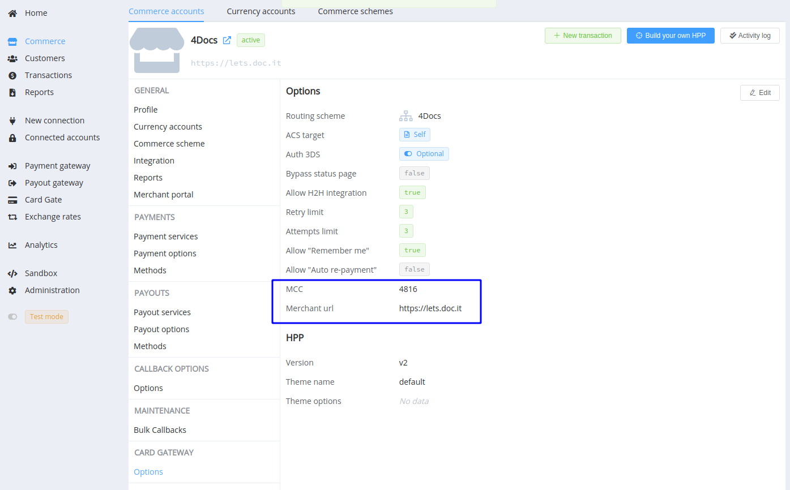
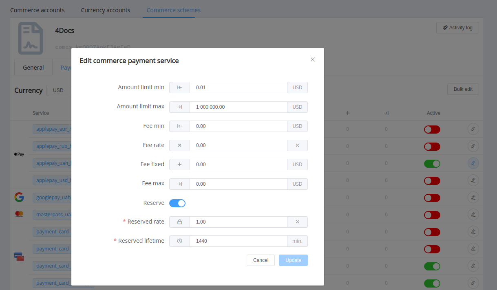
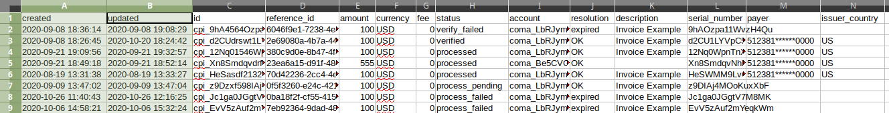

# **PayCore.io v1.23 (October 27, 2020)**

*By Dmytro Dziubenko, Chief Technology Officer*


Cheery Greetings from the [PayCore.io](https://paycore.io/) team!

Our release notes reflect our continued investment to our customers' benefit in transaction handling and payment optimisation. So, here you can check what that we've been working on for the past two weeks.

But (again) we have an urgent message to impart firstly.

!!! attention "Since the v1.23.1 release (29/10/2020)"
    According to the requirements of the acquirers, we will **block** the cards upon receiving the specified resolutions from specific provider acquirers.

    | Resolutions | Providers |
    |---|---|
    | `card_is_lost` | [ ADgroup](/connectors/adgroup), [ Exactly](/connectors/exactly), [ ForwardBank](/connectors/forwardbank), [ Procard](/connectors/procard), [ TKBpay](/connectors/tkbpay), [ WinPay](/connectors/winpay), [ Wirecard](/connectors/wirecard) |
    | `card_is_stolen` | [ Exactly](/connectors/exactly), [ ForwardBank](/connectors/forwardbank), [ Platio](/connectors/platio), [ Procard](/connectors/procard), [ TKBpay](/connectors/tkbpay), [ WinPay](/connectors/winpay), [ Wirecard](/connectors/wirecard) |
    | `card_restricted` | [ Procard](/connectors/procard) |
    | `fatal_card_expired` | [ ForwardBank](/connectors/forwardbank), [ Procard](/connectors/procard) |
    | `fatal_decline` | [ ForwardBank](/connectors/forwardbank), [ Procard](/connectors/procard) |
    | `fatal_invalid_card` | [ Procard](/connectors/procard) |
    | `fatal_issuer_unavailable` | [ ForwardBank](/connectors/forwardbank) |

## Highlights

* [Card Gateway Betterments](#card-gateway-betterments): added the OCT flow, MCC and Merchant URL options for commerce accounts, and `restrict_saved_cards` parameter for an invoice creation request.
* [Commerce UI update](#commerce-ui-update) of commerce service editing.
* [Exports' changes](#exports-changes): the time of creation and last update of transactions are displayed related to the user's timezone
* Related [bug fixes](#bug-fixes).

## In the Details

### Card Gateway Betterments

#### Original Credit Transaction Flow

From now on, we supported the *OCT (Original Credit Transaction)* flow for card payments. It is mainly applicable to refunding but not dependent on the amount of the initial payment.

As follows, OCT flow is invoked in the context of a three-method sequence:

* funds are debited from a sender's account -->
* then credited to a recipient's account -->
* and, optionally, pushed back to the sender's account (for example, when the OCT authorization is declined).

#### MCC and Merchant URL options

We attached new features to the card gateway options for commerce accounts: MCC ([Merchant category code](/getting-started/glossary/#merchant-category-code-mcc)) and Merchant URL. These data delivery is required by several global providers as additional payment verification.

Thus, Merchant URL may coincide with the Website URL in the Commerce general profile but unlike it, cannot be changed by merchants via Merchant Portal.



#### Forbid displaying previously saved card numbers

To the request for API invoice creation, we added the `restrict_saved_cards` boolean parameter to the `gateway_options` --> `cardgate` object (`false` by default). You can use it to forbid the user display of card numbers previously saved with 'Remember Me' option.

!!! example "Code sample (JSON)"
        ```json hl_lines="12"
        {
            "data": {
                "type":"payment-invoices",
                "attributes": {
                    "test_mode": true,
                    "reference_id":"8a542a-00-faf-8be7062a4603f029-224",
                    "currency":"USD",
                    "amount":"100",
                    "service":"payment_card_usd_hpp",
                    "gateway_options": {
                        "cardgate": {
                            "restrict_saved_cards": true
                        }
                    }
                }
            }
        }
        ```

### Commerce UI Update

We refined the interface of commerce service editing.



Also, if you disable the use of the rolling reserve, the values of `reserved_rate` and `reserved_lifetime` variables are set to `null`.

### Exports' Changes

Minor update of our data exports: now the time of creation and last update of transactions are displayed related to the timezone of the user who started exporting.



<!--
### New Integrations

| Provider | Name  | New features |
|:-:|:-:|:-:|
|       | [ADgroup](/connectors/adgroup/)  | Qiwi acquiring: cards & Qiwi wallets |
|   | [Paysage](/connectors/paysage/) | Payouts, Host-to-host payment connection |
|  | [Stripe](/connectors/stripe/) | Refunds, ApplePay |
-->

### Bug Fixes

Whereas we continue developing quality improvements, we also made numerous fixes for our products.

Stay tuned to be the first to know about our future advances!
