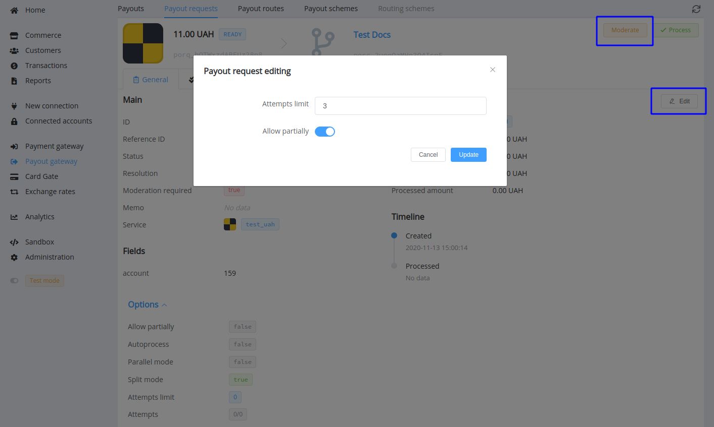
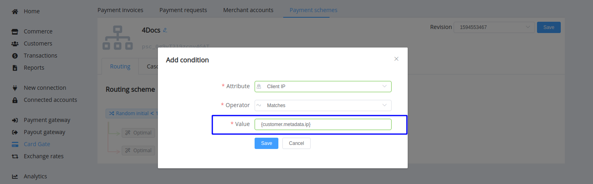
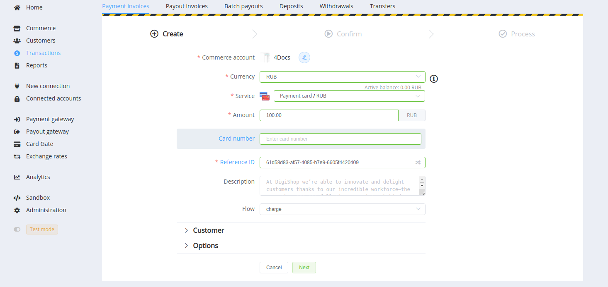

# **PayCore.io v1.24 (November 10, 2020)**

*By Dmytro Dziubenko, Chief Technology Officer*

Cheery Greetings from the [PayCore.io](https://paycore.io/) team!

We work carefully to squash bugs and release new features. And here's an account of the improvements you can find in the latest release.

## Highlights

* [Payout Request Editing](#payout-gateway-update): added possibility to patch payout request options
* [Card Gate Updates](#card-gate-update)
* Related [bug fixes](#bug-fixes)

## In the Details

### Payout Gateway Update

We added the possibility to edit a Payout Request: change the number of attempts or allow partial processing.

But to enable it, firstly, the edited request should meet the following conditions:

* It must remain in the initial or transitional status (**`created`**, **`ready`**, **`dispatching`**, or **`pending`**), so, you should pause processing the request by setting it on moderation
* Also, if you want to allow partial transaction processing, the original Payout Invoice must have a **split mode enabled**

Once you have set new options, you can remove the request from moderation to continue processing.

### Card Gate Update

We implement a powerful feature for card payment routing: the dynamic attributes. Now composing the route, you can set an attribute as variable and compare their values more flexibly.

The dynamic attribute is formed according to the scheme: `{object.object.attribute}`. So, for example, you can specify an attribute value as `{customer.metadata.ip}` and check if an expected Client IP, that is sent in customer metadata parameters, matches with that payment is made.

<!--
### New and Updated Integrations

| Provider | Name  | New features |
|:-:|:-:|:-:|
|   | [OffsetPay](/connectors/offsetpay/) | H2H payment connection |
|  | [Parimatch](/connectors/parimatch/) | Verify global update |
|   | [Paysage.io](/connectors/paysage/) | H2H connection 3DS mode |
|       | [TKB Pay](/connectors/tkbpay/)  | 3DS 2.0 and failover for 3DS 1.0  |
|   | [WPayments](/connectors/wpayments/) | H2H payment connection, Payouts |
-->

Besides, we added the `card_number` attribute as an **optional** field for the `payment_card_rub_hpp` method.

These data are used for connection with the *ADGroup* provider, and otherwise, you can leave the value empty.

### Bug Fixes

We continued working on system enhancement and made related to this bug fixes.

Stay tuned for the next updates!
