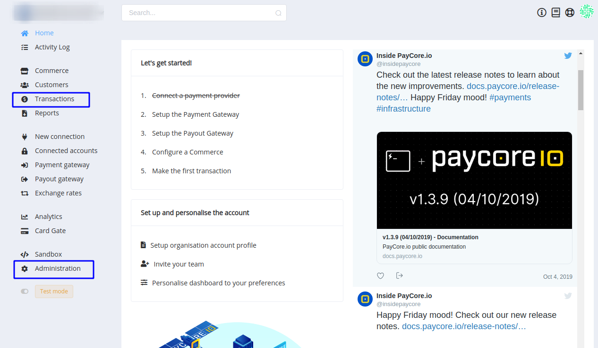
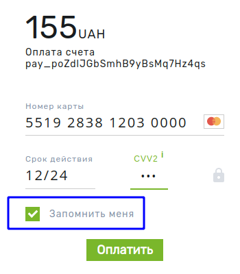
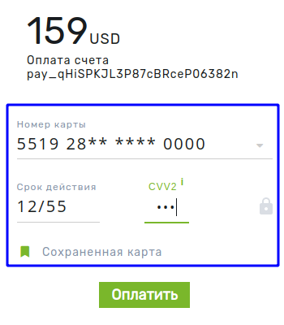
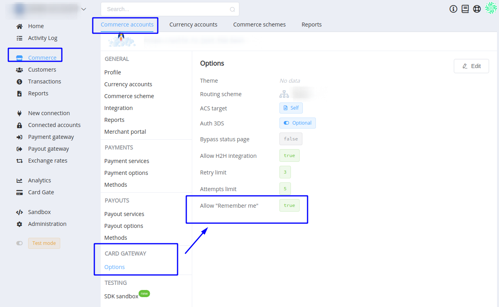
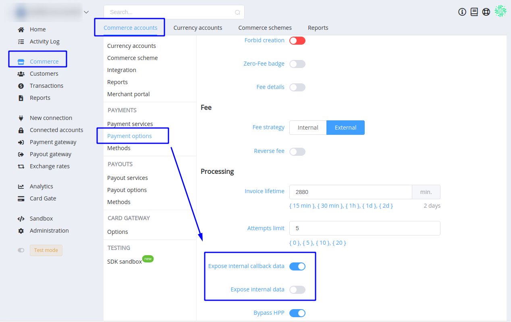
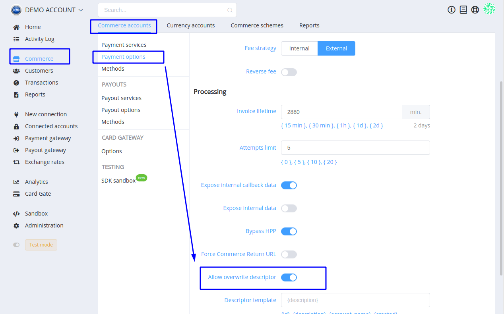

# **PayCore.io v1.3.14 (October 18, 2019)**

*By Dmytro Dziubenko, Chief Technology Officer*

Happy Friday mood from [PayCore.io](http://paycore.io/)!

The newest versions of Platform Dashboard and Merchant Portal App both have their general improvements and reorganisation that we are in a hurry to share with you.

## Highlights

* [UX/UI improvements](#uxui-improvements): reorganised dashboard menu
* [Commerce upgrades](#commerce-upgrades): additional options in the commerce account settings
* [Integration update](#integration-upgrade): ePay advanced protocol
* [Bug Fixes](#performance-betterment-and-bug-fixes). Of course, we found some of irritative bugs and fixed them mercilessly

## Full List of Changes

### UX/UI Improvements

There is the most noticeable this week update. We reorganised the side navigation menu, but don't worry&mdash;all your favourite features on the spot!

Additionally, we renamed 'Organisation' to '*Administration*' and '*Operations*' to '*Transactions*'. In our view, these titles are more appropriate.

And we significantly improved Merchant Apps. It became faster and more efficient.

### Commerce upgrades

#### Allow 'Remember Me'

And there is the most customer-friendly this week update.

 

We implemented the '*Remember*' card functionality for your trusted Merchants. If you allow this feature in '*Card Gateway*' options, Card Gate enables remembering and later auto fulfilling of customer's card data, when they make the next payments.

To implement this option, be sure that you set up identifying your customers with the unique internal IDs.

#### Expose external data

Not only for Callbacks: if you toggle '*Expose external data*' function, you can collect extended data and also **get it** from the providers.

Turn on it in the '*Commerce account*' settings.

#### Allow overwrite descriptor

Extended functionality of dynamic descriptor generation. But merchants need your permission on creating and overwriting it.

Find this option in the '*Commerce account*' settings too.

## Integration upgrade

ePay connector updated their protocol for payments, so we also have upgraded our connection methods.

| Provider | Name  | New features |
|:-:|:-:|:-:|
| | [ePay](/connectors/epay/) | Protocol update |

### Performance Betterment and Bug Fixes

And, of course, we put a lot of efforts on performance betterment and hotfixes. We are here for you, your success and easy-going production. So, if you have some remarks, addenda, requests, or you have found any bugs in our platform performance, feel free to contact us via [e-mail](mailto:support@paycore.io) or your account at [Jira service desk](https://support.paycore.io).

Stay tuned for the next updates!
