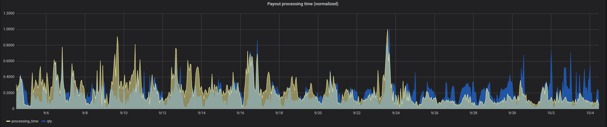
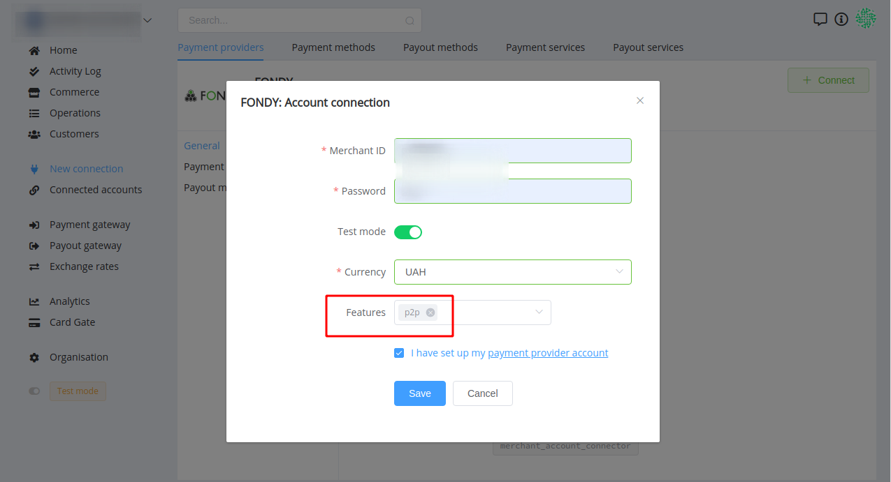
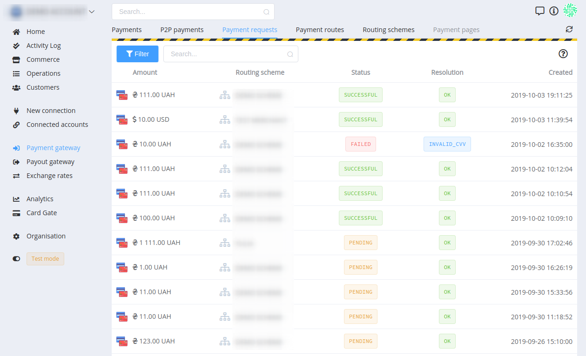
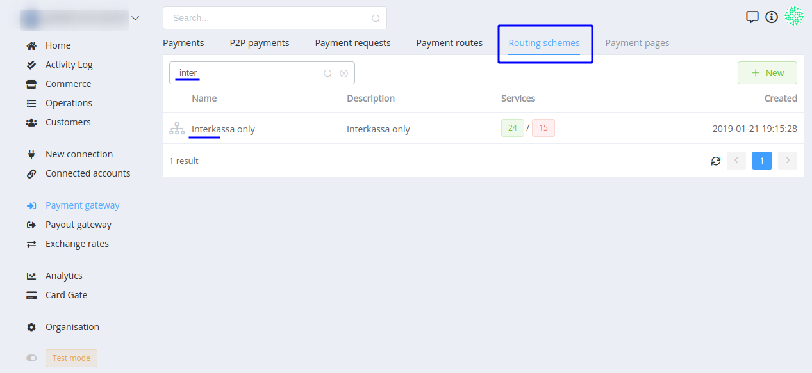
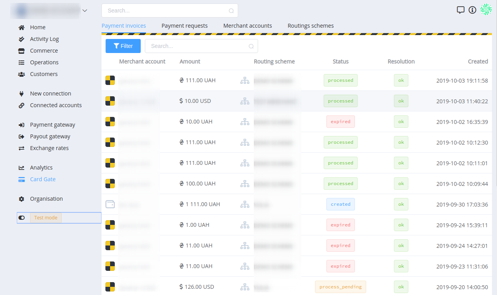
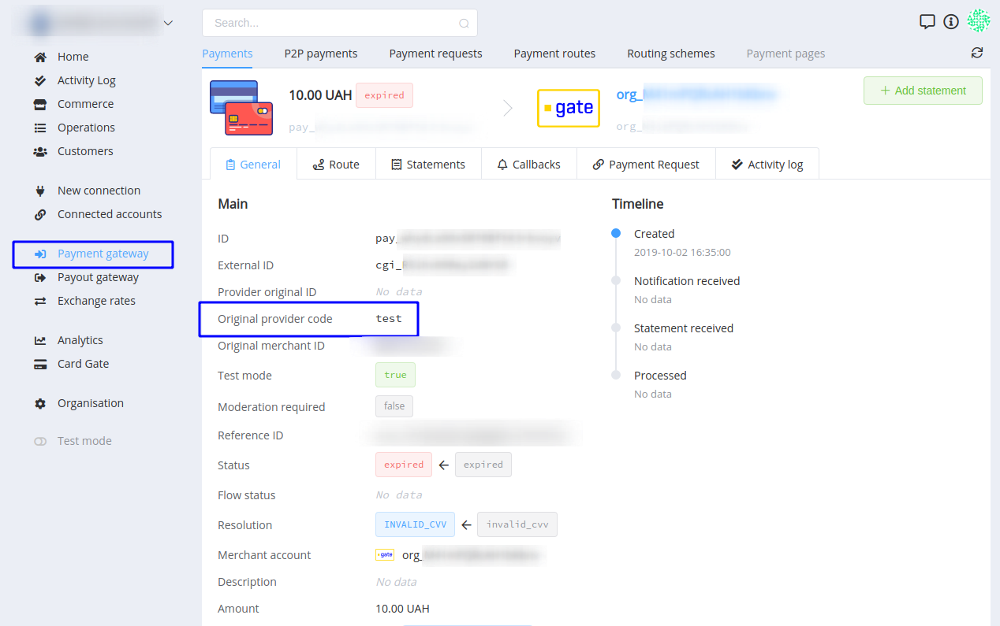
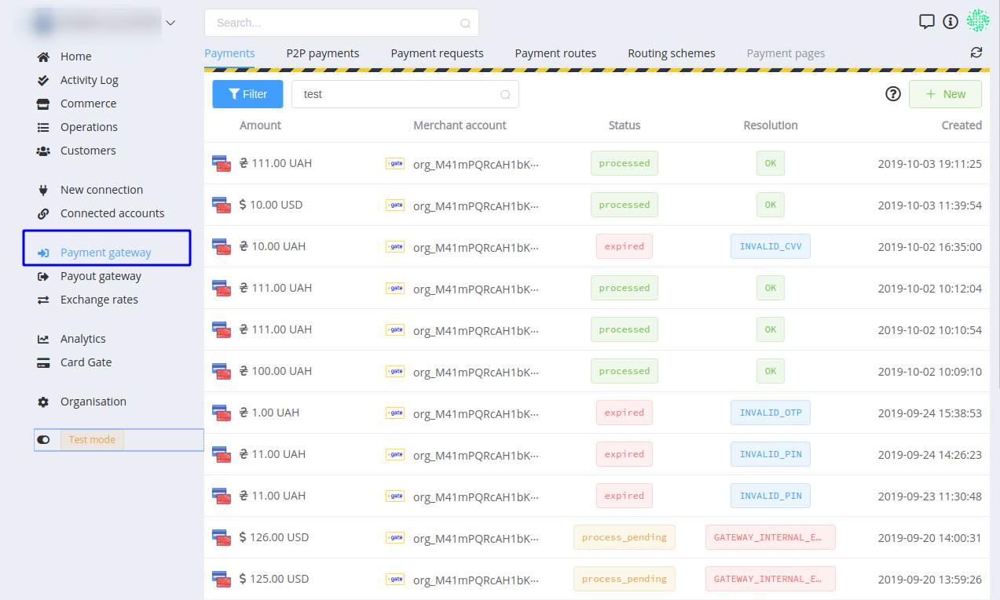

# **PayCore.io v1.3.9 (October 04, 2019)**

*By Dmytro Dziubenko, Chief Technology Officer*

Happy Friday mood from [PayCore.io](http://paycore.io/)!

We continue working on system enhancements, and these are short notes about our updates and improvements.

And it isn't news, but we have significantly reduced the processing time of payouts. Look at that graph and enjoy our little victory:

## Highlights

* [System UX Betterment](#system-ux-betterment): allocated *P2P payments* and *Payment requests*, added search through the routing schemes by name
* [Card Gate Upgrades](#card-gate-upgrades): added *Payment invoices* tab, Original provider code is attached for card payment's data
* [Integration Improvements](#integration-improvements): refunds for Tranzzo, Concord Bank and Procard
* [Bug Fixes](#bug-fixes): we pursue our effort on fighting deficiencies

## All Updates

### System UX Betterment

From here on out, peer-to-peer (P2P) payments are identified in a separate tab in the payments' grids.

What is peer-to-peer payment? Money transfer from sender's card to the card, phone number or account of the recipient. P2P payments are all about ease-of-use, convenience, and speed: to send money, users need to make a few clicks. And will be cool to give them that opportunity.

To connect P2P account, don't forget to choose `p2p` feature from the dropdown:

We separated the *Payment requests*' grid, and it's easier now to look them up.

Also, navigating between routing schemes feels much better with the added search field:  

### Card Gate Upgrades

Since then, you can find all *Payment invoices* in the first tab of the *Card Gate* section.

And the last, but not the least system reform: *Original provider code* is attached for card payment's data. Card Gate is still displayed as the main provider for the card payments, but you can find a transaction provider's code in the payment general info: 

And search through all payments by this parameter too:

### Integration Improvements

This release includes upgrades for connections with:

| Provider | Name  | New features | How to connect |
|:-:|:-:|:-:|:-:|
|  | Concord Bank | Refunds | [Step-by-Step](/connectors/concord/)
|  | Procard | Refunds | [Step-by-Step](/connectors/procard/) |
|  | Tranzzo | Refunds | [Step-by-Step](/connectors/procard/) |

### Bug Fixes

We identified and effectively resolved various types of bugs. And it was essential for speeding-up payment process which I mentioned in the beginning.

Stay tuned!
