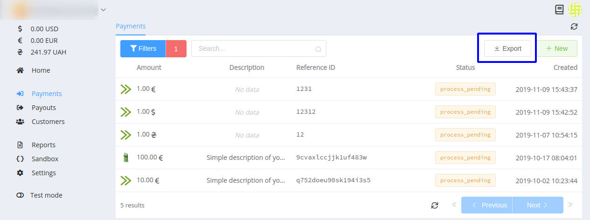
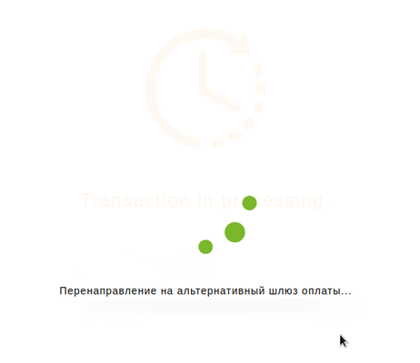
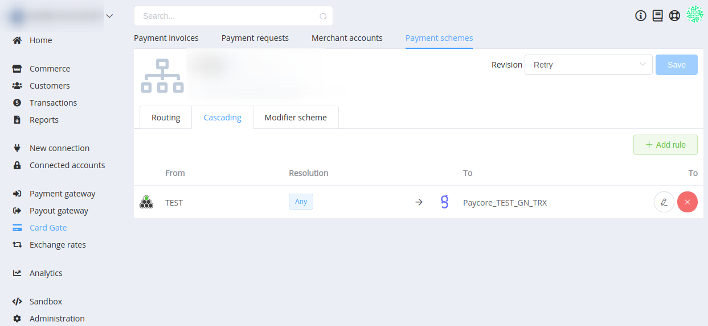
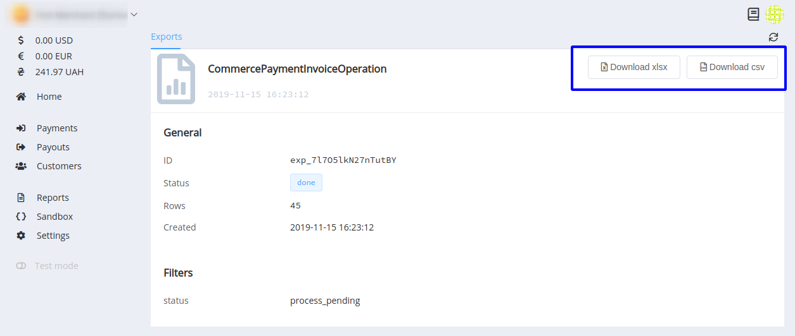

# **PayCore.io v1.4.4 (November 15, 2019)**

*By Dmytro Dziubenko, Chief Technology Officer*

Happy Friday mood from [PayCore.io](http://paycore.io/)!

It seemed November 11 Sales' Rush shook the global payment system as hard as it could. As payment hub, we also felt waves of this shaking and were up in arms.

It gave us an additional motive to devote time for general system improvements (that, mostly, yet not ready for the full implementation). But our dev team also found resources for few pleasing features: check the information below to find about them.

## Highlights

* [Card Gate](#card-gate-update): added the payment retry after declining transaction by the bank-acquirer
* [Merchant App](#merchant-app-update): added the data export for payments and payouts
* [Performance improvements](#performance-improvements)

## All Changes

### Card Gate Update

From now on, if a transaction is declined by the acquirer after passing ACS, it will be automatically sent via cascading route. Also, the customer will receive the informational message about searching for an alternative payment gateway.

!!! info
    Pay attention that at least one cascading route must be configured for this Card Gate payment gateway.

### Merchant App Update

Similarly to [this platform upgrade](../v1.3.4/#data-export), we added the transaction data export for the Merchant App's payments and payouts. Filter desired entities and export them to .xls and .csv formats.

<!--
### New Integrations

This release includes new integrations with:

| Provider | Name  | New features |
|:-:|:-:|:-:|
|  | [Exactly](/connectors/exactly/) | H2H Connection |
|  | [Twelve.live](/connectors/twelvelive/) | Payment Gateway, Payout Gateway |
-->

### Performance Improvements

We continue working hard on system betterment. Hope, you will appreciate that in the nearest future.

Stay tuned for the next updates!
