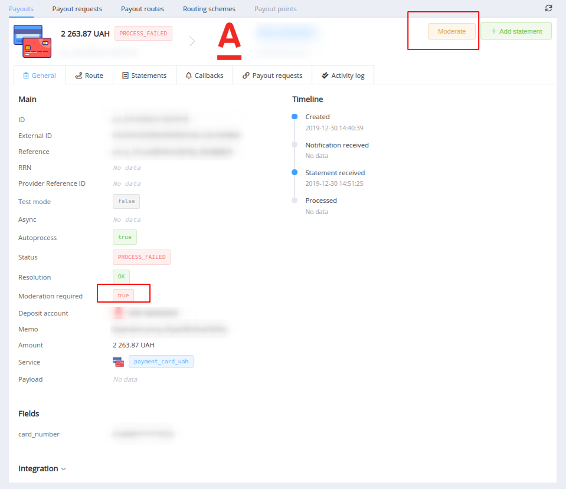

# **PayCore.io v1.5.21 (January 10, 2020)**

*By Dmytro Dziubenko, Chief Technology Officer*

Happy Friday mood from [PayCore.io](https://paycore.io/)!

There are the first release notes in the 2020s! Are you ready for the new decade? We're looking forward to new opportunities and development attitudes!

And we are back on track and continue working on our platform growth.

## Highlights

* [Payouts' moderation upgrade](#payouts-moderation-upgrade): added possibility to moderate payouts directly from the dashboard
* [Performance improvements](#performance-improvements)

### Payouts' Moderation Upgrade

We added a button to the *General payout overview* in the *Payout Gateway* section. Just find an entity for the payout that is required moderation and select the right option.

<!--
### New Integrations

| Provider | Name  | New features |
|:-:|:-:|:-:|
|  | [Cypix](/connectors/cypix/) | Payments & Payouts |
|  | [Paysoft](/connectors/paysoft/) | Payouts |
-->

### Performance Improvements

We've had several additional fixes and small improvements made to our products. And we have more things planned for this year all across our platform! To stay up-to-date, follow our [blog](https://paycore.io/blog/), [Facebook](https://www.facebook.com/paycore.io/) or [Twitter](https://twitter.com/paycoreio) account.

Also, if you have any feature suggestions or ideas, don't forget to contact us via [e-mail](mailto:support@paycore.io) or your account at [Jira service desk](https://support.paycore.io).

Stay tuned!
