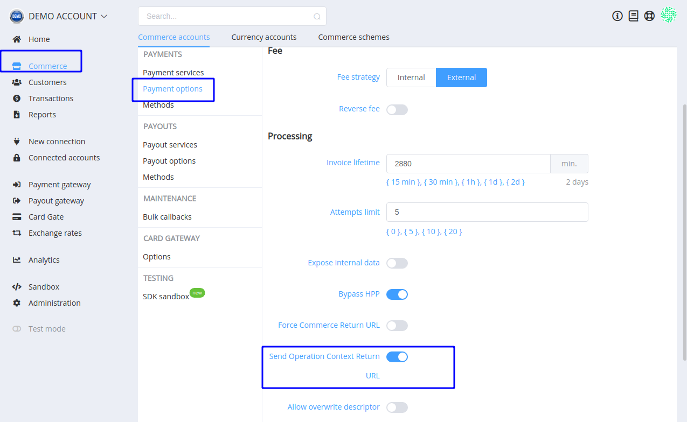
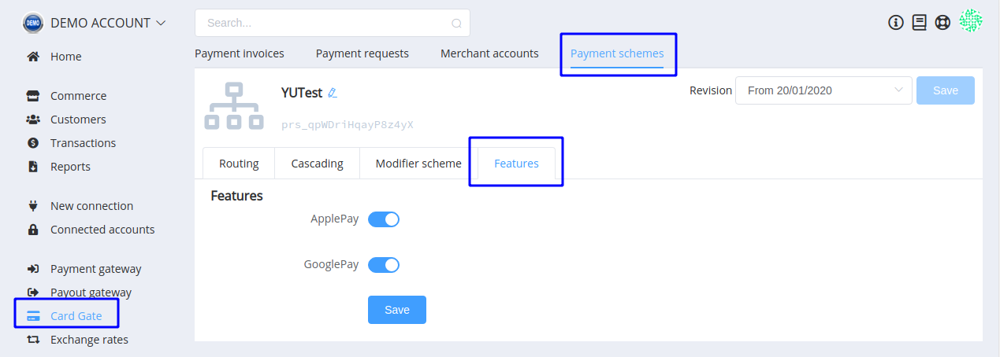

# **PayCore.io v1.6.12 (January 24, 2020)**

*By Dmytro Dziubenko, Chief Technology Officer*

Happy Friday mood from [PayCore.io](https://paycore.io/)!

We keep enhancing our products. And this week enhancements, like all the rest, have been prioritized to help you increase your daily efficiency and improve your client relationships.

Without further adieu, here’s what’s coming in the version 1.6.12!

## Highlights

* [Commerce minor improvement](#commerce-improvement): added optionality to display transaction context in Return URL
* [Card Gate upgrade](#card-gate-upgrade): added Features tab to the payment schemes
* [API update](#api-update): added `context` and `return_urls` objects
* [Performance betterment](#performance-betterment)

## List of Changes

### Commerce Improvement

#### Option to Send Transaction Context in Return URL

Previously, as default, we added transaction context to the return URL. And you (and your customer) saw in the address line the set of characters kind of `/?id=cpi_iYp7cZZWV8W2wQAV&serial_number=iWV8WW2wQAVwQAZ&amount=111.00...` and so on, and so on. A bit tiresome, isn't it?

From now on, you can choose if you need this addition or prefer to simply display the return link. Toggle the option in the Commerce settings.



### Card Gate upgrade

#### Payment Schemes' Features

The significant addition to payment functionality is the features for Payment schemes. Currently, you can control displaying to customers the Google Pay and Apple Pay possibilities for card payments, but we plan to expand the list of features.



### API update

#### Context Data for Payouts

Several providers demand to send additional information in payout requests such as expiry date along with the card number. We fixed that problem and added the `context` object to the `payment_card` method for payouts in which you can send all additional required data.

!!! example "JSON snippet"
    ``` json
        "fields":{
            "card_number":"4890494540223609"
            },
        "context":{
            "card": {
                "exp_month":"09",
                "exp_year": "2020"
            }
        }
    ```

#### Return URLs Variations

Unless you only want to use one general link for customers' return to your site, you can set different return URLs for different statuses and display relevant pages to your customers. Send object `return_urls` with desired statuses and links in the Payment Invoice.

!!! example "JSON snippet"
    ``` json
        "return_url":"https://example.com/payment/status/29515/2",
        "return_urls": {
            "success": "https://example.com/payment/status/1",
            "pending": "https://example.com/payment/status/2",
            "fail": "https://example.com/payment/status/3"
            }
    ```

Pay attention: the `return_urls` object has a higher priority than a single `return_url`.

### Performance betterment

Don't want to have another wordy talk about performance and bug fixing but, anyway, hope you notice the enhancement of the platform's productivity.

Stay tuned for the next updates!
