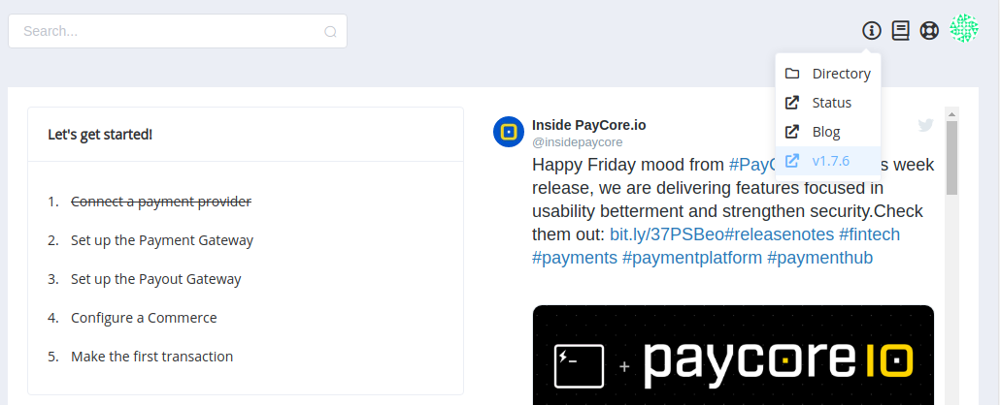
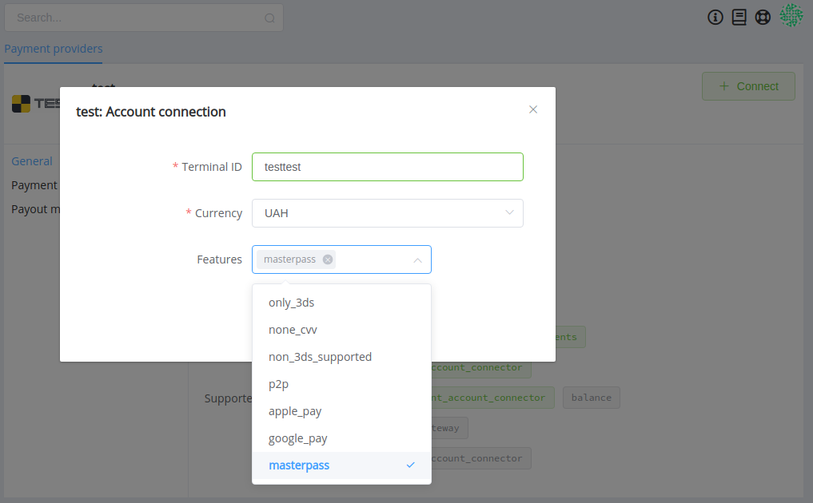
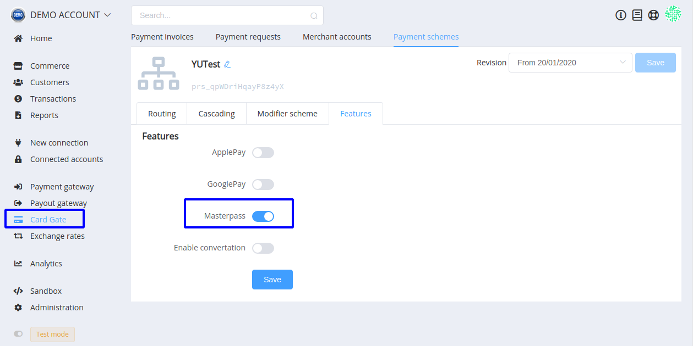
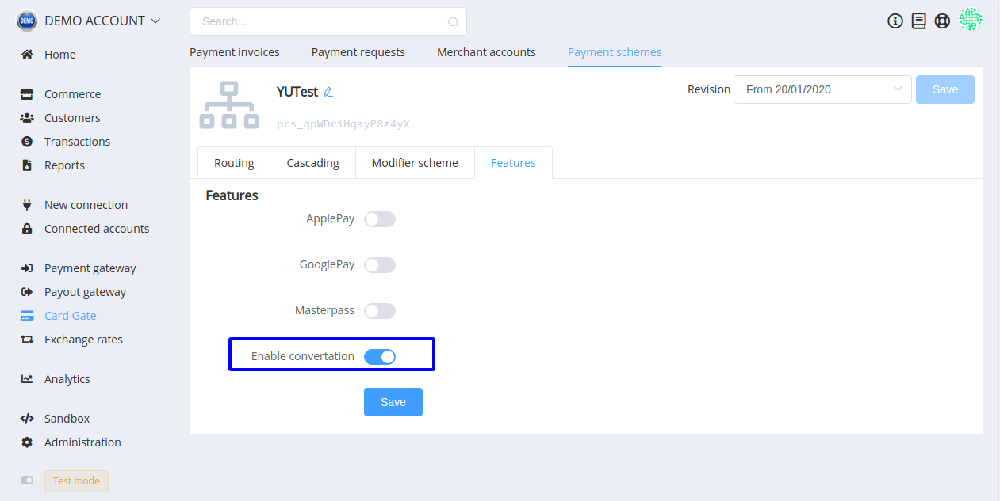
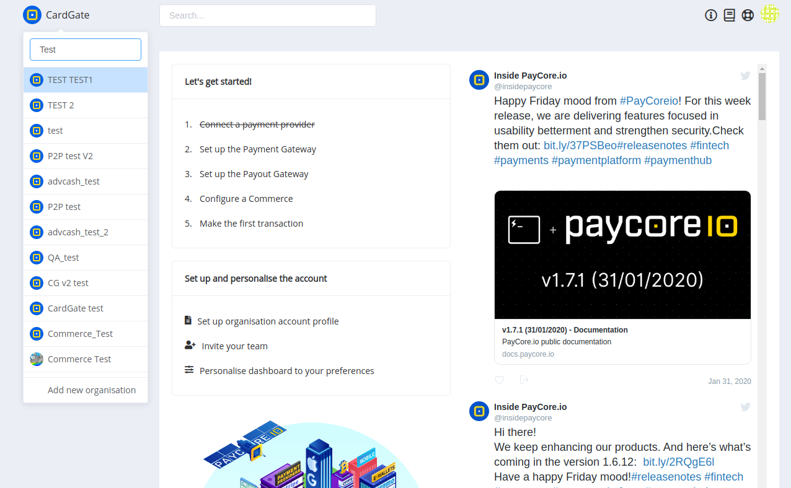

# **PayCore.io v1.7.6 (February 07, 2020)**

*By Dmytro Dziubenko, Chief Technology Officer*

Happy Friday mood from [PayCore.io](https://paycore.io/)!

We have made several updates that hope you will like. This week release introduced substantial improvements to the platform UX and card payment connections.

## Highlights

* [Card Gate Updates](#card-gate-updates): add Masterpass and possibility to customize currency exchange
* [Data Export](#data-export): exports for Deposits, Withdrawals and Transfers
* [Layout Upgrade](#layout-upgrade): added quick search for accounts
* [Performance improvements](#performance-improvements)

## List of Changes

### Card Gate Updates

Right behind ApplePay and GooglePay, we added Masterpass payment feature! To enable it, click '[New Connection](https://dashboard.paycore.io/connect-directory/payment-providers)' and choose the preferred payment provider. Then select `masterpass` from the feature list.

Don't forget to reconnect Card Gate connections with right currencies and toggle Masterpass feature in the payment schemes.

Also, did you notice another new feature in the previous screenshot? From now on, we can eliminate double loss due to bank fees on currency exchange by enabling this option. If the currency of the customer's card does not match the currency of the invoice, we check them and exchange invoice amount according to the chosen rate scheme in the relevant commerce account.

But pay attention when the feature is allowed, the important thing is to control applying of FXrates schemes.

### Data Export

We added tools for exporting data for Deposits, Withdrawals, and Transfers. It works the same as for [Payment and Payout Invoices](/release-notes/v1.3.4/#data-export), and you can find it on Transactions tabs.

### Layout Upgrade

If you are a team member of more than five organisations and often need to switch them, you'll appreciate this minor improvement. To search quickly for the right account name, just start typing in the drop-down.

### Performance Improvements

This release is packed with updates but not bugs, and that is our minor triumph.

Stay tuned (so we can gladly share with you another notable news next weeks)!
