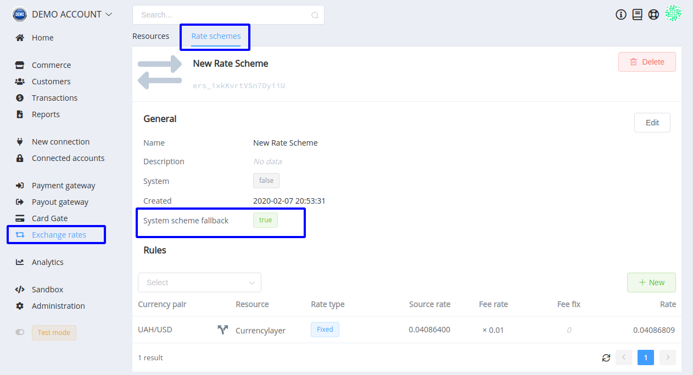

# **PayCore.io v1.8.0 (February 14, 2020)**

*By Dmytro Dziubenko, Chief Technology Officer*

Happy Friday mood from [PayCore.io](https://paycore.io/)!

February is a short month, but we have a ton of things in the works: this release is just a little part of future updates.

## Highlights

* [FXRates Updates](#fxrates-updates): added `System scheme fallback` option
* [Performance improvements](#performance-improvements)

## List of Changes

### FXRates Updates

This betterment helps to avoid errors in currency exchange when a rule about some currency pair is missing in the current rate scheme. We added `System scheme fallback` option, and when it is enabled, the missing rules are bound to the "Default system rate" scheme.

So, even if the invoice used currency is dropping in the exchange scheme, the exchange will be made according to the Default rate scheme and the transaction avoids this type of errors.

<!--
Also, from now on, our platform supports the following currencies:

| Name | Code | Default FXRates Source |
| :-: | :-: | :-: |
| Armenian Dram | AMD | [cba.am](https://www.cba.am/en/sitepages/ExchangeArchive.aspx) |
| Azerbaijani Manat | AZN | [cbar.az](https://www.cbar.az/currencies/17.01.2020.xml) |
| Moldovan Leu | MDL | [bnm.md](http://www.bnm.md/en/content/official-exchange-rates) |
| Tajikistani Somoni | TJS | [nbt.tj](https://nbt.tj/en/kurs/kurs.php) |
| Uzbekistan Som | UZS | [cbu.uz](http://cbu.uz/en/arkhiv-kursov-valyut/json/) |

### New integrations

| Provider | Name  | New features |
|:-:|:-:|:-:|
|  | [BillLine](/connectors/billline/) | Payments and Payouts |
|  | [ECommPay](/connectors/ecommpay/) | Payouts |
|  | [Kuna](/connectors/kuna/) | Payments and Payouts |
|  | [Rapyd.net](/connectors/rapyd/) | Payouts |
|  | [Selcom](/connectors/selcom/) | Payments and Payouts |
-->

### Performance Improvements

We also mercilessly fixed a bunch of bugs, and hope you notice the linked performance improvements.

Stay tuned for the next updates!
