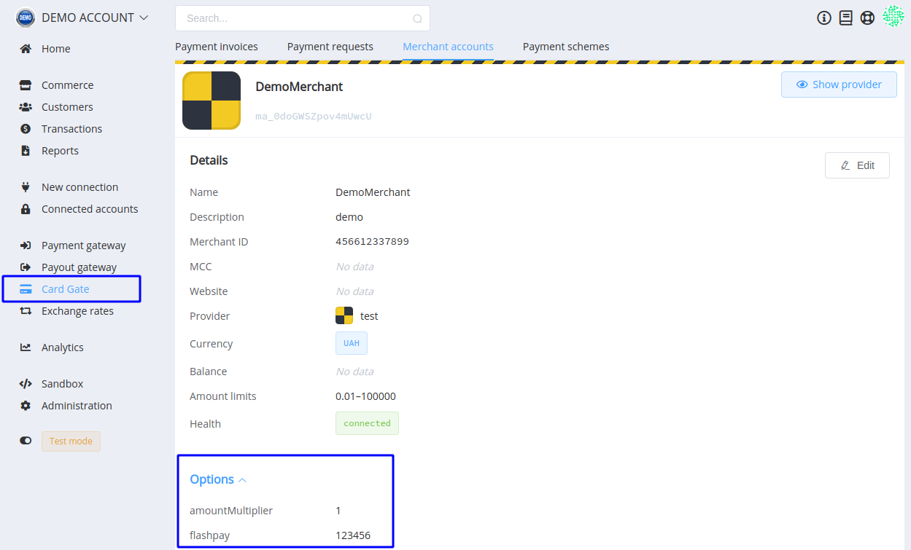
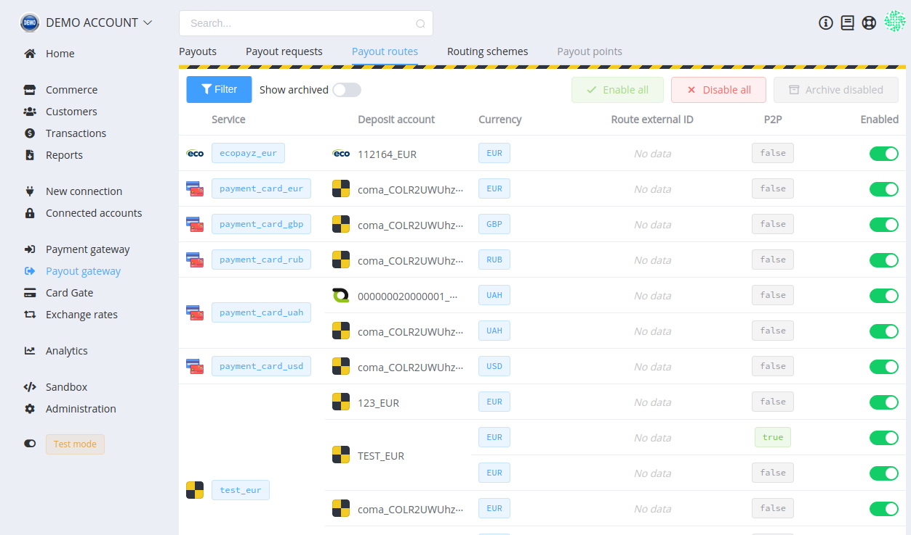

# **PayCore.io v1.9 (February 28, 2020)**

*By Dmytro Dziubenko, Chief Technology Officer*

Happy Friday mood to all of you! Version 1.9 is here!

These weeks we're continually working to improve the customer experience with [PayCore.io](https://paycore.io/) platform. And suppose leaping ahead with more further updates in the nearest time.

## Highlights

* [Card Gate update](#card-gate-update): added options for merchant accounts
* [Update routing schemes for payouts](#update-payout-routes)
* [Performance improvements](#performance-improvements) (and bug fixes)

## List of Changes

### Card Gate Update

Our dev team has added new settings for merchant accounts and an additional block in the account overview.

The Amount Multiplier is a factor that helps to optimize your interaction with PSPs. It allows modifying the amount shown to a customer at the provider's checkout and increasing or decreasing this amount depends on fee strategy.

FlashPay parameter may be useful for our Ukrainian partners. It allows us to link the merchant account with the account in FlashPay and synchronize reporting to the National Bank (more domestic systems are coming soon).

### Update Payout Routes

We updated creating of payout routes similar to payment's ones. Also, added filters for fast search-in.

### Performance Improvements

We also made minor platform improvements and fixes, but hope you notice this.

And if you have any questions, ideas, or suggestions for betterment, let us know by request at [Jira service's desk](https://support.paycore.io/) or [email](mailto:support@paycore.io).

Stay tuned!
