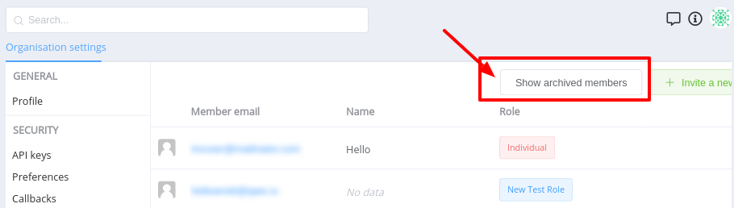
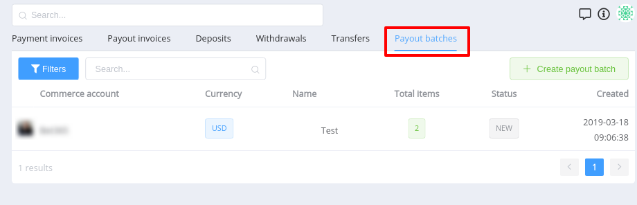
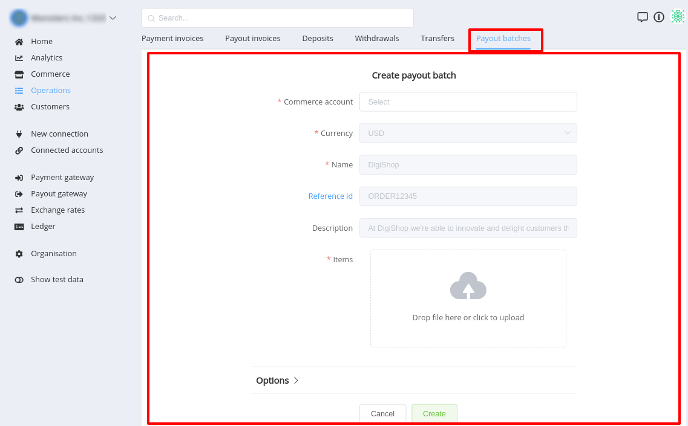
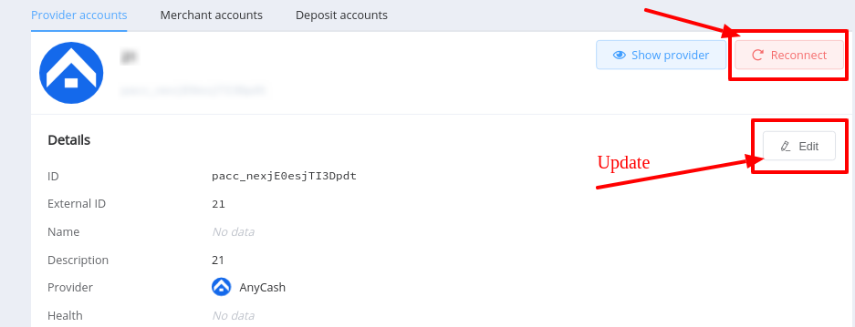
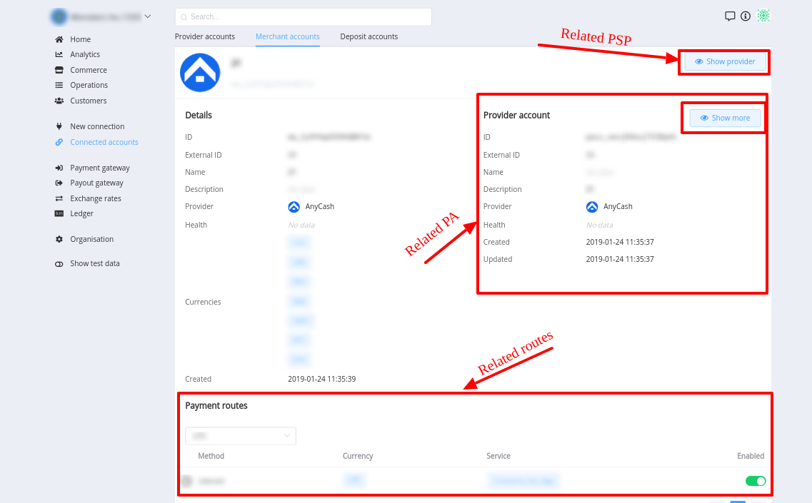
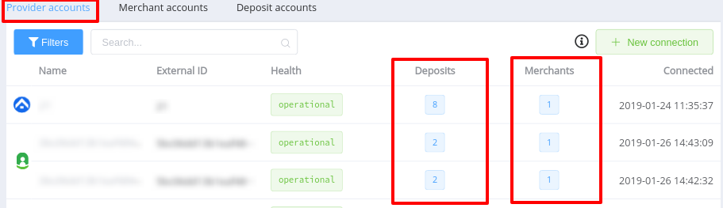
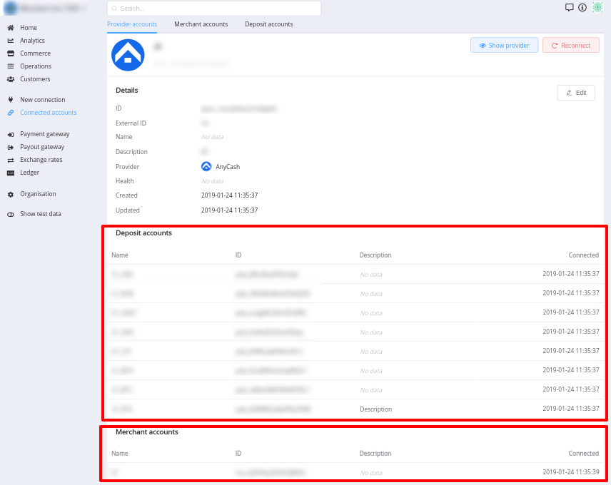

# **PayCore.io® v0.58: March 23, 2019**

*By Dmytro Dziubenko, Chief Technology Officer*

Hello all, here is an update on what the dev team has been working on the last week. We are currently still in the process of migrating existing customers to the new  PayCore.io® Commerce, which was recently released and fixing some previously unknown issues, improving system perfomance and upgrading user interface.

## List of changes
   
- [Commerce update](#commerce-update)
  
    - Commerce features
    - Commerce Public API
    
- [Operations update](#operations-update)
   
    - Operation statuses updated 
    - Payment invoice: **`Autoprocess`** property removed

- [UI upgrade](#ui-upgrade)
    
    - Organisation
    - Batch Payouts
    - Connected accounts

- [New Integrations](#new-integrations)
- [Performance improvements](#performance-improvements)

### Commerce update

#### Commerce features 

- Fee strategy change
- **`Fee shift IN/OUT`** —> **`Include fee`**</li>
- Contract services: add ability of **`Amount limits`** manualy setting
- Expose internal callback data

#### Commerce Public API

- Public fee details _(Allows get fee details through Public API)_
- Public Zero-Fee badge _(Set Zero-fee flag in Pre-request through Public API)_
- Payment Invoice: Public access _(Allows creation through Public API)_

### Operations update

#### Operation statuses updated 

- Payment:

  **`FAILED`** => **`process_failed`**

  **`PENDING`** => **`process_pending`**

  **`EXPIRED`** => **`expired`**

  **`REFUNDED`** => **`refunded`**

  **`REFUNDING`** => **`refund_pending`**

  **`REFUND_FAILED`** => **`refund_failed`**

  **`SUCCESSFUL`** => **`processed`**

  **`INITIALIZED`** => **`created`**

  And some **New** statuses were added.

!!! info
    Read more about  [Payment statuses](/products/payment-gateway/payments/#payment-status)

- Payment and Payout Invoices: henceforth statuses are **`lowercase`**

!!! info
    Read more about  [Payment Invoice](/products/commerce/operations/payment-invoice/overview/#statuses) and [Payout Invoice](/products/commerce/operations/payout-invoice/overview/#statuses)  statuses

#### Payment invoice 

Henceforth, Payment invoice has no **`Autoprocess`** property.

It will process automaticaly as default..

### UI Upgrade

#### Organisation

We removed archived members from member list switcher **`Show archived`** to display a list of archived members.

??? info "Screenshots"
    

#### Batch Payouts

We released user interface section for Payout Batches. 

It includes **List**, **Overview** and **Creating** pages. 

It is located in **Operations** section of PayCore.io Dashboard.
  
??? info "Screenshots"
    

    

#### Connected accounts

- Accounts <b>Reconnect</b> and <b>Update</b> ability
    
    ??? info "Screenshots"
        

- Related entities navigation upgraded
    
    ??? info "Screenshots"
        

- Provider accounts: 
    - Related accounts counters added at list page. 
      
        ??? info "Screenshots"
            

    - Deposit and Merchant accounts section added at overview page.
      
        ??? info "Screenshots"
            

### New Integrations

We have established a new integration with:

  Provider | Name  |
|:-:|:-:|
|   | Skrill (Payment gateway) |
|   | Paymega.eu  (Payment gateway) |

For a list of all available integrations, please visit <a href="https://dashboard.paycore.io/connect-directory/payment-providers" target="_blank" rel="noopener">Payment Providers</a> page.

### Performance improvements

We also made general performance improvements and various bug fixes.

