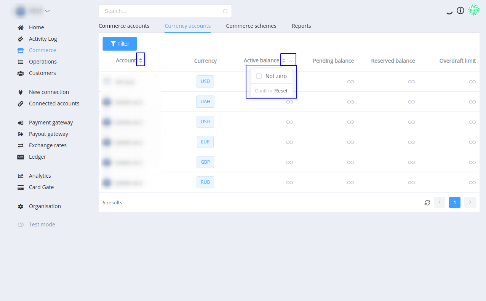
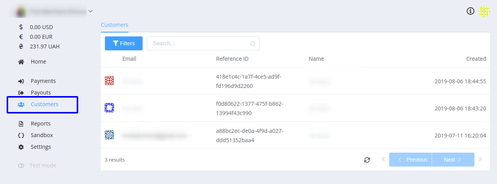
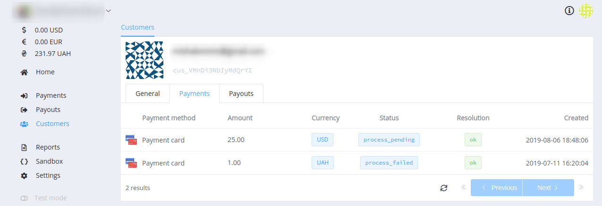
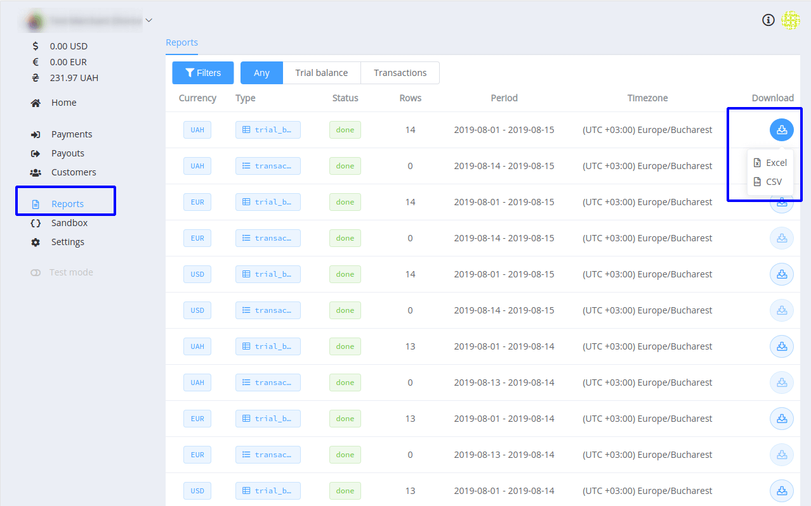
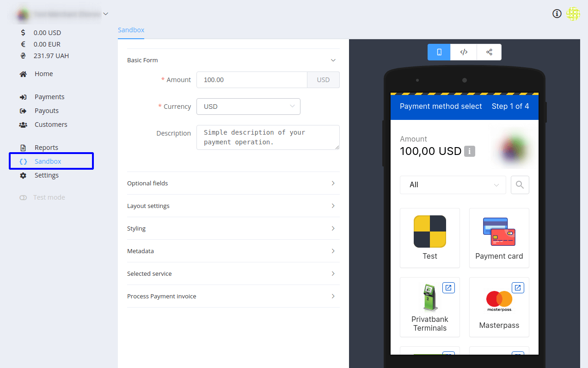

# **PayCore.io v0.60.30 (August 16, 2019)**

*By Dmytro Dziubenko, Chief Technology Officer*

Happy Friday mood from [PayCore.io](https://paycore.io)!

Here are weekly notes to highlight our product updates and improvements so you can easily stay up to date on what’s new.

## List of Changes
  * [Analytics boost](#analytics-boost)
  * [Commerce API upgrade](#commerce-api-upgrade)
  * [Card Gate improvements](#card-gate-improvements)
  * [Layout upgrade](#layout-upgrade)
  * [Merchant Portal upgrade](#merchant-portal-upgrade)
  * [New integrations](#new-integrations)
  * [Performance improvements and bug fixes](#performance-improvements)

## Analytics boost

We speeded up the *Paycore.io Analytics*. 

Now data generation is carried out much more quickly. You get answers for your organisation's important questions in near real-time with the most updated data up to the moment the query was sent out. Enjoy using the Analytics!

## Commerce upgrade

Added card details to *callbacks*:

* permanent account number (PAN)
* expiry month and year
* cardholder name

```
  "payment_card":{
               "last":"1111",
               "mask":"511111******1111",
               "brand":"visa",
               "first":"511111",
               "holder":"unknown unknown",
               "expiry_year":"22",
               "issuer_name":"unknown",
               "expiry_month":"12",
               "issuer_country":"US"
              }
```

## Card Gate improvements

* Russian localisation is added to the *Hosted Payment Page (HPP)* interface.
* Payment card form theme is a new feature. You can use a static form for that matches your project's look and feel. But if you're running multiple storefronts than the dynamic rendering is right for you. You can render a payment card form by supplying up to 10 user-defined parameters!

## Layout upgrade

Just a couple of buttons but *Currency accounts* are sorted much more conveniently.

Find this feature in the *Commerce section* → *Currency accounts* tab:



## Merchant Portal upgrade
Since our last notes about Merchant App, significant changes have occurred in the interface.

* Added the list of *Customers*.



Click on the record to find more detailed information about the customer and incoming and outgoing transactions as associated with this customer ID.



* The *Report* section is available. You can filter transaction reports by currencies and periods. There're separate lists for trial balance records and transactions. Trial balance reports can be downloaded either in .csv or .xlsx format.



* *Sandbox* for HPP creating is also added as the separate section in the sidebar menu. You can play settings and set up a payment page for your project.



## New integrations
We have progressed on the support of new payment providers satisfying your needs.

  Provider | Name  | New features |
|:-:|:-:|:-:| 
|<a href ="https://accentpay.com/en/home_en/" target="_blank" rel="noopener">  </a>  | Accentpay | Payment redirect |
|<a href ="https://https://connectum.eu/" target="_blank" rel="noopener">  </a>  | Connectum | Host-to-host, payments and payouts |
|<a href ="https://www.cardpay.com/home" target="_blank" rel="noopener">  </a>  | CardPay | Host-to-host improvements |
|<a href ="https://www.epay.com/" target="_blank" rel="noopener">  </a>  | ePay | Host-to-host, payments |

For a list of all available integrations, please visit [Payment Providers](https://dashboard.paycore.io/connect-directory/payment-providers) page.

## Performance improvements
We continue developing quality improvements and made numerous fixes all across our platform.