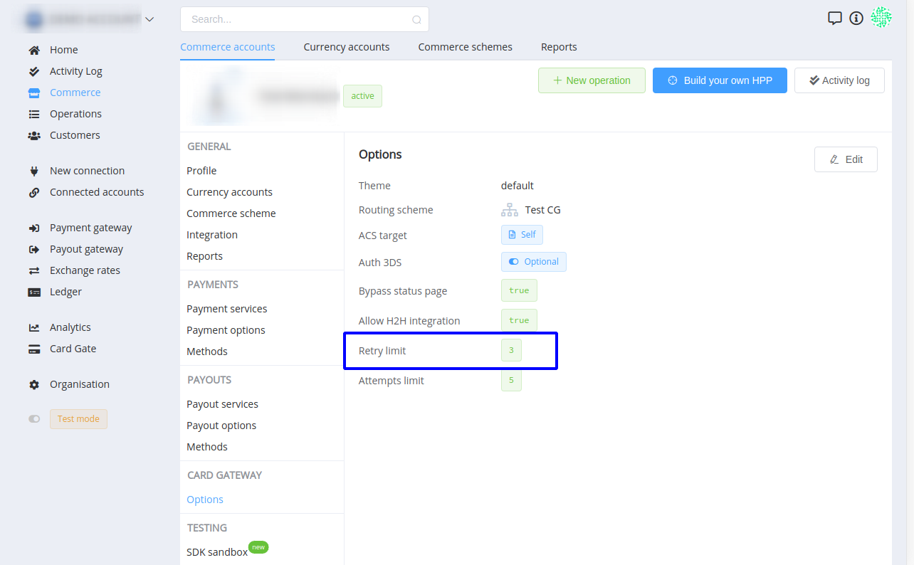

# **PayCore.io v1.0 (September 13, 2019)**

*By Dmytro Dziubenko, Chief Technology Officer*

Happy Friday [the 13th] mood from [PayCore.io](http://paycore.io/)!

We don't believe in superstitions and hope you don't, either. Because we have so many things to celebrate today! It's Programmers' Day, and my own Birthday, and certainly the fresh release of the platform. So hurray for **version 1.0**!

We can name [PayCore.io](http://paycore.io/) a stable product in the continuous growth stage now. Inevitably, there will be less of some epic modifications and feature updates but our dev team is focusing on core streamlining and system improvement.

## Highlights

* [Commerce enhancements](#commerce-enhancements): a batch of new events in the *Activity Log* and settings for Payment Retry and Cascading in the Dashboard.
* [Card Gate Test environment](#test-environment-upgrade): try Test card numbers for payments setup.
* [Integrations update](#integrations-update): Piastrix improvements.
* [Performance betterment and bug fixes](#performance-improvements). 

## All Updates

### Commerce enhancements

New events added to the *Activity Log*. Track account history of changes in the details now!

Set up Payment Retry user attempts in the *Commerce* section &rarr; *Commerce account* settings &rarr; *Card Gateway Options* &rarr; *Retry limit*. 

Set up Cascading attempts in the same section:

And routing rules for Cascading in the *Card Gate* section &rarr; *Routing Schemes* &rarr; *Cascading*:

### Test Environment Upgrade

In addition to Test Mode, we added Test card numbers for trying out Card Gate settings. Use them and their combination with expiry dates' values and check different status responses.

[Read more -->](/connectors/test/#test-card-numbers/)

!!! attention
    Remember to use **Test Mode** to process any test transactions.

### Integrations update

| Provider | Name  | New features | How to connect |
|:-:|:-:|:-:|:-:|
|  | Piastrix | Separate channels for merchant connections | [Step-by-Step](/connectors/piastrix/) |

### Performance improvements

Our top priority for the near future is stabilizing and facilitate connectivity so we put all attention to
 the improvements and bug fixing.

Stay tuned!