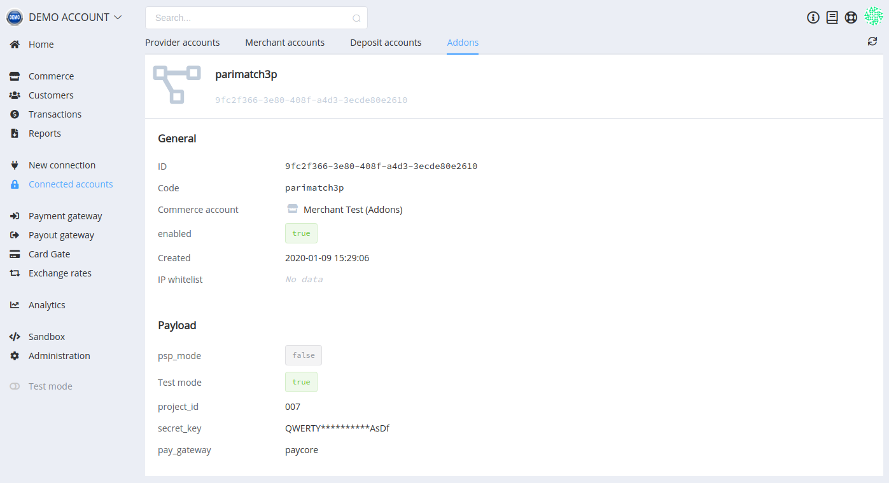
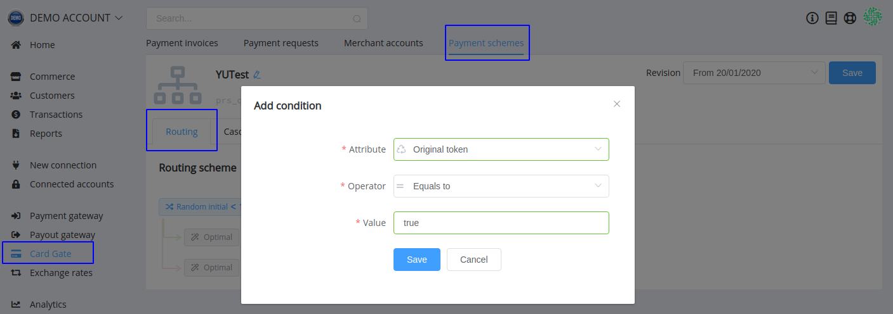
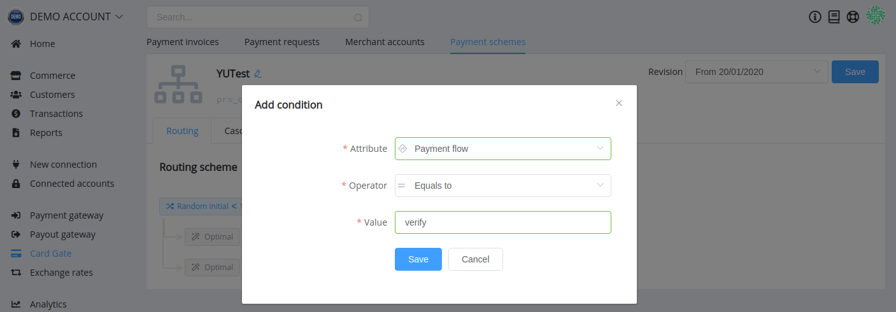
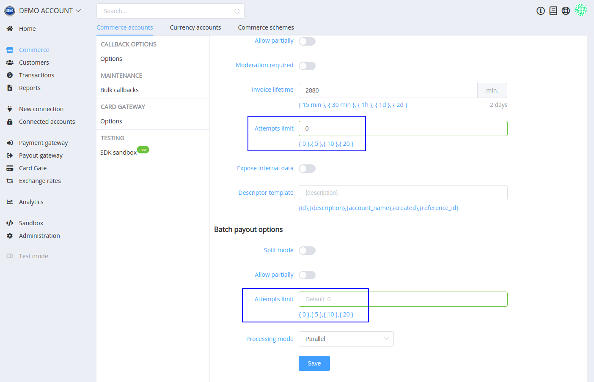

# **PayCore.io v1.11 (March 25, 2020)**

*By Dmytro Dziubenko, Chief Technology Officer*

Cheery Greetings from PayCore.io!

The coronavirus disease (COVID-19) continues to spread, and we have an increased awareness of our responsibility to our employees, clients, and partners. We try to meet the challenges of the global pandemic implications head-on, take care of the health and safety of our employees and their families, and to minimize the impact of the financial pressure on our customers. Follow our news on [the blog](https://paycore.io/blog/) and [Facebook page](https://www.facebook.com/paycore.io/) to keep up with the updates.

And of course, we do not stop improving our product. Welcome to version 1.11!

## Highlights

* [Addons](#addons): implemented addons
* [Card Gateway Routing Updates](#card-gateway-routing-updates): added possibility to set up Callbacks' options, filtered archived currency accounts
* [Commerce Update](#commerce-update): expanded information about payment
* [New integrations](#new-integrations): Masterpass UI Flow for Concord Bank, Google Pay UI Flow for Portmone.com, ApplePay and Google Pay UI Flow for WinPay, updated Forwardbank connection
* [Performance improvements](#performance-improvements)

## List of Changes

### Addons

In a broad sense, an addon is a utility that enhances primary functionality. And PayCore.io addons are tailored solutions developed to meet the needs of our customers. That allows us to introduce the  necessary but narrowly focused features without interfering product architecture.

Decisions on whether to implement addons are made individually with each client. After implementation, you can find a list of all enabled addons and general information about them and linked accounts in the provider hub section (*Connected Accounts* --> *Addons*).

### Card Gateway Routing Updates

To create supplementary conditions in the routing schemes, we added two new attributes:

* Original Token (in case of recurrent payment flow)

* Payment Flow (as a follow-up to [the previous update](/release-notes/v1.10/#verify-flow))

??? note "You may also notice"
    We added `delayed_charge` value for Payment Flow attribute, but so far it is just a spoiler for future betterments.

### Commerce Update

Minor renewal for payout users: we change default attempts limit for processing from 5 to 0, in both separate and batch payouts options.

This change does not affect already configured accounts, but we recommend to check the settings if you used to make payouts with the default value before (just so we are clear).

### New Integrations

| Provider | Name  | New features |
|:-:|:-:|:-:|
|  | [Concord Bank](concordbank/) | Masterpass UI Flow                                         |
|       | [Fovward Bank](forwardbank/)       |   Protocol update              |
|           | [Portmone.com](portmone/)                | H2H connection, Google Pay UI Flow                                  |
|       | [WinPay](winpay/)       |   ApplePay and Google Pay UI Flow               |

### Performance Improvements

Our dev team made various bug fixes, and these were small but essential moves to general performance improvements.

We also continue the firm commitment to supporting our customers. Should you have any questions regarding the potential impact on our joint activities, please contact us, so we can work things out.

Stay tuned for the next updates!
