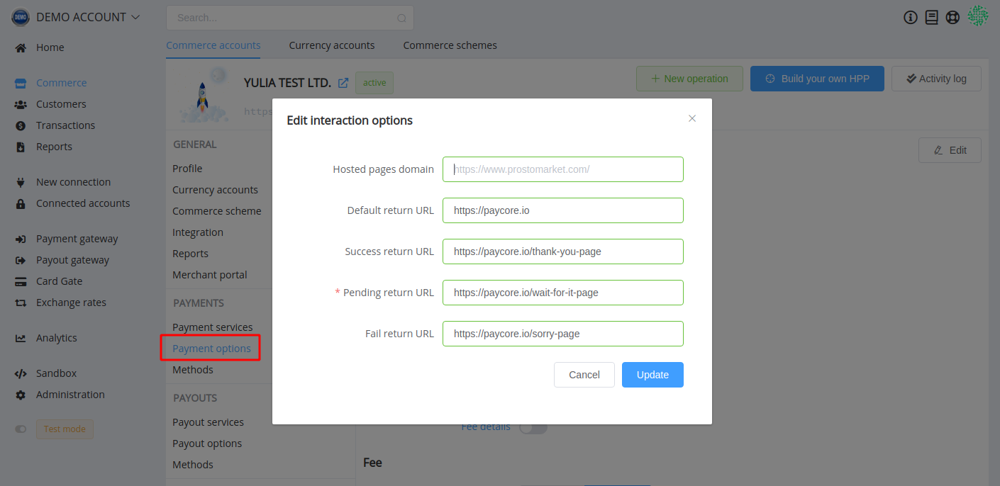
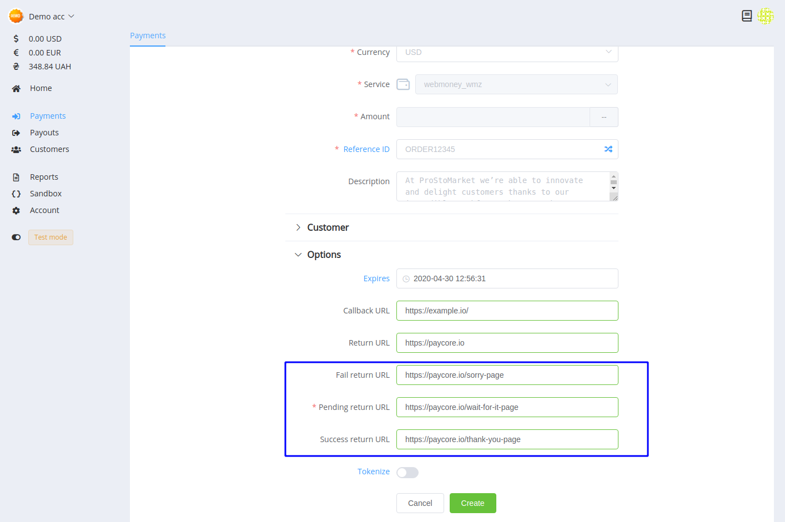

# **PayCore.io v1.13 (April 30, 2020)**

*By Dmytro Dziubenko, Chief Technology Officer*

Cheery Mid-week Greetings from PayCore.io!

We take our clients' requests seriously, especially when it comes to updating our product. So, let us provide insight into what we've been developing inspired by your needs and wishes.

## Highlights

* [Tokenisation process upgrade](#tokenisation-process-upgrade): separated two types of tokens
* [Updates for Commerce account management](#updates-for-commerce-account-management): functionalities for archiving accounts and setting up different Return URLs from the dashboard
* [Dashboard UX Betterment](#dashboard-ux-betterment): grid tabs in the dashboard's section open as a new tab in a browser
* [Integration Updates](#integration-updates): Concord Bank 3DS Flow, Portmone.com non-3DS Flow, UAPay Balances, new supported currencies, Google Pay UI update
* [Bug Fixes](#bug-fixes)

## List of Changes

### Tokenisation Process Upgrade

A little news on the platform's internal improvements: we separate two types of tokens. Now we have public tokens for using in the Checkout process with the *Remember me* option—and private tokens for card predefining and write-offs.

This update does not affect the integration processes for our clients but allows us to speed up the interaction between the platform components.

### Updates for Commerce Account Management

Our dev team cleaned up the *Commerce* section and added functionality for archiving accounts that already not in use. Their data is stored in a separate tab, and you can always find, view and unarchive them if necessary.

As an extension for [this API update](/release-notes/v1.6.12/#return-urls-variations), we have added a relevant block to the integration options.

And you can find the same options on the *Merchant Portal* when the *New Payment* is creating. They are automatically filled in according to the Commerce account settings, but you can modify their value in invoice.

### Dashboard UX Betterment

We waited for this from the outset and finally got the hands to do: grid tabs in the dashboard's section open as a new tab in a browser (*okay, that doesn't sound as cool as it might, but it still makes users happier*)!

### Integration Updates

| Provider | Name  | New features |
|:-:|:-:|:-:|
|  | [Concord Bank](/connectors/concordbank/) | 3DS Flow                                         |
|            | [Portmone.com](portmone/)                  | non-3DS Flow                          |
|  | [UAPay](/connectors/uapay/) | Balances                                        |

Besides that, we have extended the list of supported currencies.

| Name | Code | Default FXRates Source |
| :-: | :-: | :-: |
| Brazilian Real | BRL | [bcb.gov.br](https://www.bcb.gov.br/en/financialstability/currencytable) |
| Kyrgyzstani Som | KGS | [nbkr.kg](https://www.nbkr.kg/index1.jsp?item=1562&lang=ENG)|
| Nigerian Naira | NGN | [cbn.gov.ng](https://www.cbn.gov.ng/rates/ExchRateByCurrency.asp) |
| Tanzanian Shilling | TZS | [bot.go.tz](https://www.bot.go.tz/) |

Also, we updated inner logic of interaction with Google Pay UI.

### Bug Fixes

We are polishing up our platform now, so it's not surprising that we find a lot of tiny things that can be developed or fixed. And thank our clients for help in these improvements!

Feel free to contact us via [e-mail](mailto:support@paycore.io) or your account at [Jira service desk](https://support.paycore.io) and stay tuned for the next updates!
