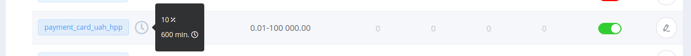
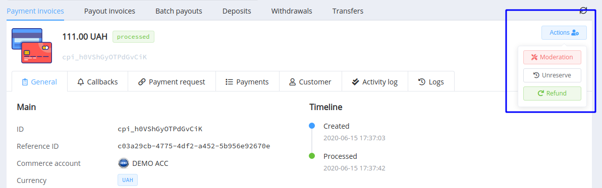

# **PayCore.io v1.14 (June 19, 2020)**

*By Dmytro Dziubenko, Chief Technology Officer*

Cheery Greetings from [PayCore.io](https://paycore.io/)!

These notes provide a brief overview of the new features, enhancements, and other significant changes introduced in the release 1.14 of our platform.

## Highlights

* [Rolling Reserve](#rolling-reserve): added possibility to withhold part of the funds before releasing to the merchant
* [New Integration](#new-integration): VCreditos wallet payments and payouts, 

## List of Changes

### Rolling Reserve

What is a *Rolling Reserve*? A rolling reserve is a type of reserves that withholds a small percentage of all of a merchant’s gross sales in a non-interest-bearing account for a predetermined amount of time before releasing the funds to the merchant. Payment processors may use rolling reserves as a risk management tactic for high-risk merchant accounts.

You can set up the reserve rate (in percentage) and continuance (in minutes) for every commerce payment service you use.

After turning-on reserve, these services are marked with a clock icon in the service scheme's list. Move the mouse over the icon to see a tooltip.

Rate 

### New Integrations

| Provider | Name  | New features |
|:-:|:-:|:-:|
|           | [VCreditos](/connectors/vcreditos/)                | Payments and Payouts                            |
