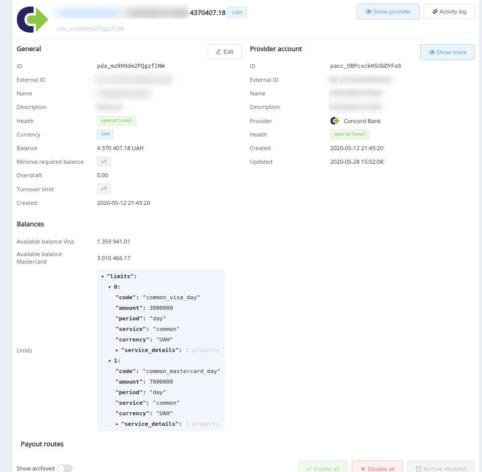

# **PayCore.io v1.15 (June 23, 2020)**

*By Dmytro Dziubenko, Chief Technology Officer*

Cheery Greetings from [PayCore.io](https://paycore.io/)!

This release of the platform allows us to provide our users with enhanced account experience, including data export and analysis. Check the highlights to learn more about updates!

## Highlights

* [Platform UX Enhancements](#platform-ux-enhancements): added payloads for Deposit account balances, extra fields to the Payout Overview, the layout sort parameter 'Created', actions for p2p payments, and new fields to the export grids for Deposits, Withdrawals, and Transfers
* [Merchant Application Update](#merchant-application-settings-update): added API Key to the configuration
* [Integration Updates](#integration-updates): CardPay and Platio instant payments 
* [Bug Fixes and Stability Improvements](#stability-improvements)

## List of Changes

### Platform UX Enhancements

#### The Payload for Deposit Account Balances

We added the possibility to obtain the payload for *Deposit account* balances. So now, if your provider sends additional information with the balance statistics, you can find it in the appropriate section: *Connected accounts* --> [*Deposit accounts*](https://dashboard.paycore.io/provider-hub/deposit-accounts).

#### Extra Fields in the Payout Overview

We have attached extra fields to the Payout Overview. They display all the service parameters specified when an invoice was created.

#### Sort Records by Created

Now the sections have an additional parameter to sort the entries by creation date. Hope, users can navigate the records more convenient now.

#### P2P Actions

Now you have the opportunity to prioritize payment processing directly in the invoice list. After filtering by strategies, payments will be accepted for processing according to the set priority (for this, the value of priority should be higher than 0).

You can also use this menu to send payments for manual moderation.

#### Additional Fields for Data Grid

Also, we boosted up data export and added Commerce Account ID (`com_acc_id`) and Commerce Account Name (`com_acc_name`) to the data grid in the *Deposits*, *Withdrawals*, and *Transfers* sections.

### Merchant Application Update

In extension to the [previous update](/release-notes/v1.14/#merchant-application-settings-update), we also added the API key selector to the basic configuration. The selector displays description labels of the actual existent keys.

You can create a new key, edit or revoke existent in the *Organisation* --> [*Security settings: API keys*](https://dashboard.paycore.io/administration/settings/api-keys/).

### Integrations Upgrades

| Provider | Name  | New features |
|:-:|:-:|:-:|
|           | [CardPay](/connectors/cardpay/)                | Instant Payments                           |
|           | [Platio](/connectors/platio/)                | Instant Payments                           |

### Stability Improvements

As usual, we put a lot of efforts to fix bugs and make stability improvements, and sure it's noticeable.

!!! info
    We have also reduced the time limit for dashboard user sessions to 30 days. But do not forget to check [user security settings](https://dashboard.paycore.io/user/settings/sessions) periodically, and revoke all sessions you cannot identify.

Stay tuned for the next updates!