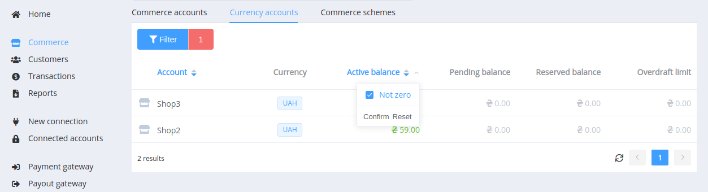

# **PayCore.io v1.16 (July 7, 2020)**

*By Dmytro Dziubenko, Chief Technology Officer*

Cheery Greetings from [PayCore.io](https://paycore.io/)!

We keep polishing and recalibrating our products, so they should be running faster and steadier than before. Beside that, we have a bunch of specific platform updates to share with you.

## Highlights

* [Payout Gateway Updates](#payout-gateway-updates): upgraded batch payouts and the added possibility for direct p2p-payouts
* [UX Improvements](#ux-improvements): added archiving for routing schemes and multi-sorting for grids
* [White Label URL Addons](#white-label-url-addons)
* [Performance Improvements](#performance-improvements)

## List of Changes

### Payout Gateway Updates

#### Batch Payouts Fix and Upgrade

*Batch Payouts* is one of the most useful but undervalued our product. This was mainly due to the confusion about parameters when using several services with different field names. But we have updated an approach to data-processing and file structure and made our batch payouts really multiservice. So use them for payouts through the *Dashboard* and save your time for other business tasks.

#### Direct P2P Payouts

If you use API integration for p2p-payouts, you can send them with the `payment_id` parameter immediately and with or without amount specifying. In the case with no specified amount, the payout will be made for the full amount of the related payment by default.  And if the requested amount is specified and less than the amount of the payment, you’ll need to prior turn on the split mode for the relevant p2p-payment route.

Also, keep in mind, you cannot send the payout with the specified payment ID and the amount that more than the initial payment.

### UX Improvements

#### Archiving of Routing Schemes

Utility update for Payment and Payout Routing Schemes: we added tools for archiving schemes which are out of use.

And you can quickly unpack archived schemes when you need them again.

#### Multi-Sorting for Grid Layouts

We combined simple sorting by columns and quick "non-zero" filter and got multi-sorting to navigate more easily.

### White Label URL Addons

As you know, we develop different [addons](/release-notes/v1.11/#addons) for our clients' needs. And from now on, you have the opportunity to get not just tailored but white label supplement to the core product. Please [contact our support team](mailto:support@paycore.io) to find the most appropriate solution for your project!

### Performance Improvements

And the overall platform performance has been improved, thanks to a clutch of fixes.

Stay tuned, the next minor update is scheduled in two weeks!
