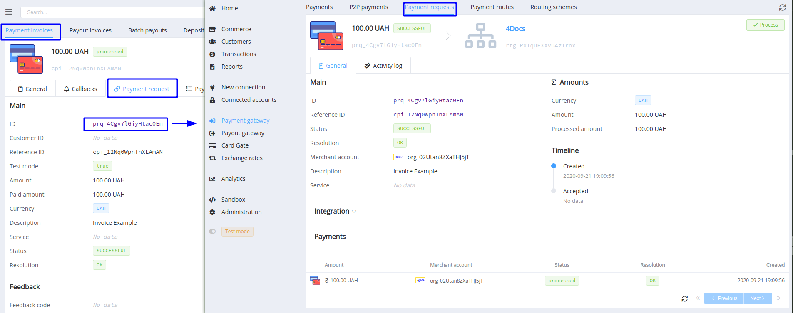

# **PayCore.io v1.21 (September 30, 2020)**

*By Dmytro Dziubenko, Chief Technology Officer*

Cheery Greetings from [PayCore.io](https://paycore.io/)!

Release Notes is our bi-weekly briefly update that highlights what we've recently worked so you can easily stay up to date on what’s new. And here we go to our latest enhancements!

## This Update Includes

* [Dashboard UX improvements](#dashboard-ux-improvements): added cross-links between transaction and request screens, and Request Payload for Payouts
* [New and updated integrations](#new-integrations): Bank Onego, Procard, new currencies
* [Minor bug fixes](#bug-fixes)

## In the Details

### Dashboard UX Improvements

#### Cross-links between screens

We have taken into account your wishes to improve navigation in sections and added cross-links between the most commonly used screens. So, for example, when you're in the Payment Request tab section, you can click on the Request ID and go to the detailed screen of the Request.

#### Request Payload

For payouts that are made with Payout Schemes, we have also added the `request_payload` object to the overview. It stores information about the exchange rate and the initial amount, and if the payout is split through different routes, the data is also displayed for each part, separately.

### New Integrations

More and more providers are evolving to the 3DS 2.0 protocol, and we are then updating the protocols of interaction with them.

| Provider | Name  | New features |
|:-:|:-:|:-:|
|          | [Procard](/connectors/procard/)              | 3DS 2.0 integration     |
|           | [Bank Onego](/connectors/bankonego/)                | Host-to-host payment connection, Payouts  |

We also expanded the list of supported currencies by Norwegian Krone (NOK), Danish Krone (DKK), and New Zealand Dollar (NZD).

### Bug Fixes

We had improved and polished the internal functioning, and our platform has just got better from there.

Stay tuned!
