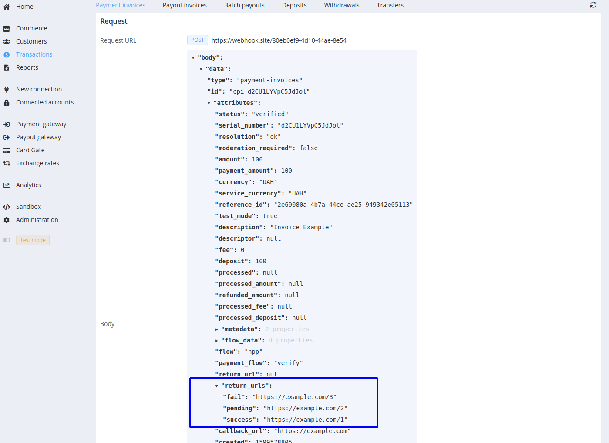

# **PayCore.io v1.22 (October 16, 2020)**

*By Dmytro Dziubenko, Chief Technology Officer*


Welcome to the [PayCore.io](https://paycore.io/) v1.22 release notes!

There you can get a quick overview of all new cool things we created in our products. But before going to them directly, we should make an important message for those clients who use payment tokenisation feature:

!!! attention "Please be aware"
    From **November 3rd, 2020**, the Private API stops to accept a `recurrent` attribute in the `gateway_options` --> `cardgate` object in requests for write-off by a token. Instead of that, you should use an `instant` attribute.

    ```json hl_lines="14 15 16"
    {
        "data":{
            "type":"payment-invoices",
            "attributes":{
                "test_mode": true,
                "reference_id":"ORDER1233",
                "currency":"USD",
                "amount":1,
                "service":"payment_card_usd_hpp",
                "token":"zsmmfyTkG6hn9DdwDhxh69LdQNJgZWk5xMdY7vg",
                "customer":{
                    "reference_id":"my_customer_1"
                },
                "gateway_options":{
                    "cardgate":{
                        "instant": true
                    }
                }
            }
        }
    }
    ```

## List of Changes

* [Batch Payouts' Refactoring and Upgrade](#batch-payouts-upgrade): added customer attributes to a single batch item
* [Card Gateway Update](#card-gate-update): added the possibility to share tokens for the *Remember me* option between your commerce accounts, and transliteration for the Cardholder DTO
* [Minor API Scheme Update](#api-update): added the Response URLs object
* [New Functionality](#new-addon): addon for registration of financial transactions in  National Bank of Ukraine
* [Minor bug fixes](#bug-fixes)

## In the Details

### Batch Payouts' Upgrade

We have heeded your wishes to improve the batch payout tool, made massive refactoring, and added new attributes for a single item in the batch. Now you can add a `customer` and a `customer_metadata` objects to link your payments to the already entered clients' data, update them, or create a new entry.

Enter all objects' attributes separated by a semicolon (;). But keep in mind that in such case, the customer reference ID is mandatory to be specified.

!!! tip "Batch Example"
    

    

    

### Card Gate Update

Suppose you have several Commerce accounts and use *Remember me* option on their checkout pages. In that case, you'll probably need the possibility to have a common database for tokens and to share tokens between these accounts. So you make it easier for your clients to fill out payment forms on your websites.

!!! note "Notice"
    This option is only available to accounts managed by the same organisation. Send us your request, and we set it up for you.

Also, we patched an issue with setting the Cyrillic cardholder names and added the transliteration algorithm to convert them to Latin. It won't cause you any more trouble with names recognising!

### API Update

We have made a minor update to the scheme, and now API returns the [Return URLs](/release-notes/v1.6.12/#return-urls-variations) object in responses and callbacks (if it is not set, returns with null values).

!!! example "Callback Example"
    

### New Addon

We continue working on [tailor-made solutions for your needs](/release-notes/v1.11/#addons). For our Ukrainian clients, this month the dev team has prepared the addon for registration and reporting of financial transactions and status in the NBU (National Bank of Ukraine). Now it supports the registration as merchants and terminals of [City24.ua](https://www.city24.ua/en/), but the list of registrars will be expanded soon.

### Bug Fixes

These weeks we also made a handful of bug fixes too small to mention.

Stay tuned for the next updates!
