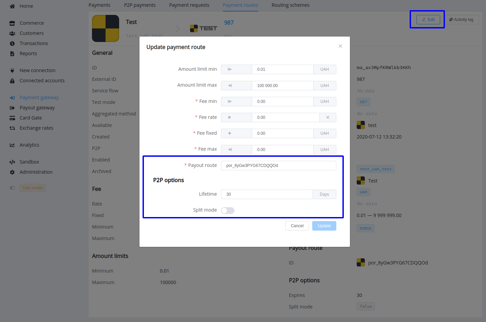
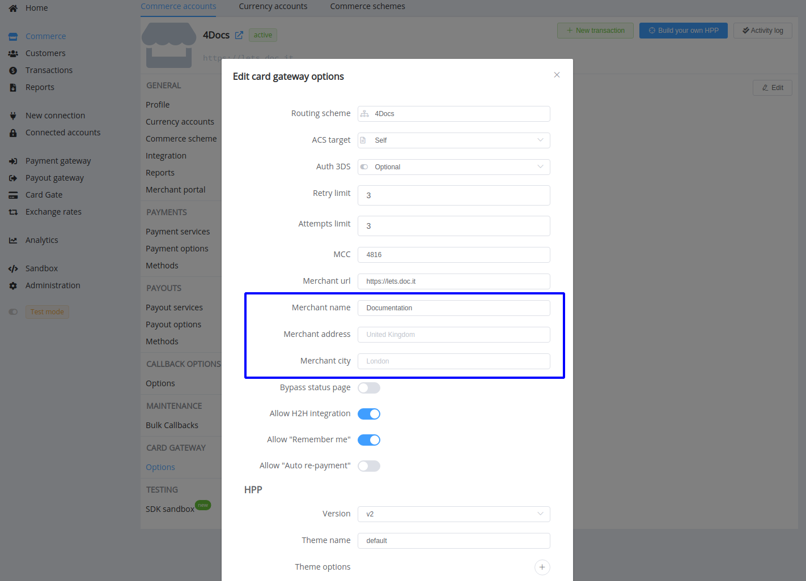

# **PayCore.io v1.26 (December 08, 2020)**

*By Dmytro Dziubenko, Chief Technology Officer*

Cheery Greetings from [PayCore.io](https://paycore.io/)!

Welcome to the Release Notes—our biweekly updates that highlight recent product improvements so you can easily stay up to date on what's new.

These weeks we have focused on connections and their optimizations. In particular, we analyzed the bottleneck of the payouts' load, and the most frequently used provider routes were separated into different queues. So, your outgoing transactions should be processed faster.

## Highlights

* [Payment Gateway Update](#payment-gateway-update): added fields for peer-to-peer options in the *Payment Routes* section
* [Card Gate Updates](#card-gate-updates): additional parameters in the Commerce settings, getting browser_info from HPP
* [Receipt Addon](#receipt-addon): added the possibility to specify a provider code
* [New and Updated Integrations](#new-and-updated-integrations): Axcess Merchant Services, Payeer, UkrGasBank, tome; support of new currencies for CardPay
* [Bug Fixes](#bug-fixes)

### Payment Gateway Update

We made refactoring of Payment routes' settings and have added fields for peer-to-peer options. You can edit them directly and specify payout route ID among the other parameters.

### Card Gate Updates

Additional parameters have also appeared in the Commerce Card Gateway settings. They are optional for filling, but you can use them for the dynamic descriptor and transaction registration with addons.

In continuation of the previous update, we fixed the frontend HPP interaction, and now you have the opportunity to obtain and transfer to the sale stage all the Browser Info fields.

We have also closed the indexing of Card Gate. So, be sure: no robots allowed on these pages!

### Receipt Addon

Slight but enjoyable improvement for the Addon users: we added the possibility to specify a provider code in your transaction receipts. Thus, if you need this option, please contact your account manager to configure all the receipt fields.

### New and Updated Integrations

| Provider | Name  | New features |
|:-:|:-:|:-:|
|       | [Axcess Merchant Services](/connectors/axcessmerchantservices/)  | H2H connection  |
|  | [Payeer](/connectors/safecharge/) | Update of the reconciliation process |
|   | [UkrGasBank](/connectors/ukrgasbank/) | Payouts, Account balances  |
|   | [tome](/connectors/tome/) | H2H connection, Payouts, Account balances |

Besides, we added VND (the Vietnamese dong) currency support for the built-in card gateway, and VND, MXN (the Mexican peso), INR (the Indian rupee) currencies for the [CardPay](/connectors/cardpay/) payment provider.

### Bug Fixes

We've been working hard to improve our platform, and of course, we've found and fixed the bugs.  

Stay tuned for the next updates and grow with us!