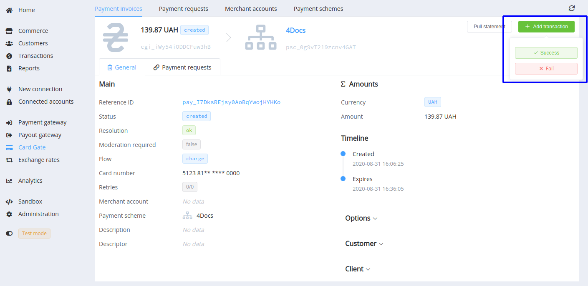
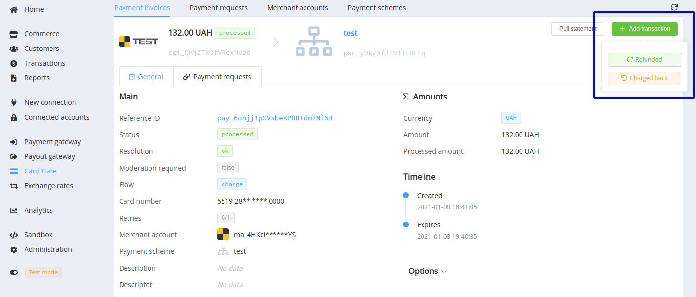
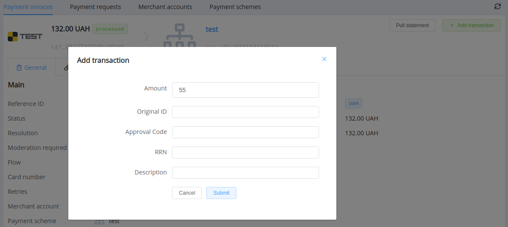
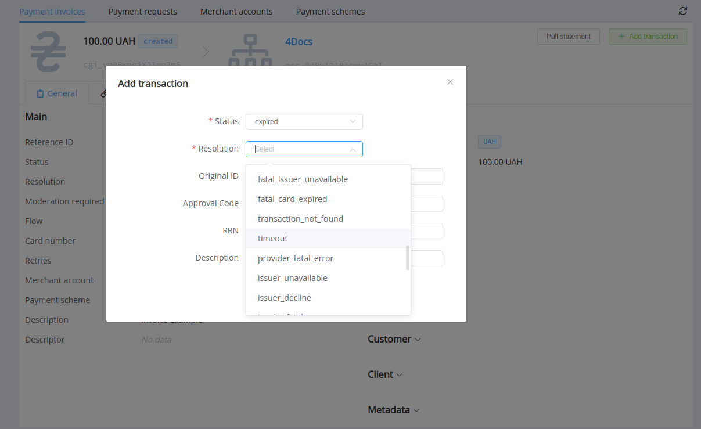

# **PayCore.io v1.28 (January 5, 2021)**

*By Dmytro Dziubenko, Chief Technology Officer*

Cheerful Greetings from [PayCore.io](https://paycore.io/)!

We start our 2021 with routing and processing updates, so in these brief notes, you can look through the most relevant of them.

But firstly, the important news:

!!! info "Be aware"
    From February 2, 2021, we start to send in the Callbacks an additional parameter `auth_type`. Thus, it allows identifying which flow the transaction was managed by.

    This will not affect existing integrations, but if you want to obtain information about the authentication types, you should add the relevant parameter to your Callback handlers.

## Highlights

* [Payout Schemes optimisation](#payout-schemes-update): at payout splitting, the system examines routes' limits and remaining amounts for each following parts
* [Manual card transaction handling](#card-gate-update)
* [Other fixes and improvements](#fixes-and-improvements)

## In the Details

### Payout Schemes Update

Our dev team fixed an issue when the remaining amount after payout splitting on peer-to-peer routes was lower than the minimum amount limit and could not be paid. So now, the system examines routes' limits and remaining amounts for each following parts to choose the optimal alternative. And the last payout is sent:

* by a p2p route within amount limits,
* or with the remaining amount by a non-p2p route if no feasible p2p route is found.

### Card Gate Update

Good news to your support engineers! We added the option for manual correction of transaction statuses.

And, if for any reason you find differences between card transaction statuses at PayCore.io log system and payment provider information, you can use the *'+ Add transaction'* button to fix that.

You can indicate that the amount has been partially refunded (partially processed or charged back), update description, add the provider's original transaction ID, approval code, or RRN.

And at setting status `fail`, or `expired`, you can choose the proper resolution.

<!--
### New Integrations

| Provider | Name  | New features |
|:-:|:-:|:-:|
|   | [CoinsPaid](/connectors/coinspaid/) | Payments  |
|  | [dLocal](dlocal/) | Reconciliation flow update\* |
|   | [Ibox Bank](/connectors/iboxbank/) | Payouts |
|   | [Kassa](/connectors/kassa/) | Payouts, Account Balances  |
|   | [MaxPay](/connectors/maxpay/) | Host-to-host connection  |
|   | [Russian Standard Bank](russianstandardbank/) | H2H connection |

!!! info ""
    \* We added an extra check to the dLocal reconciliation flow because the provider can put transaction creation to the waiting list queue up to 5 minutes after receiving the request.

-->

### Fixes and Improvements

Also, there were a few little bugs that caused troubles as bugs usually do. We fixed them, and everything is going better.

Stay tuned for the next updates!
