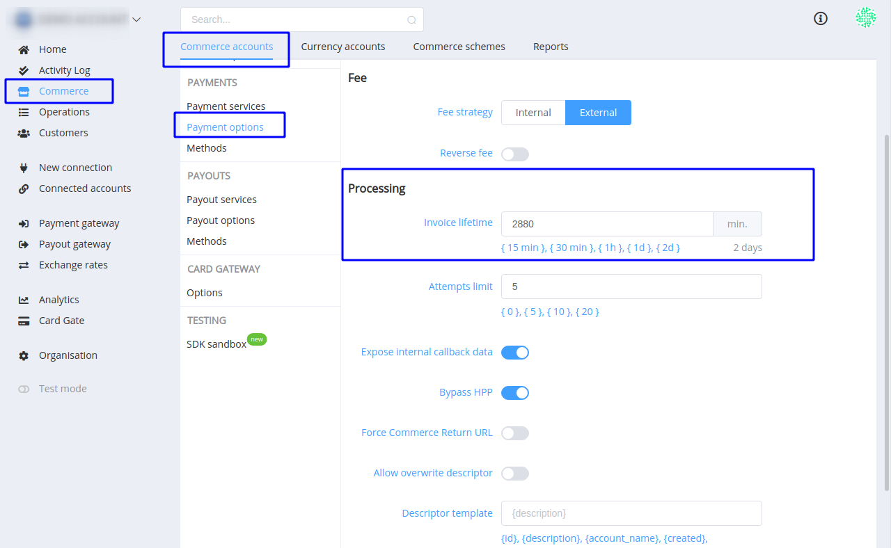

# **PayCore.io v1.3.12 (October 11, 2019)**

*By Dmytro Dziubenko, Chief Technology Officer*

Happy Friday mood from [PayCore.io](http://paycore.io/)!

Maybe, you're already up to speed, but we would see a need to share that we're preparing a global upgrade of the Merchant portal. Our dev team hopes it will become much faster, more comfortable and useful.

But while most of the developments go under the hood and undetected, yet we have found some updates to talk about.

## Highlights
* [Commerce improvements](#commerce-improvements): updated setting up of payments' expiry date.
* [New integrations](#new-integrations): Alfa-Bank &mdash; payout gateway, Paymentwall &mdash; host-to-host connection.
* And we haven't been avoiding [Bug Fixes](#bug-fixes).

## List of Changes

### Commerce Improvements

#### Expiry Date of Payments

If you stated invoices' lifetime in payment options, you could notice that sometimes it didn't work correctly and invoice stayed active longer time. We fixed its behaviour.

Set up the invoice's lifetime in general commerce settings. You can choose from default options or specify other value in minutes. 

### New Integrations

This release includes upgrades for connections with:

| Provider | Name  | New features | How to connect |
|:-:|:-:|:-:|:-:|
|  | Alfa-Bank | Payouts | [Step-by-Step](/connectors/concord/)
|  | Paymentwall | H2H merchant connection | [Step-by-Step](/connectors/paymentwall/) |

### Bug Fixes

We put a lot of attention on our platform's improvements and, is as often the case, we found several bugs and needed to do numerous hotfixes. Please bear with us, these imperfections irritate us too.

Also, we refused Freshchat as a communication channel but don't leave our customers without support. Please contact us via [e-mail](mailto:support@paycore.io) or your account at [Jira service desk](https://support.paycore.io).

Have a nice weekend! 