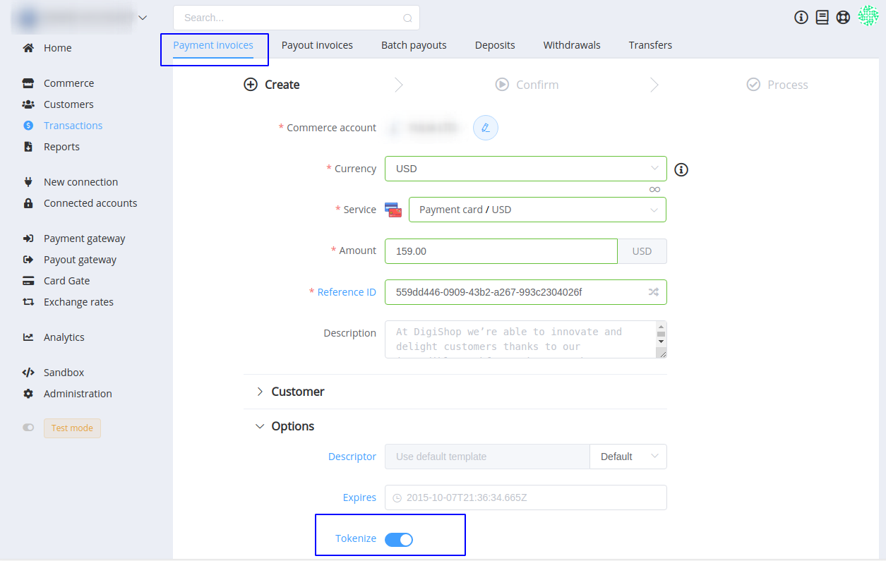

# **PayCore.io v1.3.17 (October 25, 2019)**

*By Dmytro Dziubenko, Chief Technology Officer*

Happy Friday mood from [PayCore.io](http://paycore.io/)!

We keep enhancing our products. This week we focused on boosting productivity and payment safety.  

## Highlights

* [Card data tokenization](#card-data-tokenization): added the possibility to replace sensitive customer data with a token
* [New Integrations](#integration-upgrade): Wonderlandpay H2H, Paymentwall Refunds
* [Performance Improvements](#performance-improvements): we have successfully improved our products' performance and resolved revealed issues

## List of Changes

### Card data tokenization

Tokenization is the process of protecting sensitive data by replacing it with an algorithmically generated number called a token. That token is impossible to trace back to the original data, but we can store tokens and inversely associated with the cards. It is one of the most effective methods to improve payment security and prevent data breaches.

Also, PCI standards do not allow storing credit card numbers retailers' databases after a transaction. Tokenization of a card number solves this issue and protect customer data.

Use Tokenize option creating payment invoice.

If the payment transaction is successful, the `token` will be received in callbacks, in the `payload` object.

### New Integrations

This release includes new integrations with:

| Provider | Name  | New features |
|:-:|:-:|:-:|
|  | [Paymentwall](/connectors/paymentwall/) | Refunds |
| | [WonderlandPay](/connectors/wlandpay/) | H2H merchant connection |

### Performance Improvements

This release is not so packed for updates as the previous ones, but we have successfully improved our products' performance and resolved revealed issues.

Stay tuned!
