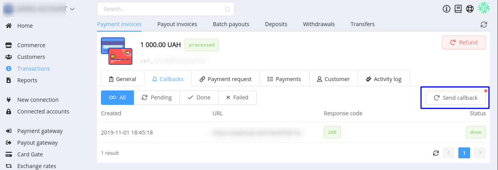

# **PayCore.io v1.3.21 (November 1, 2019)**

*By Dmytro Dziubenko, Chief Technology Officer*

Happy Friday mood from [PayCore.io](http://paycore.io/)! We started November with massive performance enhancements.

Our dev team is working hard on the search optimising and overall improvements in platform productivity, and we already have encouraging results. Besides, we haven't connected new payment providers this week but updated protocols with a bunch of maintained providers, such as XPay, ePay, Interkassa, etc.

To check other notable updates, please read the information below.

## Highlights

* [Commerce updates](#commerce-updates): added Merchant Portal's configuration tab, changed callbacks' lifetime
* [Card Gate betterment](#card-gate-betterment): added possibility to make payouts by card tokens
* [Bug fixes](#bug-fixes)

## List of Changes

### Commerce Updates

#### Merchant Portal tab

We added new tab to the *Administration* settings where you can configure initial settings of the application.

#### Callbacks' Lifetime

From now on callbacks are stored on a server for up to 14 days, therefore, if you need data about the payment after that period, send new callbacks from *Payment* or *Payout gateway* sections.

### Card Gate Betterment

#### Payouts with the tokenized card

As a follow-up to [the previous update](/release-notes/v1.3.17/#card-data-tokenization), we added the possibility to make payouts by tokens. If you tokenize card number and keep the resulting token, you can use it instead of the full card number.

But notice, if you post both parameters in the request, `card_number` will have a priority over `token`.

### Bug Fixes

Bugs invariably follow any improvements, but we always prevent or find and fix them. So, if you want to help in our fights, fill free to contact us via [e-mail](mailto:support@paycore.io) or [Jira service desk](https://support.paycore.io).

Stay tuned for the next great updates!
