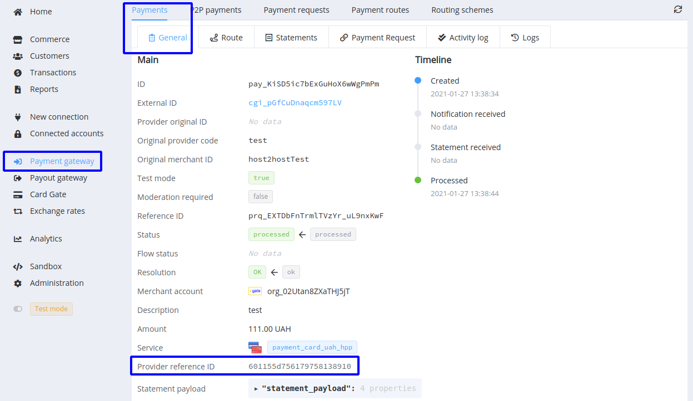
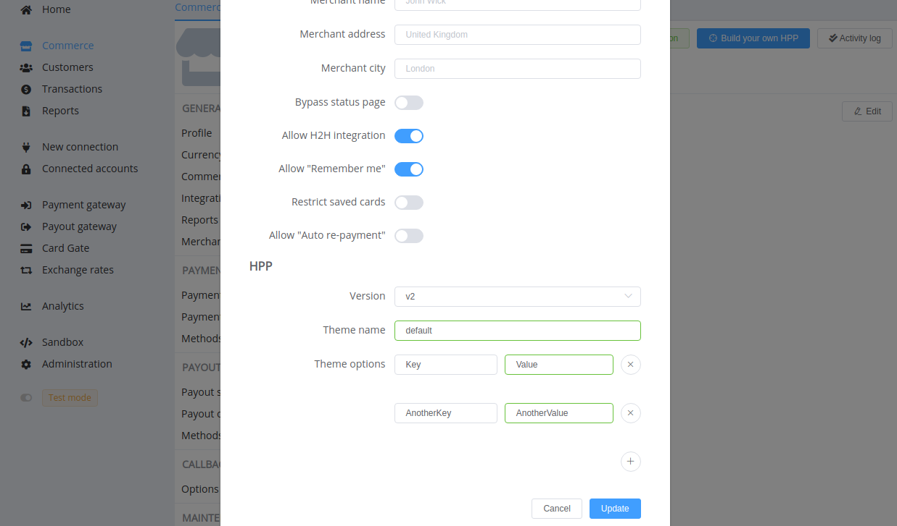

# February 6, 2021

[PayCore.io](https://paycore.io/) versions: 
**1.36**, **1.35**, **1.34**, **1.33**, **1.32**, **1.31**, **1.30**, & **1.29**

*by Dmytro Dziubenko, Chief Technology Officer*

Cheery Greetings from the [PayCore.io](https://paycore.io/) team!

As you may have probably aware, we changed our release flow approach, so the platform's minor versions have been launched more frequently. And today's notes feature all the improvements you can find in our last updates. Let's sum up our January advances!

## Highlights

* [Payment Gateway updates](#payment-gateway-updates): added fee set for chargebacks to Commerce payment services' options and Provider Reference ID parameter to payment flow
* [Card Gateway update](#card-gateway-updates): security updates, increased HPP theme options limit, updated `browser_ip` regular expression to support IPv4 and IPv6 addresses
* And other platform performance improvements

## List of Changes

### Payment Gateway Updates

#### New Payment services' options: added fee set for chargebacks

In addition to the already familiar Commerce settings, now we provide the opportunity to configure fees for chargeback procedure. Thus, you can use them to recompense possible penalty fees from acquirers.

Chargeback Fees are available to configure for the card payment services, as well as ApplePay, GooglePay, and Masterpass. To do so, go to the *'Commerce'* settings --> *'Payments': 'Payment services'*, select the desired one, and specify fee values.

But we certainly wish you have fewer consumer chargebacks and disputes associated with your accounts.

#### Provider Reference ID parameter

We found that some providers do not accept our Reference ID format, for example, have various additional requirements to this parameter, such as length or characters used. Hence, we added an extra attribute 'Provider Reference ID' to generate and send ID according to their requirements (but in the vast majority of cases, this field will remain empty).

It is important to recall that Provider Reference IDs may be the same for different providers due to their generation restrictions. Therefore, to search and check transaction data, use the Reference IDs unique throughout our system.

### Card Gateway Updates

#### Card Gateway HPP security update

We made several updates related to the HPP status page and redirect security scope. From now on, we set an additional cookie with payment context when a user submits the payment form.

We also should recall that after the invoice expiry, the status page becomes inaccessible to any user.

!!! note "But in any case"
    If we have gained the ACS data, we process them and pass to the acquirer to finalise the transaction.

#### Increased HPP theme options limit

The [possibility to customise the Hosted Payment Page design with theme options](archive/v1.17/#additional-checkout-theme-options) was so convenient for you that we have raised its limit again: up to 50 options.

Find and edit the '*Theme options*' in '*Commerce*' settings --> '*Card Gateway options*' --> '*HPP*':

#### Updated a regular expression for the `browser_ip`

We also enlarged a regular expression for the `browser_ip` attribute of the `browser_info` object to support IPv4 and IPv6 addresses' format.

### Performance Improvements

Hope, you mentioned the growth of the platform's productivity because we put a lot of effort into bug fixing and overall improvement.

Stay tuned for the next updates, we plan a lot of significant enhancements in the nearest time!
