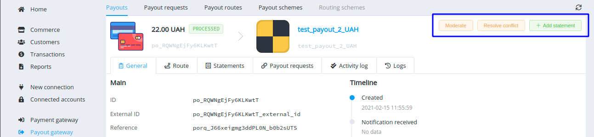
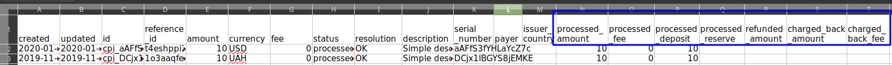
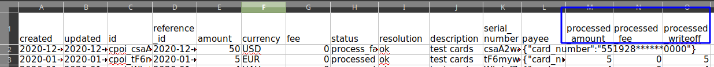
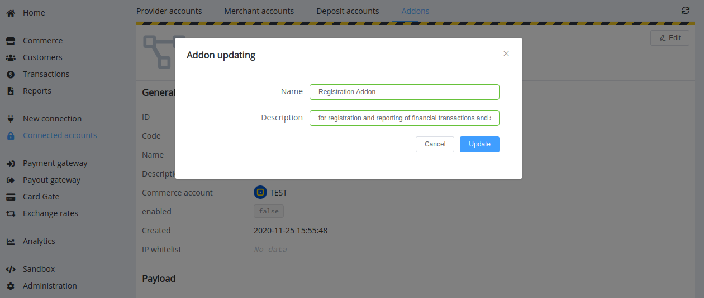

# March 3, 2021

[Corefy](https://corefy.com/) versions: 
**1.44**, **1.43**, **1.42**, **1.41**, **1.40**, **1.39**, **1.38**, & **1.37**

by Dmytro Dziubenko, Chief Technology Officer

Cheery Greetings from the [Corefy](https://corefy.com/) team!

Yes, as you have noticed, we changed our name from PayCore.io to Corefy and launched a new interactive [website](https://corefy.com/). You can visit it and, among other things, find reasons and details about our rebranding in the [announcement](https://corefy.com/blog/paycore-io-rebrands-to-corefy-for-growth-and-expansion/).

And have a look at [our *Connectors* page](/connectors/): the number of performed integrations with local and worldwide payment providers exceeded 100, and we continue to extend that list. Look it up; you might find the connection just right for you.

But no more time wasted: let's check out the platform enhancements delivered in the latest releases!

## Highlights

* [Payout Gateway update](#payout-gateway-update): added possibility to resolve statement conflict from the Dashboard
* [Extended Export Data Files](#extended-export-data-files) and add new fields
* Update [Addons](#addons-editing): add editing option
* [Performance Improvements](#performance-improvements)

## In the Details

### Payout Gateway Update

We have expanded the list of available features for users with moderator access rights. Now they can resolve payout statement conflicts directly in the general view of a payout.

Conflicts often result because provider statements may be received asynchronously. In such cases, a moderator can resolve the conflict to update the transaction status and obtain the latest relevant statement.

### Extended Export Data Files

We added new columns to the export data files. You can find them in payment and payouts exports both in the Dashboard and Merchant Portal.

So, the payment exports additionally show:

* processed amount
* processed fee
* processed deposit
* processed reserve
* refunded amount
* charged back amount
* charged back fee

And the payout exports get fields for:

* processed amount
* processed fee
* processed write-off

### Addons Editing

To simplify managing addons for dashboard users, we added an editing option to the Addon Overview. Now you can add and edit their names and descriptions (also displayed in the list of all available addons).

### Performance Improvements

We continue working on platform betterment, so our dev team made minor system refactoring and bug fixes.

Stay tuned for the next updates!
