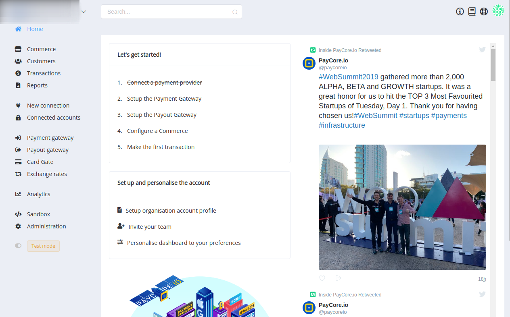
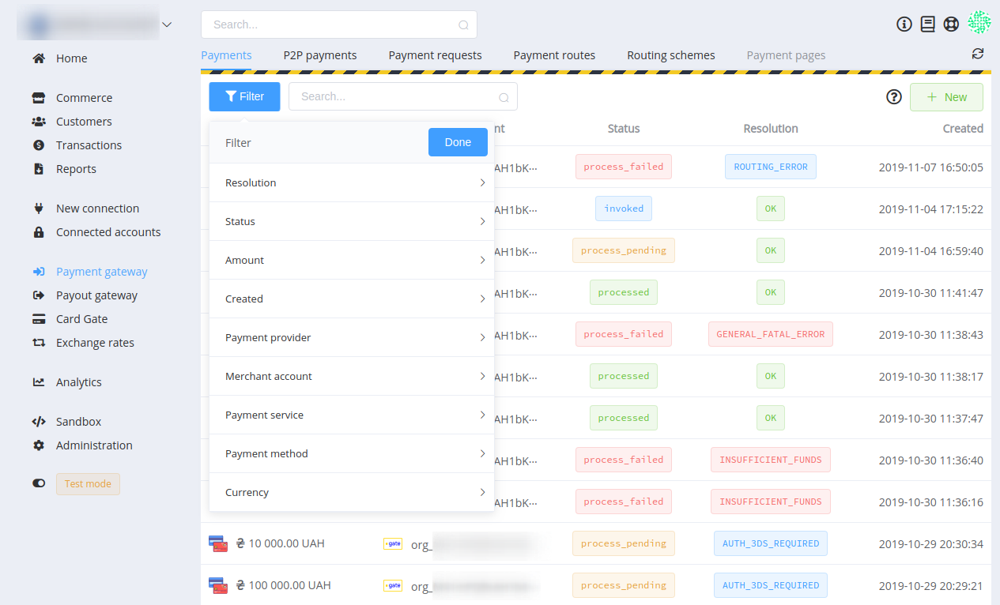

# **PayCore.io v1.4.2 (November 8, 2019)**

*By Dmytro Dziubenko, Chief Technology Officer*

Happy Friday mood from [PayCore.io](http://paycore.io/)! Yesterday we just got some amazing news about hitting the TOP 10 Most Favourited Startups of WebSummit 2019, and we're so proud and thankful for all who had chosen us! And we are keenly aware of the trust that our current users place in us. It's a great motive to move ahead and develop our product.

Meanwhile, our team continue working on system improvements and performance betterment. One of the main results is the payment reconciliation process upgrade — and many more exciting features satisfying your needs.

## Highlights

* [Hosted payment page v2.0](#hpp-v20): improved and reorganized service
* [Dashboard UX betterment](#dashboard-ux-betterment): reorganized system of filters
* [Card Gate enhancements](#card-gate-enhancements): added modifiers to routing schemes, pull statements option, payments by tokens
* [New integrations](#new-integrations): Ecopays, paysafecard
* [Performance improvements](#performance-improvements)

## All Changes

### HPP v2.0

The Hosted Payment Page (HPP) is a service that lets you use PayCore.io to accept payments without the need of integrating our products in your web pages, or even without having any website. If you are not familiar with its functions, you can [check the summary](https://paycore.io/payment-gateway/checkout/) or [read more information in our guides](../../products/hpp/).

Version 2.0 has significantly improved performance. We restructured it following best practices, made the HPP more customizable and boosted data processing.

### Dashboard UX Betterment

We reorganized the system of filters in all sections of dashboard: added new and got rid of useless.

Hope, now they are much more helpful for searching desired entries.

### Card Gate Enhancements

#### Modifiers for routing schemes

Card Gate routing schemes have a new functionality: you can add new rules connected with Modifiers such as 3D-Secure and required CVV (we intend to expand the list of conditions and modifiers later).

#### Pull statements option

From now on, you can manually pull statements and re-upload Card Gate transaction status and resolution.

#### Payments to the tokenized card

We added the possibility to create payments by a token instead of the card number. Rules for creating request are the same as [for payouts request](../v1.3.21/#payouts-with-the-tokenized-card).  

### New Integrations

This release includes new integrations with:

| Provider | Name  | New features |
|:-:|:-:|:-:|
|  | [Ecopayz](/connectors/ecopayz/) | Payment Gateway, Payout Gateway |
| | [paysafecard](/connectors/paysafecard/) | Payment Gateway |

### Performance Improvements

We also made various bug fixes, and it was small but important changes for general performance improvements.

Stay tuned for the next updates!
