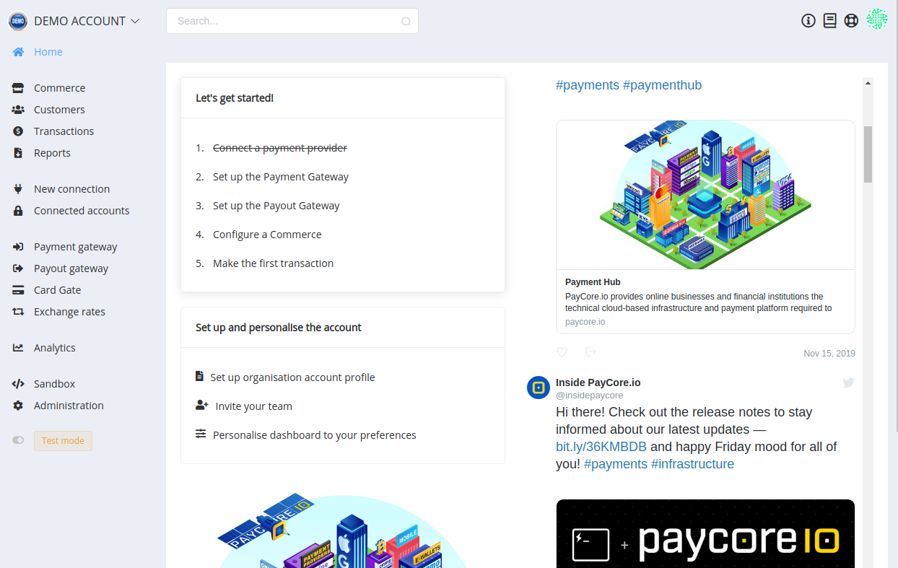

# **PayCore.io v1.4.45 (November 29, 2019)**

*By Dmytro Dziubenko, Chief Technology Officer*

Happy Friday mood from [PayCore.io](https://paycore.io/)!

We keep enhancing our products. This week the dev team focused on boosting productivity and payment safety and worked on the deep-seated modifications for our products and platform features. Mostly, these enhancements are under the hood, so this release notes are not filled up by updates. But we planned a lot of changes in the nearest time.

## Highlights

* [Card Gate upgrade](#test-card-upgrade): added possibility to test statuses connected with reconciliation process.
* [New Integration](#new-integration): xpate H2H connection
* [Bug Fixes](#bug-fixes)

## List of Changes

### Card Gate Upgrade

We updated our test cards and expanded opportunities to moderate obtaining of reconciliation statuses. Use 'successful' test card numbers and expiry date **07/77**.

For detailed information, check the [*Test Card Numbers*](/connectors/test/test-card-numbers/) article.

### New Integration

| Provider | Name  | New features |
|:-:|:-:|:-:|
|  | [xpate](/connectors/xpate/) | Host-to-host connection |

### Bug Fixes

Whereas we continue developing quality improvements, we made numerous fixes all across our platform.

If you also find any error that appears in the system, please contact us via [e-mail](mailto:support@paycore.io) or your account at [Jira service desk](https://support.paycore.io).

Have a nice weekend!