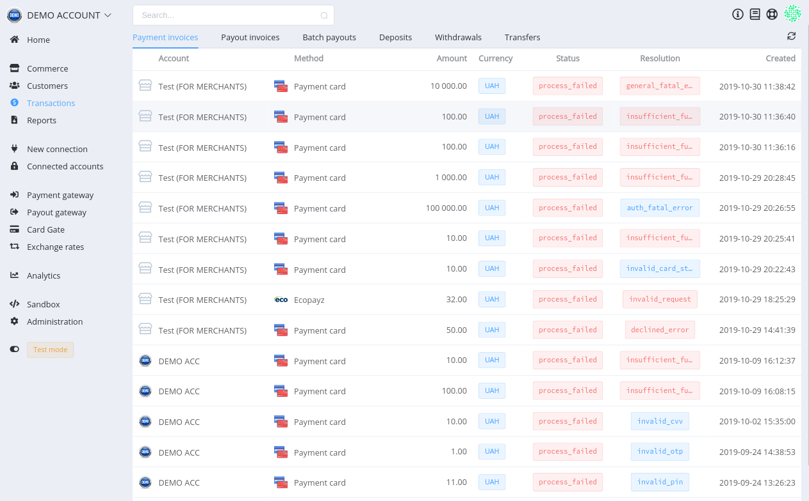
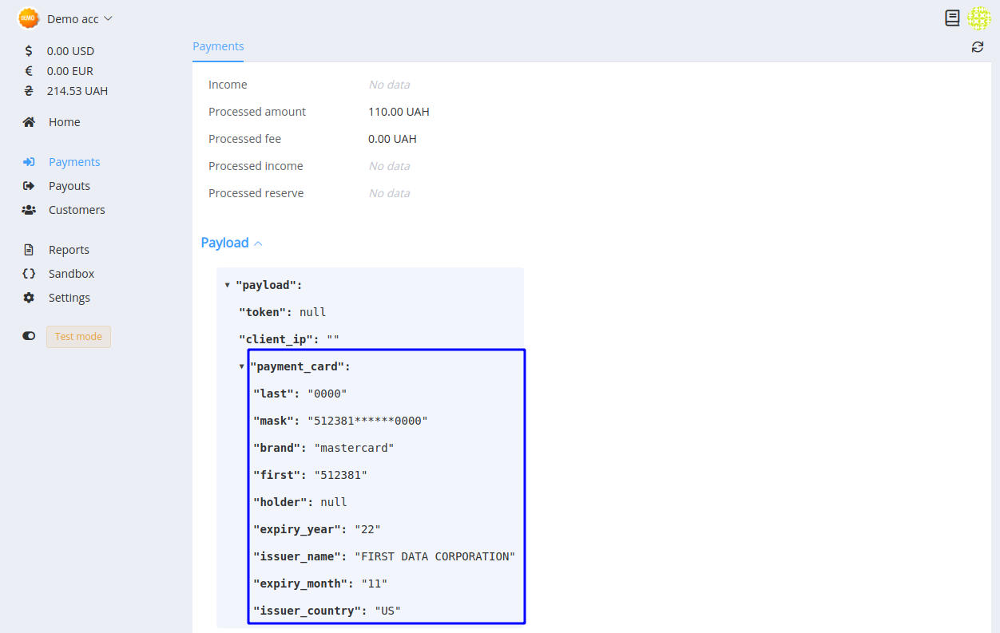

# **PayCore.io v1.4.8 (November 22, 2019)**

*By Dmytro Dziubenko, Chief Technology Officer*

Cheery Friday greetings from [PayCore.io](http://paycore.io/)!

This week we have worked on making our platform faster and more usable for you: like we always do. We cleaned up behind the curtain and optimized internal processes. And also killed bugs and added little extra things that made our platform more user-friendly.

## Highlights

* [Commerce enhancements](#commerce-enhancements): extended the list of resolutions, added bulk callbacks.
* [Merchant App update](#merchant-app-update): added card data to the payments.
* [Integration upgrade](#integration-upgrade): Twelve.live H2H-connection.
* [Bug Fixes](#bug-fixes): that's all part of the experience.

## List of Changes

### Commerce Enhancements

#### Extended Resolution List

List of possible payment resolutions was refined and further detailed.

!!! note
    A payment or payout resolution determines a request status to the payment provider's API. And, if it is not `ok`, describes a reason why the payment process is failed or stuck in pending.

#### Bulk Callbacks

If you need a massive update of transaction statuses, you can send bulk callbacks. Find this feature in the *Commerce* --> *Commerce accounts* --> *Maintenance*. Choose a type of invoices that are required to update.  Specify period: from an hour up to 2 days.

You can point out the custom date but keep in mind that callbacks' lifetime is up to 14 days.

### Merchant App Update

If payment invoice is paid by card, extended card data will be sent in the `payload` object in callbacks and shown in the General section of payment details (previously, this option was enabled only in provider's dashboard).

### Integration Upgrade

| Provider | Name  | New features |
|:-:|:-:|:-:|
|  | [Twelve.live](/connectors/twelvelive/) | Host-to-host connection |

### Bug Fixes

We also made various bug fixes. Hope, we caught them sooner than they had a chance for irritating you.

Stay tuned!
