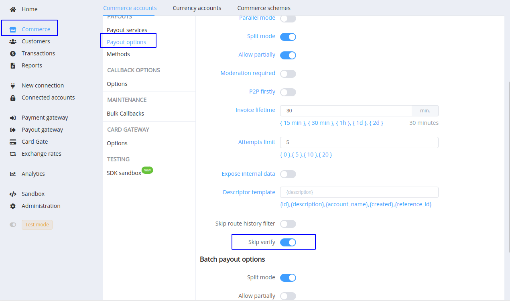

# April 2, 2021

[Corefy](https://corefy.com/) versions: 
**1.53**, **1.52**, **1.51**, **1.50**, **1.49**, **1.48**, **1.47**, **1.46**, **1.45**, & **1.44**

by Dmytro Dziubenko, Chief Technology Officer

Cheery Greetings from the [Corefy](https://corefy.com/) team!

Our main priority for this month was streamlining, and we made a series of tiny decisions for code refactoring and bettering our products. Most of them go unnoticed, though we've also got changes to light up.

## Highlights

* [Processing supplements](#processing-supplements): added partial statuses for payments' refunds and chargebacks, and an option to skip the verify stage on payouts
* [Card Gate](#card-gate-update): added possibility to update features for connected merchant accounts in the Dashboard
* [Merchant Portal](#merchant-portal-updates): configuration and exports updates
* [Transaction Registration Addon](#transaction-registration-addon): added API endpoints to get data from Transaction registration addon
* [Performance improvements](#performance-improvements)

## List of changes

### Processing supplements

#### For payments

We added `partially_charged_back` along with  `partially_refunded` to the payment status list. Both status types are considered final but keep in mind that transaction refund can be requested several times until the transaction sum becomes zero equal in the used currency.

!!! info "Payment statuses"

    

#### For payouts

The verify stage is an integral part of a transaction flow. Despite this, in several cases (for example, payouts through self-service terminals), it's not always possible to examine requisite existence in a provider database due to data transport errors. Time and money can be lost, and to prevent such situations, we added the commerce option, which allows skipping background verification at payout processing.

Find this option in *Commerce account settings* --> *Payouts* --> *Payout options* and use with caution.

!!! info ""
    

### Card Gate update

We simplified handling of connected merchant accounts: if the provider has allowed the account to use the new features on their side, you don't need to reconnect but only go to its details and edit used features in the *Dashboard* (*Card Gate* --> *Merchant accounts*).

!!! info ""

    

### Merchant Portal updates

#### Logo and favicon uploader

Now when you set up the merchant portal, you can upload its logo and favicon at once. Options aren't mandatory but helpful if you want to improve the portal's style.

The supported file formats:

* Logo: `.svg` and `.png`
* Favicon: `.svg`, `.png`, `.ico`

!!! info ""

    

#### Export usage update

We've improved the generation of the *Exports* based on the Portal user's timezone. So now, you don't need to manually add your time difference with UTC (default time value); just set the timezone in the user profile settings.

### Transaction Registration Addon

We're continuously making our addons better, thus provided separate API endpoints for the transaction registrations in the National Bank of Ukraine.

Method: `GET`

Endpoints:

* `/addon/transaction-registration/transactions`
* `/addon/transaction-registration/transactions/{id}`

??? info "Filters for use with `/transaction-registration/transactions` endpoint"

    | Filter name                 | Scheme value type | Description                                                               |
    |-----------------------------|-------------------|---------------------------------------------------------------------------|
    | filter[status]              | array[string]     | Transactions filtered by registration status (`fail` or `success`)        |
    | filter[processing_status]   | string            | Transactions filtered by processing status                                |
    | filter[created][from]       | integer           | Transactions created after a specified date in the Unix timestamp format  |
    | filter[created][to]         | integer           | Transactions created before a specified date in the Unix timestamp format |
    | filter[registration_date]   | integer           | Transactions filtered by date of registration                             |
    | filter[unregistration_date] | integer           | Transactions filtered by date of registration cancelling                  |
    | filter[registrator_code]    | string            | Transactions filtered by a code of the registrar                          |
    | filter[type]                | string            | Transactions filtered by type (`payments` or `payouts`)                   |
    | filter[reference_id]        | string            | Transactions filtered by Reference ID                                     |
    | filter[payment_provider]    | string            | Transactions filtered by a payment provider code                          |
    | filter[commerce_account]    | string            | Transactions filtered by Commerce ID                                      |

### Performance improvements

We've also made various minor performance improvements and related bug fixes.

And that's all news for today. Stay tuned for the following updates!
