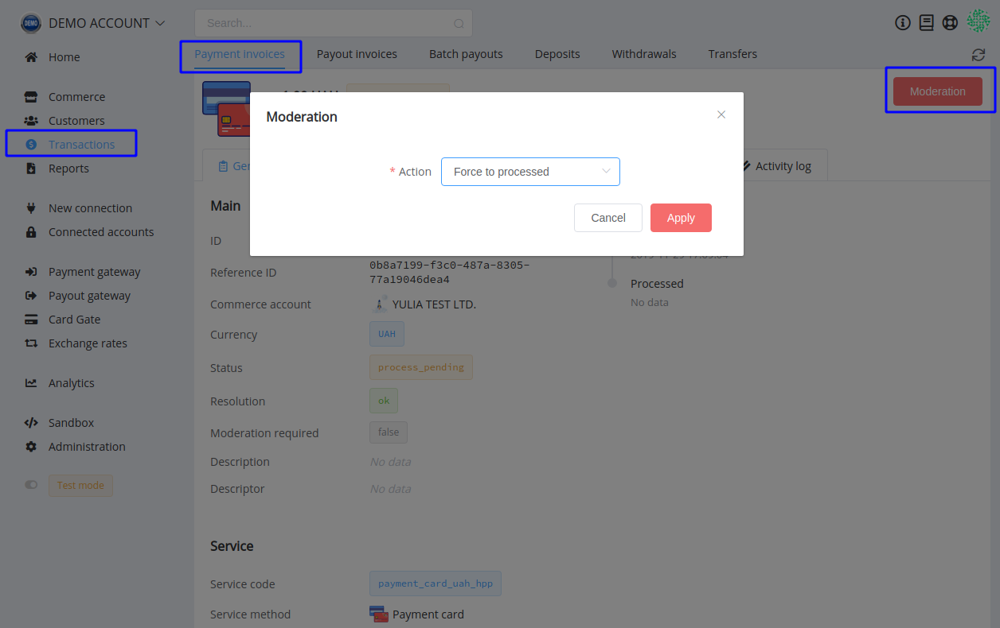
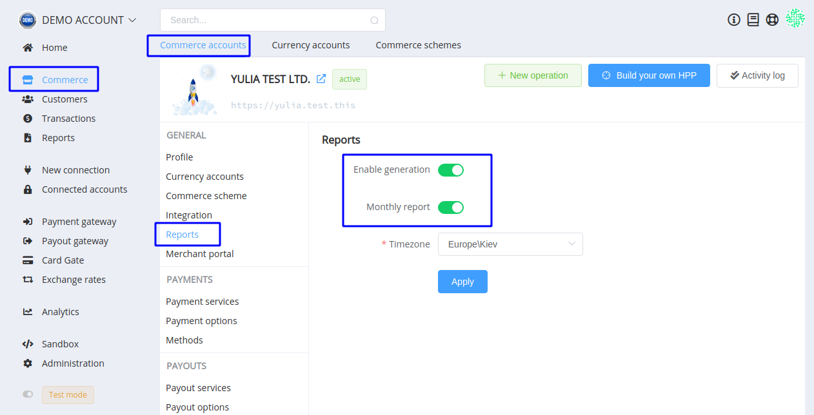

# **PayCore.io v1.5 (December 06, 2019)**

*By Dmytro Dziubenko, Chief Technology Officer*

Winter came, and there are only 18 days until Christmas!

Happy Friday mood from [PayCore.io](http://paycore.io/)!

We continue working on improving our platform. And here are weekly notes to highlight our product updates and improvements so you can easily stay up to date on what’s new.

## Highlights

* [Commerce improvements](#commerce-improvements): possibilities to moderate payment invoices through the dashboard, and to generate transaction reports monthly, added the turnover limit
* [Card Gate update](#card-gate-update): edited Payload object
* [New Integration](#new-integration): Dotpay
* [Bug Fixes](#bug-fixes)

## List of Changes

### Commerce Improvements

#### Moderate payment invoices

From now on, if you need to process a payment invoice forcedly, moderate it from the dashboard. Check this option in the General section of the invoice's entity.

#### Generate transaction reports monthly

As an option for a commerce account, monthly transaction reports can be enabled in the Reports section of the account settings.

This option is linked with the general feasibility of report generation: if both of them are toggled, the monthly report will be generated automatically on the first of every month.

#### Add Turnover limit

This update takes care of deposit accounts. In the account settings, you can limit the number of daily transaction funds.

Find this option in the Connected Accounts section.

### Card Gate Update

Satisfying your needs, we edited the Payload and added the `client_ip` key to the object. This update is also connected with the Merchant App data.

### New Integration

| Provider | Name  | New features |
|:-:|:-:|:-:|
|  | [Dotpay](/connectors/dotpay/) | Payouts |

### Bug Fixes

As working on performance improvements, we also fixed bugs and optimized the code inside the platform.  And hope, our efforts were noticed.

Stay tuned!