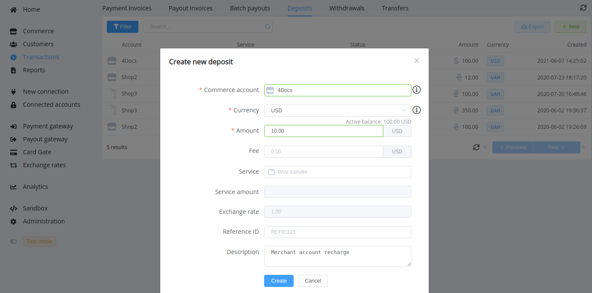
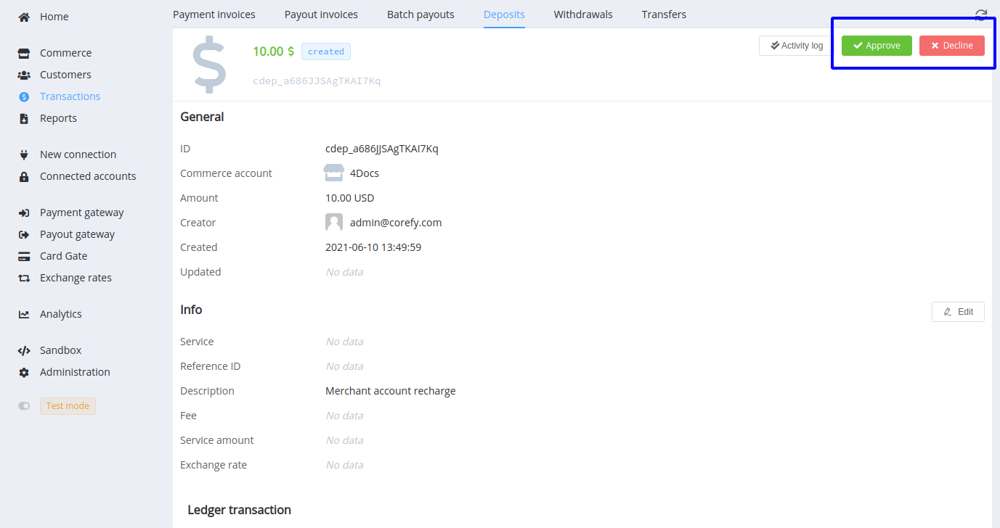
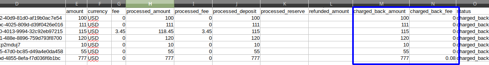
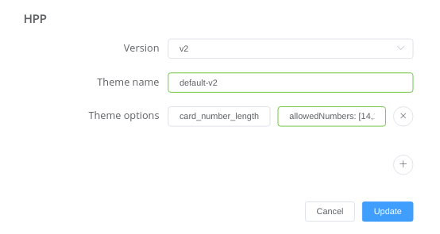
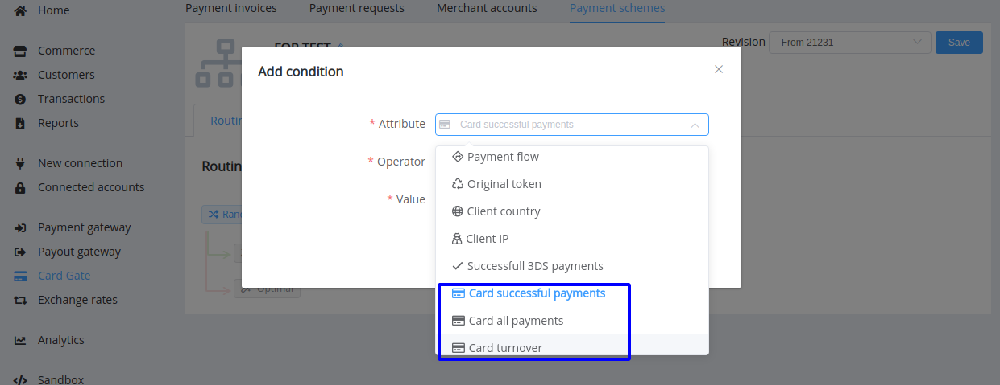
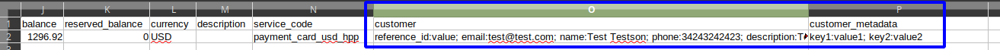
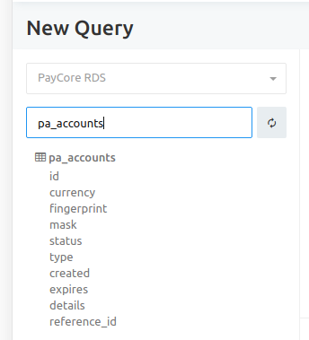
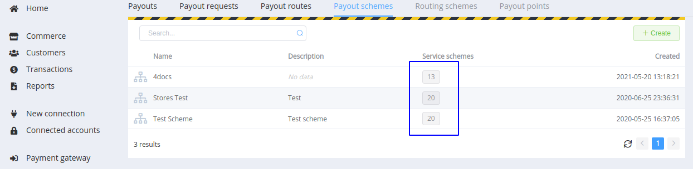

# June 9, 2021

<span style="font-size: 115%">[Corefy](https://corefy.com/) versions:<br>
**1.75**, **1.74**, **1.73**, **1.72**, **1.71**, **1.70**, **1.69**, **1.68**, **1.67**, & **1.66**</span>
<hr>
<div style="text-align: right; font-size: 85%; font-style: italic;">by Dmytro Dziubenko, Chief Technology Officer</div>

Cheery Greetings from the [Corefy](https://corefy.com/) team!

This month our dev team has focused on optimising the transaction flow, among other things, updated handling and finalising the user authentication process (and has prepared a few more updates that we'd like to share).

!!! caution ""

    We've updated the white list of our IP addresses and specially mentioned those that will be deprecated soon. So [check it out](/integration/ips/#white-list-ip-addresses) to update the relevant IP lists wherever they are needed.

## Highlights

* [Commerce update](#commerce-update): implemented two-step transactions within an organisation
* [Gateways updates](#gateways-updates): detailed charged back amounts and fees, added an option for the card validation field on the default HPP, and new metrics for card payment routing
* [Customers section's updates](#customers-sections-updates): added options to control payments and payouts availability in the customer entry and two extra columns in the transactional report tables for the customers' data and metadata
* Added an extra table for [Analytics queries](#analytics-update)
* [Minor dashboard layout update](#dashboard-layout-update)
* Performance improvements and bug fixes.

## List of changes

### Commerce update

#### An additional stage for confirmation of transactions within an organisation

As we announced in the [previous notes](/release-notes/v1.54-1.65/), we've updated transfers, deposits and withdrawals processing. Therefore, you should further review and confirm (or decline) prepared transactions within your organisation—or ask your teammates with relevant access about it.

!!! tip ""
    
    

### Gateways updates

#### Charged back amounts and fees are detailed

The reconciliation process has become a bit more informative because we added `charged_back_amount` as a parameter to the API scheme for the Payment invoices, Payment requests, and Payments. It's also obtainable in Callbacks for payment invoices.

And besides, charged back amounts and charged back fees are detailed in report and export tables.

!!! example ""

    === "Charged back amounts and fees in the export table"

        
    
    === "Code sample of the Payment invoice Callback"

        ``` json hl_lines="43 73"

            {
            "data":{
                "type":"payment-invoices",
                "id":"cpi_i1T5VQhj5IbHHI1P",
                "attributes":{
                "status":"charged_back",
                "serial_number":"i1T5VQhj5IbHHI1P",
                "resolution":"ok",
                "moderation_required":false,
                "amount":55,
                "payment_amount":55,
                "currency":"USD",
                "service_currency":"USD",
                "reference_id":"Test Order #d49a4e0da458",
                "test_mode":true,
                "description":"Vendor 1",
                "descriptor":null,
                "fee":0, 
                "deposit":55,
                "processed":1622799052,
                "processed_amount":55,
                "refunded_amount":null,
                "processed_fee":0,
                "processed_deposit":55,
                "metadata":[],
                "flow_data":[],
                "flow":"hpp",
                "payment_flow":"charge",
                "return_url":"https://example.com",
                "return_urls":[],
                "callback_url":"https://example.com",
                "created":1622799042,
                "updated":1622799067,
                "payload":[],
                "original_data":[],
                "rrn":null,
                "approval_code":null,
                "reserved_amount":null,
                "reserve_expires":null,
                "unreserved":null,
                "source":"platform_dashboard",
                "callback_logs":[],
                "charged_back_amount":55
                },
                "relationships":[],
                "links":[]
            },
            "included":[
                {
                "type":"payment-requests",
                "id":"prq_5ww1QATNAFv9LA7m",
                "attributes":{
                    "amount":55,
                    "paid_amount":55,
                    "amount_readonly":true,
                    "currency":"USD",
                    "reference_id":"cpi_i1T5VQhj5IbHHI1P",
                    "status":"CHARGED_BACK",
                    "description":"Vendor 1",
                    "test_mode":true,
                    "expires":1622802631,
                    "created":1622799042,
                    "processed":1622799052,
                    "return_url":"https://com.paycore.io/return?id=cpi_i1T5VQhj5IbHHI1P",
                    "callback_url":"https://example.com",
                    "resolution":"OK",
                    "payment_service":null,
                    "metadata":{
                    "fee":"0.00",
                    "fee_strategy":"external"
                    },
                    "fields":[],
                    "charged_back_amount":55
                    },
                "relationships":[]
                    },
                {
                "type":"customers",
                "id":"cus_HF0o1mHSWKzFEbCg",
                "attributes":{
                    "reference_id":"test",
                    "email":"test@test.com",
                    "name":"Test Customer",
                    "phone":"44 20 7234 3456",
                    "description":"A test user for test transactions",
                    "created":1593120883,
                    "metadata":[],
                    "avatar":"",
                    "archived":false,
                    "processing_options":{
                    "payment_enabled":true,
                    "payout_enabled":true
                    }
                },
                "relationships":{
                    "commerce-account":{
                    "data":{
                        "type":"commerce-accounts",
                        "id":"coma_FoXWOaBSEnUpvP4I"
                                }
                            }
                        }
                    }
                ]
            }
        ```

#### Default HPP (Checkout) theme update

We've added a `card_number_length` option for validation of the card number field. You can use it with the default HPP theme if you allow entering card numbers with a length different from 16 digits (by default).

The `card_number_length` option can obtain two **mutually exclusive** parameters:

* `range`—an object with `min` and `max` keys and integer values for a range from the lowest to the highest value;
* `allowedNumbers`—an array to list possible integer values.

!!! example ""

    === "A range from the lowest to the highest value"

        ```json
            "card_number_length":{
                "range":{
                    "min":12,
                    "max":18
                }
        ```

    === "A particular quantity of digits"

        ```json
            "card_number_length":{
                "allowedNumbers":[14,16,18]
            }
        ```

You can send HPP options via the Private API or set them up in the dashboard: *Commerce* section --> *Card Gateway*: *Options* --> *HPP*.

!!! tip ""

    

#### New metrics for card payment routing

We've started collecting additional figures about card payments for the entire period of running the card vault, and now you can use them as conditions in payment routing schemes:

* `Card successful payments` counts the number of successful payments by a card;
* `Card all payments` numbers all payments by a card;
* `Card turnover` calculates the total amount of successful payments by a card in the transaction currency.

!!! tip ""
    
    

### Customers section's updates

#### New options to manage customers' profiles

We've added options to control payments and payouts availability for a customer. Therefore, added the check whether the related option is enabled before processing the transaction.

!!! tip ""
    

Both options are enabled by default, so you should find and edit a customer entry to block specified transaction types.

#### Customers' data in transactional reports

From now on, there are two extra columns in the transactional report tables for the customers' data and metadata from the related Dashboard entries. We're sure that it comes in handy for sorting and analysing transactions.

!!! example

    

### Analytics update

We've added an extra table for Analytics queries that deals with the organisation database. The `pa_accounts` table displays the data only from the card vault now, but we plan to extend it with other account types like cryptocurrency or mobile money wallets later.

However, formatting queries with data from the table consider that we don't display sensitive user data (such as card numbers etc.) or hide them by masks.

!!! tip ""
    

### Dashboard layout update

A minor update may be brought to the attention: we've changed counters in the *Payout Schemes* section. Now they display the numbers of all linked schemes without splitting them into enabled and disabled. This data just wasn't informative for our users, so we removed it to increase the page loading speed.

!!! tip ""
    

### Performance Improvements

We've made various bug fixes, and now our products are better than they were.

Stay tuned for the following updates!
