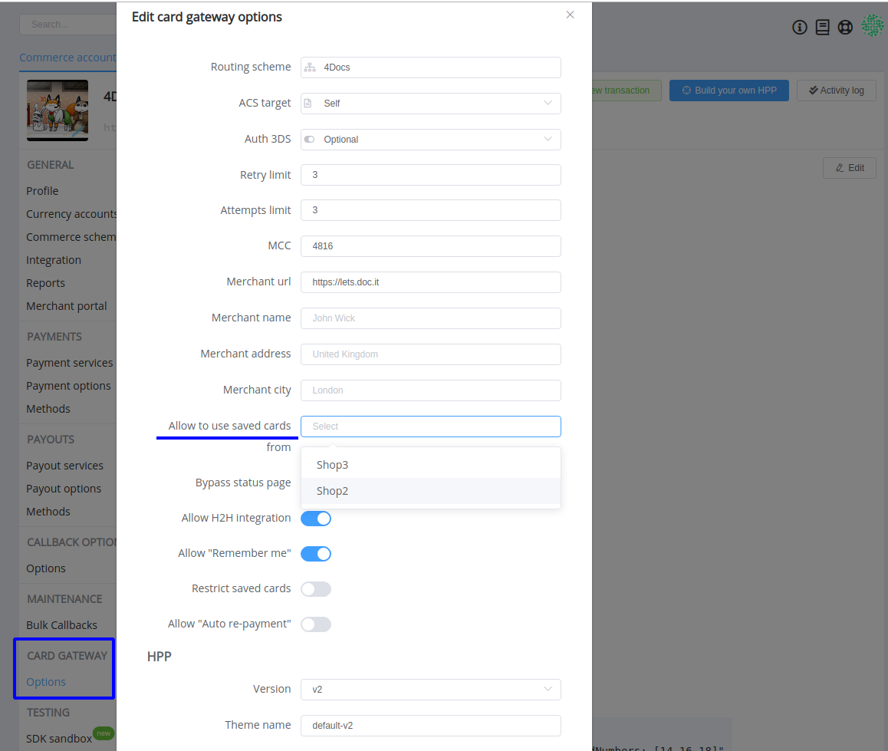
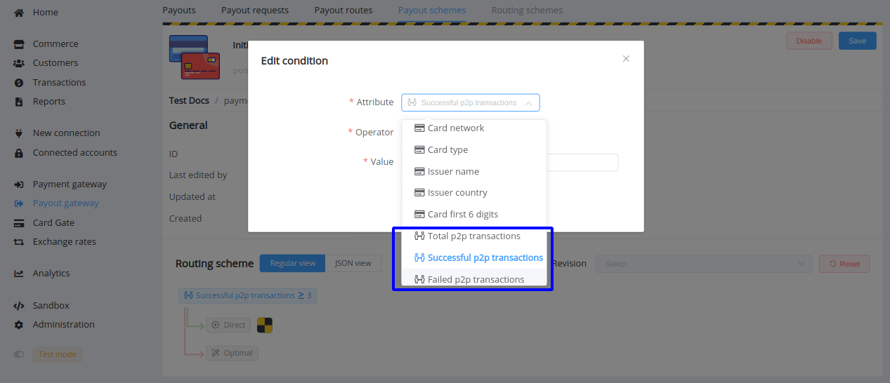
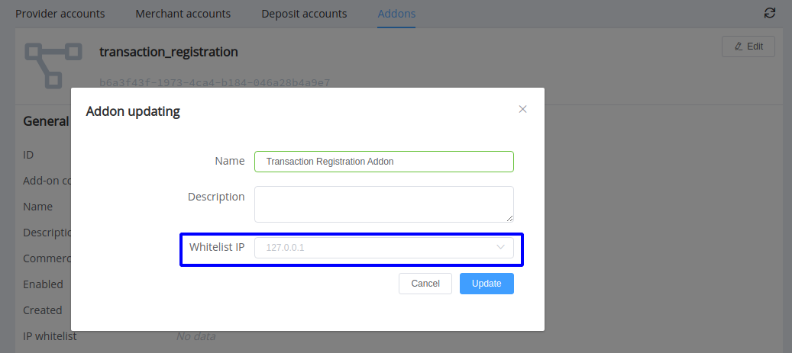
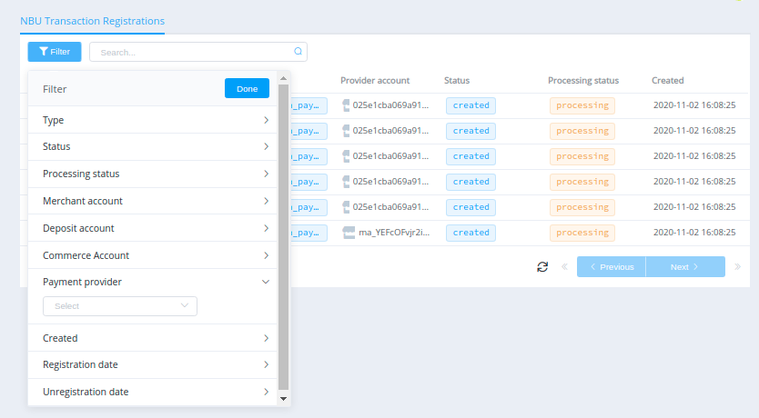

# July 8, 2021

<span style="font-size: 115%">[Corefy](https://corefy.com/) versions:<br>
**1.82**, **1.81**, **1.80**, **1.79**, **1.78**, **1.77**, & **1.76**</span>
<hr>
<div style="text-align: right; font-size: 85%; font-style: italic;">by Dmytro Dziubenko, Chief Technology Officer</div>

Cheery Greetings from the [Corefy](https://corefy.com/) team!

## Highlights

* [Commerce updates](#commerce-updates): added the `company_phone` and `country_code` parameters to the `merchant_profile` object
* [Platform API updates](#api-updates): added endpoints for handling transactions that affect the Commerce balances
* [Card Gate updates](#card-gate-updates): started supporting OTP flow for card payments, moved the 'Allow to use saved cards' to the Card Gateway Options
* [Routing updates](#routing-updates): extended the list of attributes for payout scheme conditions
* [Addons updates](#addons-management): expanded possibilities to manage addons, updated the NBU transaction registration addon, revised approaches to providing access to addons within organisations
* Performance improvements and bug fixes.

## List of changes

### Commerce updates

We've updated the Commerce settings and added the `company_phone` and `country_code` (for ISO 3166-1 numeric format) parameters to the `merchant_profile` object that can be transmitted to providers during transactions processing.

!!! example "`merchant_profile` code sample"

    ``` json
    {
    "company_name": "Best Docs Store",
    "mcc": "5942",
    "company_address": "1 Canada Square",
    "city": "London",
    "website_url": "https://lets.doc.it",
    "company_phone": "447911123456",
    "country_code": "826"
    }
    ```

### API updates

We've extended the feasibility of Platform API and added endpoints for handling transactions that affect the Commerce balances:

* `/deposits`
* `/deposits/{id}`
* `/deposits/{id}/process`
* `/deposits/{id}/terminate`
* `/withdrawals`
* `/withdrawals/{id}`
* `/withdrawals/{id}/process`
* `/withdrawals/{id}/terminate`
* `/transfers`
* `/transfers/{id}`
* `/transfers/{id}/process`
* `/transfers/{id}/terminate`

**Allowed methods**: GET, POST

Using these endpoints, you can obtain information about transactions within the organisation, create, and process or terminate them if you have related access rights.

### Card Gate updates

#### OTP flow for card payments

We continue enhancing card payments processing and have added the OTP flow for transactions through Card Gateway.

Suppose an acquirer requests an additional user verification step by passing an OTP test. In that case, it allows the merchant's website to display the verification page, and the user completes the card authentication process by entering a one-time password there without redirecting. That makes steps of processing fewer and completes the transaction process faster.

#### Allow using saved cards from another commerce account option

Minor changes in the commerce settings' layout: we've moved the [*Allow to use saved cards*](https://docs.paycore.io/release-notes/v1.54-1.65/#share-saved-card-tokens-between-commerce-accounts) option from the *General profile* page to the *Card Gateway: Options*.

!!! tip ""
    

### Routing updates

We've extended the list of attributes for payout scheme conditions. For them, we examine the total number of peer-to-peer transactions performed through this service as well as successful and failed ones. So pick one of the related attributes to compare with integers and set up the scheme.

!!! tip ""
    

### Addons management

We've expanded possibilities to manage addons, in particular, added functions to connect newly available ones. Besides that, you can edit already established addons, make them enabled in your organisation and set up IP Whitelist.

!!! tip ""

    === "Add a new addon"

        
    
    === "Edit the addon's settings"
    
        

Good news for our Ukrainian clients who use the [NBU transactions registration addon](/release-notes/archive/2020/v1.22/#new-addon). To make it more user-friendly, we've added all registered transactions to a separate section. It displays short data about transaction entries and allows filtering them by main parameters.

!!! tip ""
    

Finally, we've revised approaches to providing access to addons within organisations. Now we configure them during an organisation set-up. And you can contact your account manager to connect any addons as necessary, considering that the related dashboard section doesn't display the complete ready list.

### Bug Fixes

This month we're also working on general performance improvements and various bug fixes.
